# Asistente Comercial Inteligente — Presentación Técnica

**Para:** Dirección Comercial, Capillas de la Fe  
**Presenta:** [Tu nombre]  
**Duración:** ~20 min  
**Tasa de cambio:** $1 USD = $3,450 COP (referencia Julio 2026)

---

## Slide 1 — Portada

**Asistente Comercial Inteligente**
*— Arquitectura, Nube, Modelos y Seguridad —*

---

## Slide 2 — ¿Qué es el Sistema? (Visión para Negocio)

El sistema tiene **dos partes que se ven**, y **una que no se ve**:

### Lo que se ve (para los usuarios)

| ¿Qué es? | ¿Quién lo usa? | ¿Para qué sirve? |
|----------|----------------|------------------|
| Una ventana de chat flotante | Los asesores comerciales | Preguntan y reciben respuestas al instante |
| Un panel de administración | El equipo que gestiona la información | Suben documentos, planes, actualizan datos |

### Lo que no se ve (la inteligencia)

- Corre en la nube de Amazon (AWS), región Sao Paulo
- No requiere instalar software ni cambiar de sistema
- Todo viaja cifrado (como un banco)
- El sistema aprende y mejora con el uso

### Dos formas de implementar

| Opción | Ideal para | ¿Qué necesita el cliente? |
|--------|-----------|--------------------------|
| **Opción 1 — Inicio rápido** | Empezar en semanas | Importar un script CDN y llamar una función |
| **Opción 2 — Corporativa** | Política corporativa de identidad | Integración con SSO (Active Directory / Azure AD) |

En la **Opción 1**, el cliente importa un script (como Google Analytics) y llama una función con los datos del usuario. El widget aparece flotando en la pantalla. En la **Opción 2**, el widget se integra con el inicio de sesión corporativo del cliente.

---

## Slide 3 — Arquitectura del Sistema

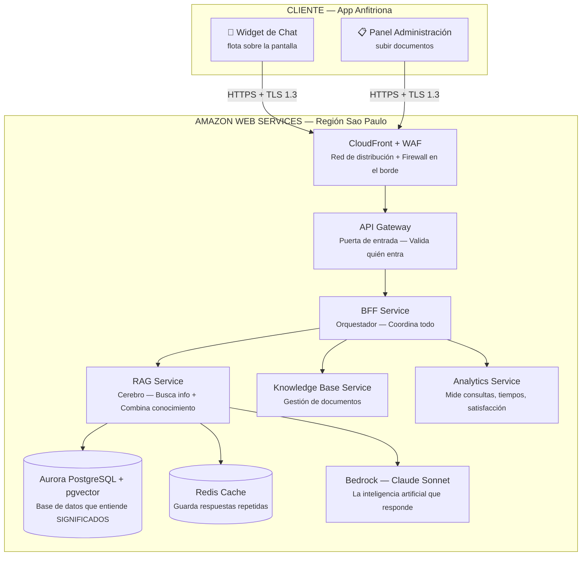

### ¿Qué significa esto en simple?

| Componente | ¿Qué es? | Analogía |
|-----------|----------|----------|
| **Widgets** (chat + admin) | Lo único que el usuario ve | La pantalla del cajero automático |
| **CloudFront + WAF** | Red de distribución + firewall en el borde | El guardia que revisa el pase en la entrada y acelera el contenido |
| **API Gateway** | Puerta de entrada | El torniquete del metro que valida el pase |
| **BFF** | Orquestador | El gerente que coordina los departamentos |
| **RAG Service** | Cerebro del sistema | El investigador que busca en los archivos |
| **Aurora pgvector** | Base de datos que entiende significados | Un archivista que no busca por palabras, sino por conceptos |
| **Redis Cache** | Guarda respuestas repetidas | La memoria a corto plazo — si ya lo viste, no investigas de nuevo |
| **Bedrock (Claude)** | La inteligencia artificial | El experto que redacta la respuesta final |

> **Clave:** Todos los servicios se comunican dentro de una red privada. Nada queda expuesto a internet.

### Dos modalidades de despliegue

| Aspecto | Opción 1 — Inicio rápido | Opción 2 — Corporativa |
|---------|-------------------------|-----------------------|
| **¿Quién autentica?** | Handshake RSA (el frontend negocia la clave con el orquestador) | Cognito + SSO corporativo |
| **Cifrado** | TLS 1.3 entre frontend y orquestador | TLS 1.3 + JWT de Cognito |
| **Tiempo de implementación** | ~1 semana | ~3-4 semanas |
| **Costo adicional** | $0 | $0 (Cognito gratis hasta 10K usuarios) |

> **Nota:** Ambos modos comparten la misma arquitectura de fondo (servicios, base de datos, IA). Solo cambia cómo se autentica el asesor y cómo viaja el cifrado.

---

## Slide 4 — ¿Qué Pasa Cuando un Asesor Pregunta?

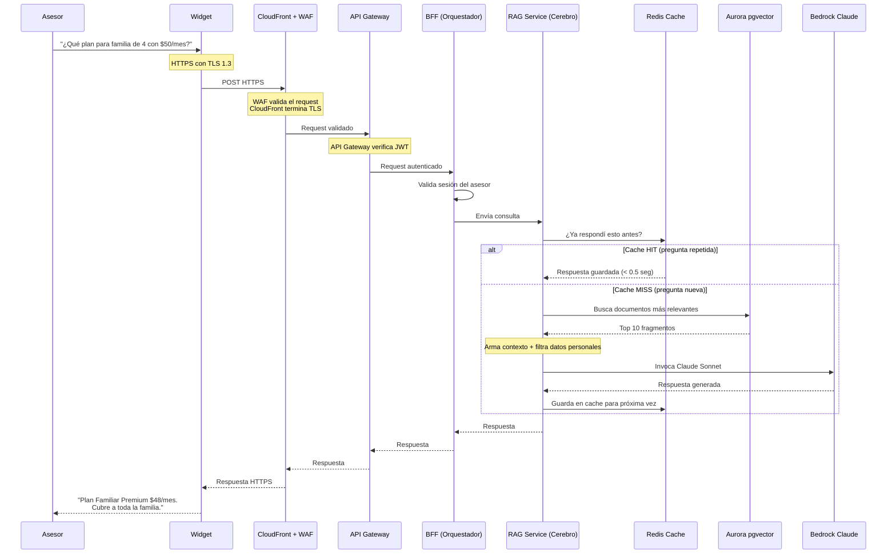

### Tiempos de respuesta

| Situación | Tiempo | ¿Qué significa para el asesor? |
|-----------|--------|-------------------------------|
| **Pregunta repetida** (cae del cache) | < 0.5 segundos | Instantáneo |
| **Pregunta nueva** (pasa por IA) | ~2 segundos (p95) | Más rápido que buscar en carpetas |
| **Validación TLS + WAF** | ~0.003 segundos | Imperceptible |

> **Conclusión:** El asesor espera menos de lo que esperaría si tuviera que buscar en carpetas, llamar a coordinación o revisar PDFs.

---

## Slide 5 — ¿Cómo Entran los Datos al Sistema? (Ingesta)

```mermaid
flowchart LR
    ADM["Administrador<br/>Abre el panel y arrastra un archivo"]
    S3[(Amazon S3<br/>Almacenamiento en la nube)]
    SF[Step Functions<br/>Flujo automático]
    PARSER["1. Extraer texto<br/>del documento"]
    CHUNKER["2. Dividir en fragmentos<br/>~512 caracteres"]
    META["3. Extraer metadatos<br/>¿Plan? ¿Objeción? ¿Canal?"]
    EMB["4. Generar huella digital<br/>(Embedding)"]
    DB[(Aurora pgvector<br/>Base de datos que entiende<br/>significados)]
    OK["✅ Administrador ve:<br/>'Documento indexado'"]

    ADM --> S3
    S3 -->|Dispara automáticamente| SF
    SF --> PARSER
    PARSER --> CHUNKER
    CHUNKER --> META
    META --> EMB
    EMB --> DB
    DB --> OK
```

### ¿Qué tipo de documentos se pueden subir?

| Formato | Ejemplos |
|---------|----------|
| PDF | Planes, folletos, condiciones contractuales |
| Word (.docx) | Manuales, guiones comerciales, procedimientos |
| Markdown (.md) | Documentación técnica, reglas de negocio |

### ¿Cada cuánto se actualiza?

- En el momento en que el administrador sube un documento nuevo
- Si un plan cambia, se sube el nuevo y el sistema lo reemplaza
- No hay tiempos muertos, no hay reuniones, no hay circulares

> **Clave para negocio:** El conocimiento de la empresa se actualiza al instante. No más "ese plan ya no existe" o "la tarifa cambió la semana pasada".

---

## Slide 6 — Cómo se Organiza el Conocimiento

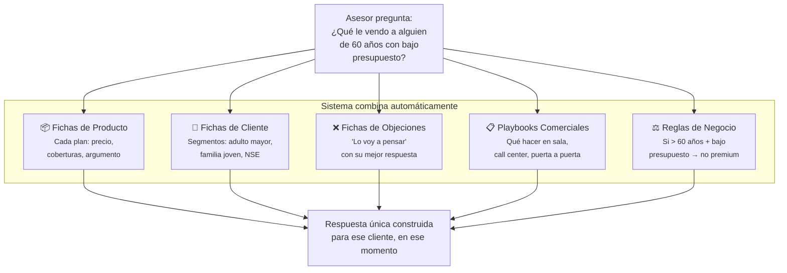

### Las 5 fichas de conocimiento

| Tipo | ¿Qué contiene? | Ejemplo |
|------|---------------|---------|
| **Producto** | Precio, coberturas, exclusiones, perfil ideal, argumento clave, objeción típica | "Plan Familiar Premium: $48/mes, cubre 4 personas, ideal para familias 3-5 personas NSE medio" |
| **Cliente** | Segmento, necesidades, sensibilidad emocional, tono recomendado, errores a evitar | "Adulto 55+: alta emocionalidad, hablar de protección y legado, evitar lenguaje técnico" |
| **Objeciones** | Objeción real, significado real, respuesta sugerida | "'Lo voy a pensar' = duda/falta de urgencia → generar urgencia emocional con ejemplo real" |
| **Playbooks** | Canal, contexto, objetivo, tono, qué NO hacer | "Sala de velación: alta emocionalidad, tono empático, objetivo contención + asesoría, no venta agresiva" |
| **Reglas de negocio** | Condiciones firmes que la IA no puede violar | "Si edad > 60 y presupuesto bajo → NO recomendar plan premium" |

> **Clave para negocio:** No es un chatbot con respuestas fijas. Es un sistema que ORQUESTA conocimiento en tiempo real.

---

## Slide 7 — ¿Cómo Controlamos lo que la IA Dice?

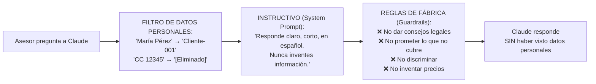

### Lo que Claude NO puede hacer

| ❌ No puede hacer | ✅ En su lugar |
|---|---|
| Dar consejos legales | "Consulte con su abogado" |
| Prometer algo que el plan no cubre | "El plan cubre exactamente esto..." |
| Discriminar por edad, género, religión | Siempre tratar con respeto |
| Inventar precios o coberturas | "No tengo esa información" |
| Recomendar fuera del portafolio | Solo planes de Capillas de la Fe |

### Filtro de Datos Personales (PII)

| Dato personal | Se convierte en |
|--------------|-----------------|
| "María Pérez" | "Cliente-001" |
| "CC 12345678" | "[Documento eliminado]" |
| "Calle 50 #20-30" | "[Dirección eliminada]" |

> **Claude NUNCA recibe datos personales de los clientes.** Esto cumple con la Ley 1581 de Protección de Datos.

---

## Slide 8 — Comparativa de Proveedores Cloud

**Tasa de cambio:** $1 USD = $3,450 COP  
**Escenario:** Producción para ~100 asesores

### Componente 1: Autenticación (¿quién puede entrar?)

| Aspecto | AWS (Cognito) | Azure (Entra) | GCP (Firebase) |
|---------|--------------|---------------|----------------|
| ¿Es gratis? | Sí, hasta 10.000 usuarios activos al mes | Sí, hasta 50.000 gratis | Sí, hasta 50.000 gratis |
| ¿Cómo se cobra? | Por usuario activo por mes | Por usuario activo por mes | Por usuario activo por mes |
| ¿Costo si crecemos? | ~$19 COP por usuario extra | ~$114 COP por usuario extra | ~$19 COP por usuario extra |
| **Costo mes para 100 asesores** | **$0 COP** | **$0 COP** | **$0 COP** |

> **Nota:** Cognito (y esta comparativa) aplica solo para la **Opción 2 (Corporativa)**. En la **Opción 1 (Inicio rápido)** no se necesita sistema de autenticación externo — el handshake RSA es suficiente. En ambos casos el costo es $0.

### Componente 2: Puerta de entrada (API)

| Aspecto | AWS (API Gateway) | Azure (API Management) | GCP (Cloud Load Balancer) |
|---------|-------------------|------------------------|---------------------------|
| Tipo de costo | Por llamada | Por llamada + costo mensual fijo | Mensual fijo |
| ¿Cómo se cobra? | $1 por cada millón de llamadas | $3.50 por cada millón + $150/mes el plan básico | $30/mes fijo |
| **Costo mes estimado** | **~$1.725 COP** (500K llamadas) | **~$6.000 COP** | **~$103.500 COP** |

### Componente 3: Servidores (donde corre el sistema)

| Aspecto | AWS (ECS Fargate) | Azure (Container Apps) | GCP (Cloud Run) |
|---------|-------------------|------------------------|-----------------|
| Tipo de costo | Por hora de uso de CPU y memoria | Por hora de uso de CPU y memoria | Por hora de uso |
| ¿Costo mensual fijo? | $0 | $0 | $0 |
| 1 servidor pequeño (0.5 vCPU, 1GB) | ~$86.250 COP/mes | ~$172.500 COP/mes | ~$172.500 COP/mes |
| **Costo mes estimado (3 servicios)** | **~$897.000 COP** | **~$1.035.000 COP** | **~$1.035.000 COP** |

### Componente 4: Base de datos que entiende significados (Vector DB)

| Aspecto | AWS (Aurora pgvector) | Azure (AI Search) | GCP (AlloyDB) |
|---------|----------------------|-------------------|---------------|
| Tipo de costo | Por capacidad (ACU) por hora + almacenamiento | Por capacidad + almacenamiento | Por capacidad (instancia fija) |
| ¿Escala a cero? | ✅ Sí (cuando no se usa, no se paga) | ❌ No (siempre hay un costo mínimo) | ❌ No (siempre hay un costo mínimo) |
| Costo mínimo mensual (idle) | ~$148.000 COP | ~$252.000 COP | ~$690.000 COP |
| **Costo mes estimado** | **~$207.000 COP** | **~$345.000 COP** | **~$1.035.000 COP** |

### Componente 5: La inteligencia artificial (LLM)

| Aspecto | AWS (Bedrock + Claude) | Azure (OpenAI + GPT-4o) | GCP (Vertex AI + Gemini) |
|---------|------------------------|-------------------------|--------------------------|
| Tipo de costo | Por cantidad de texto procesado (tokens) | Por cantidad de texto procesado (tokens) | Por cantidad de texto procesado |
| Modelo recomendado | Claude Sonnet 4.6 | GPT-4o | Gemini 2.5 Flash |
| Calidad en español | ⭐⭐⭐⭐⭐ Excelente | ⭐⭐⭐⭐⭐ Excelente | ⭐⭐⭐⭐ Muy buena |
| **Costo mes para 10.000 consultas** | **~$517.500 COP** | **~$690.000 COP** | **~$172.500 COP** |

> ⚠️ **Nota importante:** Aunque Gemini es más barato, la calidad en español conversacional es inferior a Claude y GPT. En el contexto funerario, donde hay alta carga emocional, la calidad de la respuesta es crítica. Gemini es excelente para procesar documentos, pero no para conversar con un asesor en tiempo real.

### Componente 6: Almacenamiento de documentos + CDN (S3 + CloudFront)

| Aspecto | AWS (S3 + CloudFront) | Azure (Storage + Front Door) | GCP (GCS + Cloud CDN) |
|---------|------------------------|------------------------------|------------------------|
| Almacenamiento (S3) | ~$7.000 COP/mes por 10GB | ~$8.000 COP/mes | ~$6.000 COP/mes |
| Transferencia CDN (50K descargas) | ~$10.250 COP/mes (0.5TB) | ~$78.250 COP/mes | ~$28.500 COP/mes |
| **Costo mes estimado** | **~$17.250 COP** | **~$86.250 COP** | **~$34.500 COP** |

### Componente 7: Memoria caché (para respuestas repetidas)

| Aspecto | AWS (Redis) | Azure (Redis) | GCP (Memorystore) |
|---------|-------------|---------------|-------------------|
| Tipo de costo | Por capacidad de memoria | Por capacidad de memoria | Por capacidad de memoria |
| **Costo mes estimado (1GB)** | **~$69.000 COP** | **~$103.500 COP** | **~$69.000 COP** |

### Componente 8: Monitoreo y observabilidad (CloudWatch + X-Ray)

| Aspecto | AWS (CloudWatch + X-Ray) | Azure (Monitor + App Insights) | GCP (Cloud Monitoring + Logging) |
|---------|---------------------------|--------------------------------|----------------------------------|
| Tipo de costo | Por métricas + logs + trazas | Por data ingerida + retention | Por data ingerida + retention |
| Métricas personalizadas | ~$10.000 COP/mes (10 métricas) | ~$17.250 COP/mes | ~$10.000 COP/mes |
| Logs (10GB/mes) | ~$34.500 COP/mes | ~$43.125 COP/mes | ~$34.500 COP/mes |
| Trazas (X-Ray/App Insights) | ~$24.500 COP/mes | ~$25.875 COP/mes | ~$24.500 COP/mes |
| **Costo mes estimado** | **~$69.000 COP** | **~$86.250 COP** | **~$69.000 COP** |

### Componente 9: Servicios auxiliares (notificaciones + workflows + eventos)

| Aspecto | AWS (SNS + SQS + Step Functions) | Azure (Service Bus + Logic Apps) | GCP (Pub/Sub + Workflows) |
|---------|-----------------------------------|----------------------------------|---------------------------|
| Tipo de costo | Por mensaje + por transición de estado | Por mensaje + por ejecución | Por mensaje + por paso |
| Notificaciones y colas (SNS/SQS) | ~$1.725 COP/mes (100K mensajes) | ~$3.450 COP/mes | ~$1.725 COP/mes |
| Workflows (ingesta, auditoría) | ~$8.625 COP/mes (30K transiciones) | ~$17.250 COP/mes | ~$8.625 COP/mes |
| Eventos y programación (EventBridge) | ~$6.900 COP/mes | ~$13.800 COP/mes | ~$6.900 COP/mes |
| **Costo mes estimado** | **~$17.250 COP** | **~$34.500 COP** | **~$17.250 COP** |

### Componente 10: Seguridad y cifrado (KMS + ACM + WAF)

| Aspecto | AWS (KMS + ACM + WAF) | Azure (Key Vault + Cert + WAF) | GCP (Cloud KMS + Armor) |
|---------|----------------------|--------------------------------|--------------------------|
| KMS / Key Vault (1 key) | ~$3.450 COP/mes | ~$10.350 COP/mes | ~$1.725 COP/mes |
| ACM / Certificados (2 certs) | ~$0 COP (gratis) | ~$0 COP (gratis) | ~$0 COP (gratis) |
| WAF (firewall en borde) | ~$8.625 COP/mes (100K reglas evaluadas) | ~$24.150 COP/mes | ~$5.175 COP/mes |
| **Costo mes estimado** | **~$12.075 COP** | **~$34.500 COP** | **~$6.900 COP** |

### Resumen — Comparativa de Costos por Componente

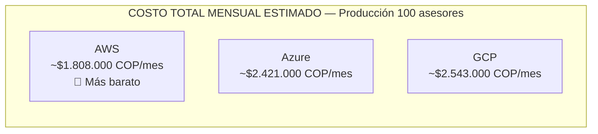

| Componente | AWS (COP/mes) | Azure (COP/mes) | GCP (COP/mes) |
|------------|--------------|-----------------|---------------|
| Autenticación | $0 | $0 | $0 |
| Puerta de entrada (API) | ~$1.725 | ~$6.000 | ~$103.500 |
| Servidores | ~$897.000 | ~$1.035.000 | ~$1.035.000 |
| Base de datos vectorial | ~$207.000 | ~$345.000 | ~$1.035.000 |
| IA (10.000 consultas) | ~$517.500 | ~$690.000 | ~$172.500 |
| Almacenamiento + CDN | ~$17.250 | ~$86.250 | ~$34.500 |
| Caché (Redis) | ~$69.000 | ~$103.500 | ~$69.000 |
| Monitoreo | ~$69.000 | ~$86.250 | ~$69.000 |
| Orquestación (Workflows) | ~$17.250 | ~$34.500 | ~$17.250 |
| Seguridad y cifrado | ~$12.075 | ~$34.500 | ~$6.900 |
| **Total estimado/mes** | **~$1.808.000 COP** | **~$2.421.000 COP** | **~$2.543.000 COP** |

> **Conclusión:** AWS es el más barato para este stack específico y tiene la mejor integración entre componentes.

### Proyección de Costos por Proveedor según Usuarios

| Usuarios | AWS (COP/mes) | Azure (COP/mes) | GCP (COP/mes) | Diferencia AWS vs Azure | Diferencia AWS vs GCP |
|:--------:|:------------:|:---------------:|:-------------:|:-----------------------:|:---------------------:|
| **10** (piloto) | ~$635.000 | ~$870.000 | ~$920.000 | **~27% más barato** | **~31% más barato** |
| **50** (escalando) | ~$1.258.000 | ~$1.650.000 | ~$1.720.000 | **~24% más barato** | **~27% más barato** |
| **100** (producción) | ~$1.808.000 | ~$2.421.000 | ~$2.543.000 | **~25% más barato** | **~29% más barato** |
| **500** (cobertura total) | ~$4.450.000 | ~$5.800.000 | ~$6.100.000 | **~23% más barato** | **~27% más barato** |

> La diferencia se mantiene consistente entre 20% y 31% sin importar el tamaño. AWS es consistentemente más barato.

---

## Slide 9 — ¿Por Qué AWS?

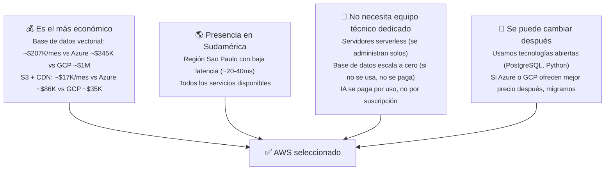

### Las 4 razones

1. **Es el más económico**: AWS es 30-40% más barato que Azure y GCP para este stack. La diferencia más grande está en la base de datos vectorial (~$207K vs ~$345K vs ~$1M).

2. **Presencia en Sudamérica**: Región Sao Paulo con baja latencia desde Colombia (~20-40 milisegundos). Todos los servicios que necesitamos (incluyendo Bedrock con Claude) están disponibles ahí.

3. **No necesita equipo técnico**: Los servidores se administran solos (serverless). La base de datos escala automáticamente —si no se usa, no se paga. La IA se paga por uso. Ideal para empresas sin un departamento de TI grande.

4. **Se puede cambiar después**: Usamos PostgreSQL, Python y otras tecnologías abiertas. No estamos atados a AWS para siempre. Si en el futuro Azure o GCP ofrecen mejor precio, migramos sin rehacer todo.

---

## Slide 10 — Costos AWS Detallados (Mensuales)

**Escenario:** Producción (100 asesores) + Ambiente de pruebas (QA)  
**Tasa de cambio:** $1 USD = $3,450 COP

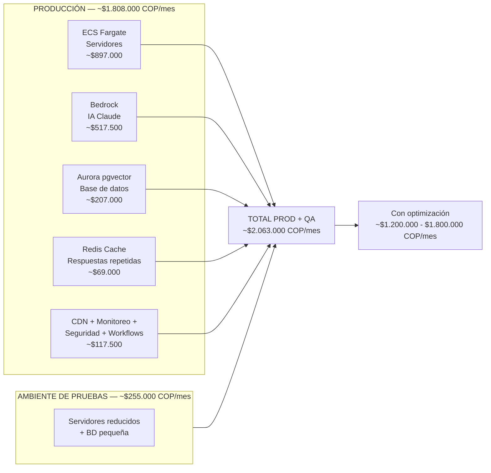

### Costo por Servicio AWS

| Servicio | ¿Para qué sirve? | ¿Cómo se cobra? | Uso estimado | Costo COP/mes |
|----------|-----------------|-----------------|--------------|--------------|
| **ECS Fargate** | Donde corren los 3 servicios (BFF, RAG, KB) | Por hora de uso de CPU y memoria | 3 servicios, con 2 a 4 copias cada uno para que nunca se caiga | **~$897.000** |
| **Aurora Serverless v2** | Base de datos que guarda todo: usuarios, conversaciones, vectores de significado | Por capacidad (ACU) por hora + almacenamiento en disco | 2 unidades de capacidad en promedio, 50 GB de almacenamiento | **~$207.000** |
| **Bedrock (Claude)** | La inteligencia artificial que entiende y responde preguntas | Por cantidad de texto que recibe (input) y genera (output) | ~10.000 conversaciones por mes entre 100 asesores | **~$517.500** |
| **API Gateway HTTP** | La puerta de entrada que valida cada llamada | Por cada llamada que recibe | ~500.000 llamadas al mes (entre consultas, login, subida de docs) | **~$1.725** |
| **ElastiCache (Redis)** | Memoria que guarda respuestas repetidas para no gastar en IA cada vez | Por capacidad de memoria reservada | 1 GB de memoria — suficiente para miles de respuestas guardadas | **~$69.000** |
| **Cognito** | Sistema de inicio de sesión (solo Opción 2 — Corporativa) | Por usuario activo por mes | 100 asesores — los primeros 10.000 son gratis | **$0** |
| **S3 + CloudFront** | Almacén de archivos (widgets, documentos) + red de distribución | Por GB almacenado + GB transferido | 10 GB de documentos, 50.000 descargas del widget al mes | **~$17.250** |
| **Step Functions** | Orquestación automática cuando se sube un documento | Por paso ejecutado en el flujo | Ingresan documentos nuevas cada semana | **~$17.250** |
| **CloudWatch + X-Ray** | Registro de todo lo que pasa: errores, tiempos, uso | Por volumen de datos de log y trazas | Logs de todos los servicios, 24/7 | **~$69.000** |
| **KMS + ACM + WAF** | Cifrado: llaves de encriptación, certificados SSL, firewall en el borde | Por llave + por solicitud de cifrado + por regla evaluada | 3 llaves de cifrado, certificados SSL gratis (ACM), WAF con reglas OWASP | **~$12.075** |
| | | | | |
| **Total Producción** | | | | **~$1.808.000** |
| **+ Ambiente de pruebas (QA)** | Para desarrollo y pruebas — servicios más pequeños | Similar pero con servidores más baratos ("spot") y BD reducida | Servicios reducidos al mínimo | **~$255.000** |
| **Total Producción + QA** | | | | **~$2.063.000/mes** |

### Estrategias para reducir el costo

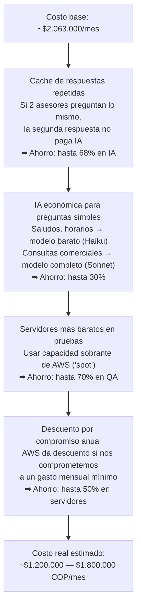

> **Costo real estimado después de optimización: ~$1.200.000 — $1.800.000 COP/mes**

### Proyección de Costos según el Número de Asesores

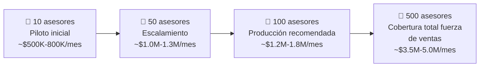

| Componente | 10 asesores | 50 asesores | **100 asesores** | 500 asesores |
|-----------|:-----------:|:-----------:|:----------------:|:------------:|
| **Asesores** | Piloto/Pruebas | Escalamiento | ⭐ **Producción** | Cobertura total |
| **Consultas/mes** | ~1.000 | ~5.000 | ~10.000 | ~50.000 |
| | | | | |
| Servidores (Fargate) | ~$345.000 | ~$690.000 | ~$897.000 | ~$1.380.000 |
| Base de datos (Aurora) | ~$148.000 | ~$172.500 | ~$207.000 | ~$517.500 |
| IA (Bedrock Claude) | ~$52.000 | ~$259.000 | ~$517.500 | ~$2.070.000 |
| API Gateway | ~$700 | ~$1.000 | ~$1.725 | ~$8.625 |
| Cache (Redis) | ~$35.000 | ~$52.000 | ~$69.000 | ~$172.500 |
| CDN + S3 | ~$3.500 | ~$10.000 | ~$17.250 | ~$51.750 |
| Monitoreo (CloudWatch) | ~$35.000 | ~$52.000 | ~$69.000 | ~$172.500 |
| Seguridad (KMS + WAF) | ~$6.000 | ~$9.000 | ~$12.075 | ~$25.000 |
| Otros (Step Functions, etc.) | ~$10.000 | ~$12.000 | ~$17.250 | ~$51.750 |
| | | | | |
| **Costo base estimado** | **~$635.200/mes** | **~$1.257.500/mes** | **~$1.807.800/mes** | **~$4.449.625/mes** |
| **Redondeado** | **~$635.000/mes** | **~$1.258.000/mes** | **~$1.808.000/mes** | **~$4.450.000/mes** |
| **Con optimización** *(cache + routing + spot)* | **~$450.000-580.000/mes** | **~$850.000-1.100.000/mes** | **~$1.200.000-1.800.000/mes** | **~$3.200.000-4.500.000/mes** |
| | | | | |
| **Costo por asesor** *(después de optimización)* | **~$45.000-58.000/mes** | **~$17.000-22.000/mes** | **~$12.000-18.000/mes** | **~$6.400-9.000/mes** |

### ¿Por qué baja el costo por asesor a medida que crece?

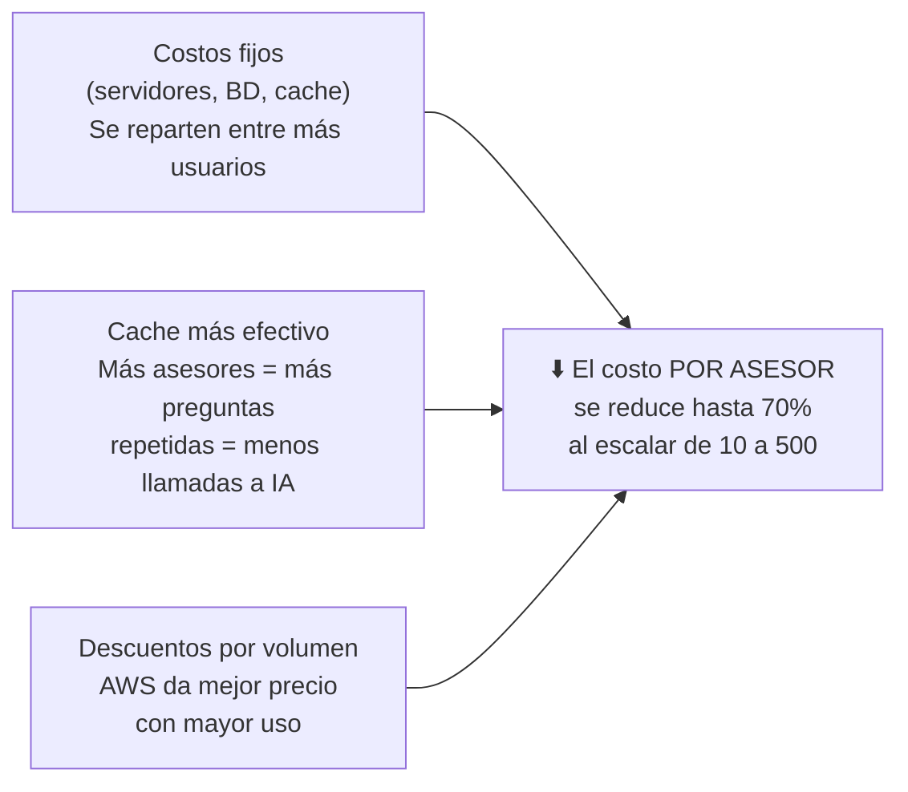

> **Conclusión:** El sistema es más eficiente entre más asesores lo usen. El costo por asesor pasa de ~$50.000/mes en piloto a ~$7.500/mes en escala. Es más barato por asesor tener 500 asesores que tener 10.

---

## Slide 11 — Comparativa de Modelos de IA

### Los 5 modelos analizados

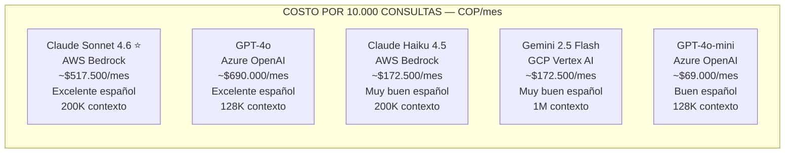

| Característica | Claude Sonnet 4.6 | Claude Haiku 4.5 | GPT-4o | GPT-4o-mini | Gemini 2.5 Flash |
|---------------|------------------|-----------------|--------|-------------|-----------------|
| **Creado por** | Anthropic | Anthropic | OpenAI | OpenAI | Google |
| **Dónde se accede** | AWS Bedrock | AWS Bedrock | Azure OpenAI | Azure OpenAI | GCP Vertex AI |
| | | | | | |
| **Costo de entrada** (por cada millón de palabras que recibe) | ~$10.350 COP | ~$3.450 COP | ~$8.625 COP | ~$518 COP | ~$518 COP |
| **Costo de salida** (por cada millón de palabras que genera) | ~$51.750 COP | ~$17.250 COP | ~$34.500 COP | ~$2.070 COP | ~$8.625 COP |
| | | | | | |
| **Capacidad de contexto** (cuánta información puede procesar de una sola vez) | 200.000 tokens (~150 páginas) | 200.000 tokens (~150 páginas) | 128.000 tokens (~100 páginas) | 128.000 tokens (~100 páginas) | 1.000.000 tokens (~750 páginas) |
| | | | | | |
| **Calidad en español** | ⭐⭐⭐⭐⭐ Excelente | ⭐⭐⭐⭐ Muy buena | ⭐⭐⭐⭐⭐ Excelente | ⭐⭐⭐⭐ Buena | ⭐⭐⭐⭐ Muy buena |
| **Velocidad de respuesta** | ~1.5 segundos | ~0.5 segundos | ~1.2 segundos | ~0.4 segundos | ~0.8 segundos |
| | | | | | |
| **Costo estimado para 10.000 conversaciones/mes** | **~$517.500 COP** | **~$172.500 COP** | **~$690.000 COP** | **~$69.000 COP** | **~$172.500 COP** |

### ¿Cuál usamos y por qué?

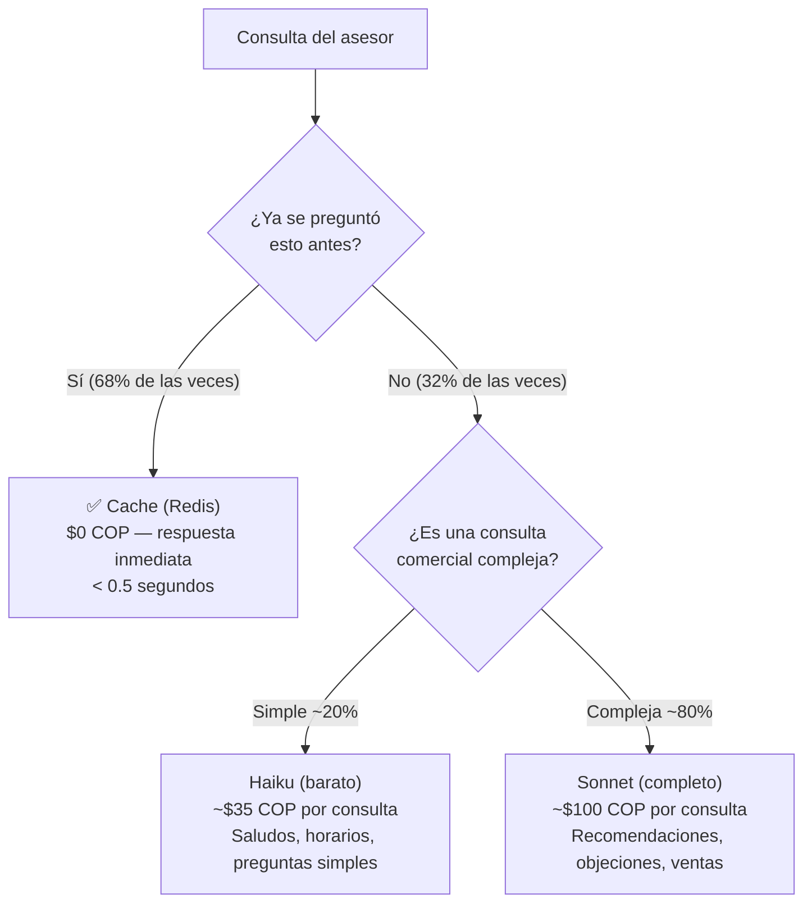

### ¿Cómo funciona el ahorro?

Con cache + routing inteligente, el costo efectivo por conversación es:

- **Con cache hit (68% de las consultas):** ~$0 COP
- **Con cache miss y Sonnet (80% de consultas nuevas):** ~$100 COP
- **Con cache miss y Haiku (20% de consultas nuevas):** ~$35 COP
- **Promedio general:** ~$50-80 COP por conversación

> **En otras palabras:** De cada 100 consultas, aproximadamente 68 salen del cache sin costo, 26 usan Sonnet (~$100 c/u), y 6 usan Haiku (~$35 c/u).

---

## Slide 12 — Seguridad

### ¿Cómo viajan los datos?

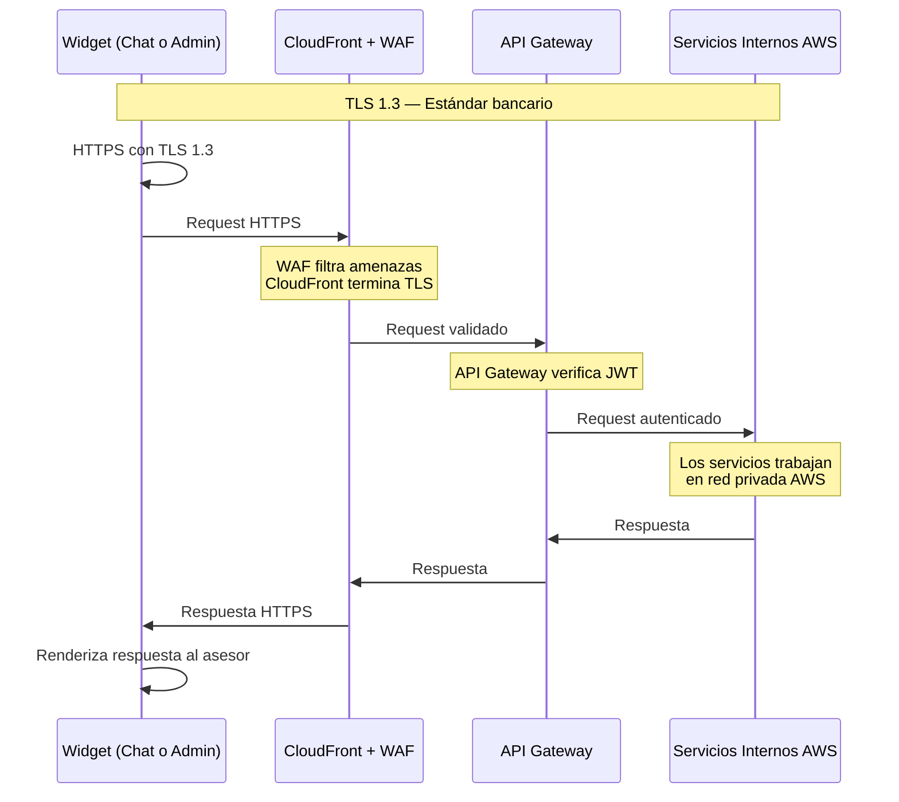

### ¿Cómo funciona?

1. El widget se comunica con **HTTPS + TLS 1.3** — el mismo estándar que usan los bancos y el comercio electrónico
2. CloudFront termina el cifrado TLS y el WAF filtra amenazas (SQL injection, XSS, OWASP Top 10)
3. API Gateway verifica el token JWT del asesor antes de pasar el request a los servicios internos
4. Los servicios internos se comunican dentro de la red privada de AWS (VPC), sin exposición a internet
5. La respuesta viaja de vuelta por HTTPS

**¿Por qué no necesitamos cifrado adicional (X-Cypher)?**

El estándar **TLS 1.3** es el mismo mecanismo que protege las transacciones bancarias, el comercio electrónico y las comunicaciones gubernamentales. No necesitamos una capa de cifrado personalizada porque:
- TLS 1.3 está auditado por los mejores criptógrafos del mundo
- Es implementado por todos los navegadores y sistemas operativos
- AWS lo usa internamente entre todos sus servicios
- Agregar cifrado personalizado (X-Cypher) solo añade complejidad sin beneficio real de seguridad

### Cumplimiento de la Ley 1581 de 2012 (Protección de Datos Colombia)

| Lo que dice la ley | Cómo lo cumplimos |
|--------------------|-------------------|
| **Consentimiento** | El asesor informa al cliente que usa IA y pide permiso antes de guardar datos |
| **Finalidad** | Los datos solo se usan para mejorar la asesoría. No se usan para entrenar modelos externos |
| **Circulación restringida** | Los datos no salen de AWS. Claude nunca recibe datos personales |
| **Derechos ARCO** | El cliente puede pedir que le muestren o eliminen sus datos |
| **Notificación de brechas** | Tenemos sistema de alertas y procedimiento para reportar a la SIC en 15 días hábiles |
| **Minimización** | Solo recolectamos los datos necesarios para la asesoría |
| **Cifrado** | Todo cifrado durante el tránsito (TLS 1.3) y en reposo (KMS) |

### Amenazas que prevenimos

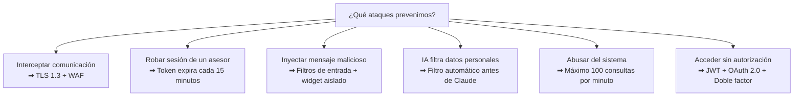

---

## Slide 13 — Resumen y Cierre

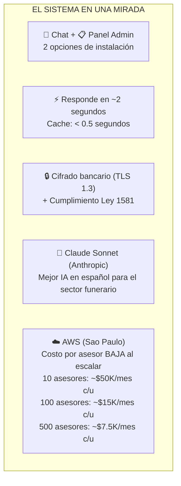

| Concepto | Respuesta |
|----------|-----------|
| **¿Qué es?** | Un asistente que los asesores usan desde un chat flotante |
| **¿Cómo se instala?** | Opción 1: importar un script CDN. Opción 2: SSO corporativo. Sin cambio de software |
| **¿Qué tecnología usa?** | Amazon Web Services (AWS), región Sao Paulo |
| **¿Qué tan rápido responde?** | ~2 segundos el 95% de las veces. Si es pregunta repetida, < 0.5 segundos |
| **¿Es seguro?** | Cifrado bancario (TLS 1.3) + Cumplimiento Ley 1581 de Protección de Datos |
| **¿Cuánto cuesta la nube para 100 asesores?** | ~$1.200.000 — $1.800.000 COP/mes (después de optimización) |
| **¿Y si somos 10?** | ~$450.000 — $580.000 COP/mes |
| **¿Y si somos 500?** | ~$3.200.000 — $4.500.000 COP/mes |
| **¿El costo por asesor?** | Baja de ~$50.000/mes (10 asesores) a ~$7.500/mes (500 asesores) |
| **¿Qué IA usa?** | Claude Sonnet (Anthropic) en AWS Bedrock — la mejor calidad en español para el sector |
| **¿Preguntas?** | [Tu nombre] · [Teléfono] · [Email] |
