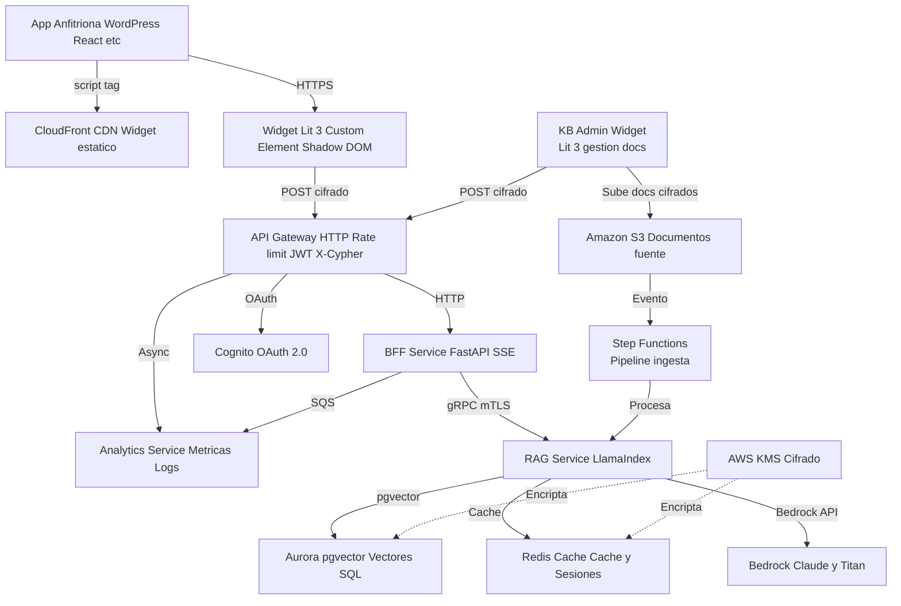
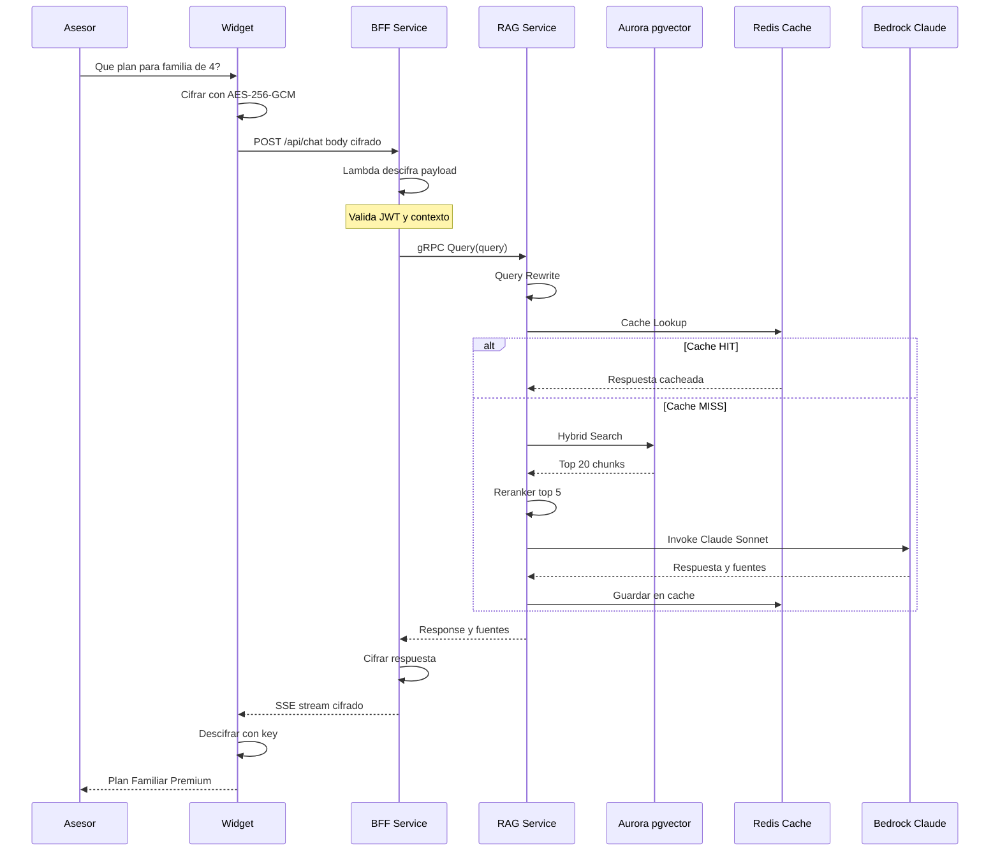
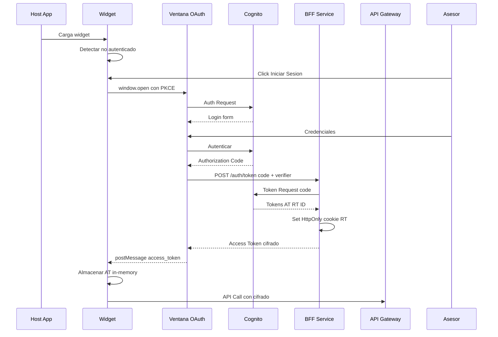
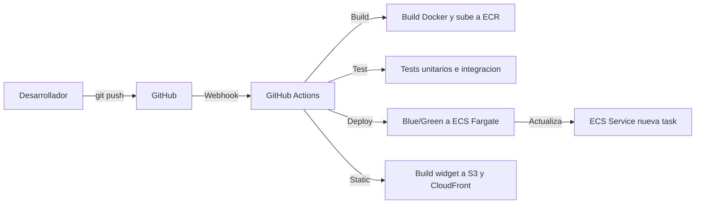
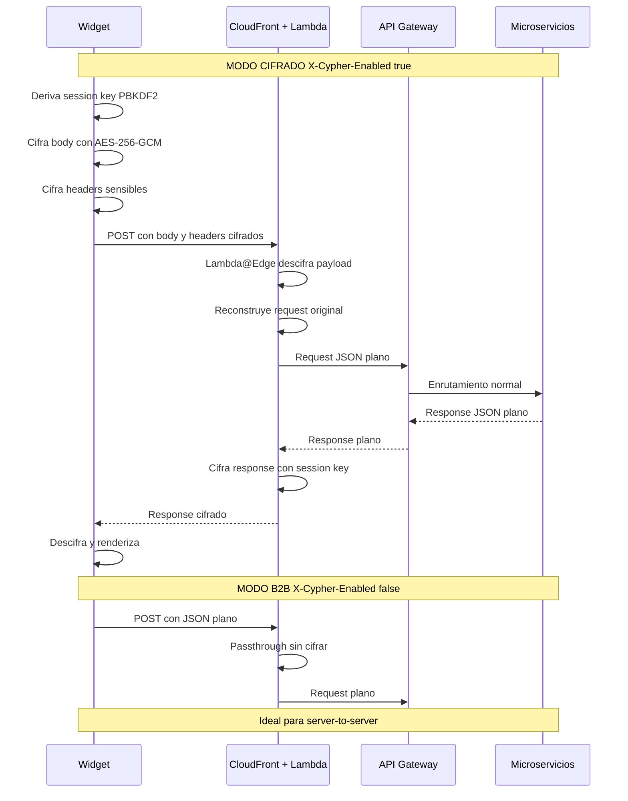
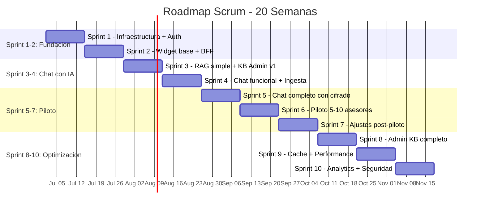

# PROPUESTA TECNOLÓGICA
## Sistema de Asesor Comercial Aumentado con IA — Capillas de la Fe

**Versión:** 1  
**Fecha:** Junio 2026  
**Clasificación:** Confidencial — Capillas de la Fe  
**Tasa de cambio:** $1 USD = $3,450 COP (referencia junio 2026)

---

## Índice

1. [Resumen Ejecutivo](#1-resumen-ejecutivo)
2. [Arquitectura del Sistema](#2-arquitectura-del-sistema)
3. [Stack Tecnológico Detallado](#3-stack-tecnológico-detallado)
4. [Comparativa Cloud Provider](#4-comparativa-cloud-provider)
5. [Seguridad](#5-seguridad)
6. [Plan de Implementación](#6-plan-de-implementación)
7. [Estimación de Costos](#7-estimación-de-costos)
8. [Modelos de Contratación y Precios](#8-modelos-de-contratación-y-precios)
9. [Referencias y Fuentes](#9-referencias-y-fuentes)

---

## 1. Resumen Ejecutivo

### 1.1 Objetivo del Sistema

Implementar un **Asistente Comercial Inteligente** basado en arquitectura RAG (Retrieval-Augmented Generation) que potencie a la fuerza de ventas de Capillas de la Fe con inteligencia artificial en tiempo real. El sistema permite a cada asesor acceder a información confiable, recomendaciones de planes, argumentos de venta personalizados y manejo de objeciones, todo desde un widget embebible en cualquier aplicación.

### 1.2 Stack Tecnológico Recomendado

| Capa | Tecnología | Especificación |
|------|-----------|----------------|
| **Frontend (Widget)** | Lit 3 + Custom Elements + Vite IIFE | Bundle ~20KB gzip, Shadow DOM nativo, 0 dependencias del host |
| **Autenticación** | Amazon Cognito + OAuth 2.0 + OIDC + PKCE | 10K MAU gratis, MFA, SSO SAML/OIDC |
| **Backend** | FastAPI (Python 3.12) + gRPC | Async nativo, SSE streaming, tipado fuerte |
| **RAG Orchestration** | LlamaIndex (retrieval) + LangChain (agentes) | Mejor RAG out-of-box + agentes complejos |
| **Vector Database** | Aurora PostgreSQL Serverless v2 + pgvector | Escala a 0 ACU (~$148.000 COP/mes idle), SQL + vectores |
| **Embeddings** | text-embedding-3-small (512d MRL) | ~$69 COP/1M tokens, 1,536 dims configurables |
| **LLM Principal** | Claude Sonnet 4.6 (Bedrock) | ~$10.350/$51.750 COP por MTok, 200K contexto |
| **LLM Económico** | Claude Haiku 4.5 (Bedrock) | ~$3.450/$17.250 COP por MTok, tareas simples alto volumen |
| **Caché** | Redis + Semantic Cache | Reduce costos LLM hasta 68%, latencia <10ms en cache hit |
| **Infraestructura** | ECS Fargate + S3 + CloudFront + API Gateway HTTP | Serverless-first, sin Kubernetes |
| **Cifrado** | AES-256-GCM extremo a extremo + AWS KMS + ACM (TLS 1.3) + mTLS | Cifrado payload + headers personalizados; ACM gratuito, KMS ~$3.450/key/mes COP |
| **Observabilidad** | OpenTelemetry + LangFuse (self-hosted) + Grafana | Datos soberanos, trazabilidad completa |
| **CI/CD** | GitHub Actions + ECR + ECS | Despliegue automatizado blue/green |

### 1.3 Costo Mensual Estimado (COP)

| Etapa | Costo/mes (USD) | Costo/mes (COP) | Usuarios | Descripción |
|-------|-----------------|------------------|----------|-------------|
| **MVP / Desarrollo** | ~$200-400/mes | ~$690.000-1.380.000 | < 10 asesores | 1-2 microservicios, instancias pequeñas |
| **Producción inicial** | ~$400-800/mes | ~$1.380.000-2.760.000 | 100 asesores | 3-5 servicios, HA parcial |
| **Escalado** | ~$800-1,500/mes | ~$2.760.000-5.175.000 | 500+ asesores | HA completa, múltiples AZ |

---

## 2. Arquitectura del Sistema

### 2.1 Diagrama de Componentes (Nivel 1)



### 2.2 Flujo de Consulta (Asesor → Respuesta)



### 2.3 Flujo de Autenticación OAuth 2.0 + PKCE + BFF



### 2.4 Flujo de Seguridad — Cifrado Extremo a Extremo (X-Cypher)

```mermaid
graph LR
    WIDGET[Widget Lit 3 - Cliente]
    LAMBDA[Lambda@Edge - Descifrador]
    GW[API Gateway]
    BFF[BFF Service]
    RAG[RAG Service]

    WIDGET -->|Request cifrado AES-256-GCM| LAMBDA
    LAMBDA -->|Descifra y reconstruye| GW
    GW -->|JSON plano| BFF
    BFF -->|gRPC| RAG
    BFF -->|Response JSON| GW
    GW --> LAMBDA
    LAMBDA -->|Cifra response| WIDGET
    WIDGET -.->|B2B: sin cifrar| GW

    style LAMBDA fill:#e74c3c,color:#fff
    style WIDGET fill:#3498db,color:#fff
```

---

## 3. Stack Tecnológico Detallado

### 3.1 Frontend — Widget Embebible

#### 3.1.1 Arquitectura del Widget

El widget se construye con **Lit 3** como Web Component nativo, empaquetado como **IIFE** (Immediately Invoked Function Expression) mediante **Vite**. Esto permite instalarlo en cualquier aplicación web agregando un simple `<script>` tag, sin importar el framework del host.

**Requisito clave:** No depende de Module Federation, Webpack, ni ningún bundler del host. Funciona en WordPress, PHP, React, Angular, Vue, jQuery, HTML plano.

#### 3.1.2 Instalación

```html
<!-- Único requisito: agregar script y custom element -->
<script src="https://cdn.capillas.ai/widget/v1/widget.js" defer></script>
<mi-widget 
  api-key="live_abc123_def456" 
  theme="light" 
  position="bottom-right"
  lang="es">
</mi-widget>
```

#### 3.1.3 Stack del Widget

| Componente | Tecnología | Versión | Tamaño |
|------------|-----------|---------|--------|
| Framework | Lit | 3.x | ~5 KB gzip |
| Build | Vite | 6.x | — |
| Formato output | IIFE | — | ~20 KB gzip total |
| Shadow DOM | Nativo | — | CSS aislado automático |
| Cifrado | Web Crypto API | Nativo | AES-256-GCM |
| Testing | Web Test Runner | — | — |

#### 3.1.4 Flujo de Comunicación con el Host

```
Host App → Widget:
  widgetElement.config = { theme: 'dark', user: { id: '123' } }
  window.postMessage({ type: '@capillas:config', payload: {...} }, '*')

Widget → Host App:
  window.parent.postMessage({ type: '@capillas:event', 
    payload: { event: 'login', user: 'asesor_456' } }, parentOrigin)
```

#### 3.1.5 Manejo de Tokens en el Widget

| Token | Duración | Almacenamiento | Propósito |
|-------|----------|----------------|-----------|
| Access Token (JWT) | 15 minutos | Variable in-memory (JS) | API calls |
| Refresh Token | 30 días | HttpOnly + Secure + SameSite=Strict cookie | Refrescar AT |
| ID Token (JWT) | 1 hora | Variable in-memory | Perfil de usuario |
| Session Key (X-Cypher) | TTL = 24h | Variable in-memory (JS, derivada de AT) | Cifrado payload |

#### 3.1.6 Cifrado en el Widget — X-Cypher Client

```typescript
// Ejemplo conceptual (TypeScript)
class CypherClient {
  private sessionKey: CryptoKey;

  async init(accessToken: string) {
    // Deriva la clave de sesión del access token + salt
    const salt = new TextEncoder().encode('capillas-xcypher-v1');
    const keyMaterial = await crypto.subtle.importKey(
      'raw', new TextEncoder().encode(accessToken),
      'PBKDF2', false, ['deriveKey']
    );
    this.sessionKey = await crypto.subtle.deriveKey(
      { name: 'PBKDF2', salt, iterations: 100000, hash: 'SHA-256' },
      keyMaterial, { name: 'AES-GCM', length: 256 },
      false, ['encrypt', 'decrypt']
    );
  }

  async encrypt(payload: Record<string, unknown>, headers: Record<string, string>) {
    const iv = crypto.getRandomValues(new Uint8Array(12));
    const plaintext = new TextEncoder().encode(JSON.stringify(payload));
    const encrypted = await crypto.subtle.encrypt(
      { name: 'AES-GCM', iv }, this.sessionKey, plaintext
    );
    const encryptedHeaders = await crypto.subtle.encrypt(
      { name: 'AES-GCM', iv: crypto.getRandomValues(new Uint8Array(12)) },
      this.sessionKey, new TextEncoder().encode(JSON.stringify(headers))
    );
    return {
      body: btoa(String.fromCharCode(...new Uint8Array(encrypted))),
      iv: btoa(String.fromCharCode(...iv)),
      headersCipher: btoa(String.fromCharCode(...new Uint8Array(encryptedHeaders))),
    };
  }

  async decrypt(ciphertext: string, ivB64: string): Promise<unknown> {
    const iv = Uint8Array.from(atob(ivB64), c => c.charCodeAt(0));
    const data = Uint8Array.from(atob(ciphertext), c => c.charCodeAt(0));
    const decrypted = await crypto.subtle.decrypt(
      { name: 'AES-GCM', iv }, this.sessionKey, data
    );
    return JSON.parse(new TextDecoder().decode(decrypted));
  }
}
```

#### 3.1.7 Widget de Administración de Knowledge Base (KB Admin Widget)

Al igual que el widget de chat, el panel de administración de la base de conocimiento se construye como un **Lit 3 Custom Element empaquetado como IIFE**, con la misma arquitectura de cifrado X-Cypher. Esto permite **reutilizarlo en cualquier cliente** con un simple `<script>` tag, sin importar el framework del host. Los asesores NUNCA ven este panel — solo los administradores lo usan para gestionar documentos.

**Instalación:**
```html
<script src="https://cdn.capillas.ai/admin/v1/kb-admin.js" defer></script>
<mi-kb-admin 
  api-key="live_abc123_def456"
  mode="full"
  lang="es">
</mi-kb-admin>
```

**Funcionalidades:**

| Funcionalidad | Descripción |
|--------------|-------------|
| **Subida de documentos** | Arrastrar y soltar PDF, DOCX, MD, TXT. Carga batch. |
| **Previsualización** | Ver el documento original y cómo queda dividido en chunks después del procesamiento |
| **Metadatos** | Etiquetar documentos por categoría (planes, objetos, playbooks, clientes, reglas) |
| **Chunk viewer** | Ver y editar los fragmentos generados automáticamente, ajustar solapamiento |
| **Búsqueda de prueba** | Probar queries de prueba y ver qué chunks retorna el sistema antes de desplegar |
| **Historial de ingesta** | Ver estado de cada documento (pendiente, procesando, indexado, error) |
| **Gestión de versiones** | Reemplazar/reindexar documentos sin perder el histórico |

**Stack:**

| Componente | Tecnología | Notas |
|------------|-----------|-------|
| Framework | Lit 3 | Mismo que el widget de chat |
| Build | Vite IIFE | Mismo bundle, mismo formato |
| Autenticación | Cognito (rol admin) | Mismo user pool, distinto rol |
| Cifrado | X-Cypher (AES-256-GCM) | **Misma estrategia que el chat** — nada viaja en texto plano |
| Hosting | S3 + CloudFront | Mismo CDN, ruta `/admin/` |
| API | Knowledge Base Service (FastAPI) | Endpoints protegidos con X-Cypher |
| Pipeline ingesta | S3 → Step Functions → Lambda → pgvector | Automático |

**Flujo de comunicación cifrada (idéntico al widget de chat):**
```
KB Admin Widget                          API Gateway + Lambda@Edge
    │                                           │
    │  POST /api/kb/upload                      │
    │  Body: ciphertext (AES-256-GCM)           │
    │  X-Cypher-Headers: {Authorization, ...}   │
    │  X-Cypher-Enabled: true                   │
    │──────────────────────────────────────────▶│
    │                                           │→ Descifra → KB Service
    │  Response: ciphertext                     │← Cifra ←
    │◀──────────────────────────────────────────│
    │
    │  (Si B2B: X-Cypher-Enabled: false → JSON plano)
```

**Flujo de ingesta de documentos:**

```
KB Admin Panel (admin)
    │ Sube PDF/DOCX/MD
    ▼
API Gateway → BFF → Knowledge Base Service
    │ Guarda archivo en S3 (bucket raw/)
    ▼
S3 Event Notification
    │
    ▼
Step Functions
    │ 1. Lambda parser (extrae texto, imágenes)
    │ 2. Lambda chunker (divide en fragmentos, solapamiento 10%)
    │ 3. Extrae metadatos (categoría, tags, fecha)
    │ 4. Genera embeddings con Titan Embeddings V2
    │ 5. Almacena en Aurora pgvector (HNSW index)
    ▼
Notificar al panel: "Documento indexado correctamente"
```

### 3.2 Backend — Microservicios

> **Nota sobre terminología:****
> - **BFF** (Backend for Frontend): servicio intermediario entre el widget y los microservicios internos. Es el único servicio expuesto al exterior (vía API Gateway). Maneja sesiones, orquestación de requests y formateo de respuestas.
> - **gRPC**: protocolo de comunicación **back-to-back** entre microservicios internos (BFF ↔ RAG Service, RAG ↔ Knowledge Base). No se usa para comunicación con el widget ni con el frontend. El widget siempre se comunica vía HTTPS con el BFF. gRPC se elige por su eficiencia (Protocol Buffers, streaming bidireccional, tipado fuerte) para el tráfico interno entre servicios dentro de la VPC.

#### 3.2.1 Servicios y Tecnologías

| Servicio | Lenguaje | Framework | Protocolo | Puerto | Réplicas |
|----------|----------|-----------|-----------|--------|----------|
| **BFF** | Python 3.12 | FastAPI | HTTP/SSE | 8080 | 2-3 |
| **RAG Service** | Python 3.12 | FastAPI + LlamaIndex | gRPC | 50051 | 2-3 |
| **Knowledge Base** | Python 3.12 | FastAPI + LangChain | gRPC | 50052 | 1-2 |
| **Analytics** | Python 3.12 | FastAPI | HTTP | 8083 | 1-2 |

#### 3.2.2 Comunicación entre Servicios

| De | A | Protocolo | Autenticación | Propósito |
|----|---|-----------|---------------|-----------|
| Lambda@Edge | API Gateway | Interno | — | Request descifrado |
| API Gateway | BFF | HTTP/1.1 | JWT + OAuth | Solicitudes widget |
| BFF | RAG | gRPC + mTLS | Certificado cliente | Consultas RAG |
| BFF | Analytics | SQS | IAM Role | Eventos async |
| RAG | Bedrock | AWS SDK | IAM Role | InvokeModel |
| RAG | Aurora | PostgreSQL (TLS) | IAM Auth | Queries pgvector |
| RAG | Redis | Redis (TLS) | IAM Auth | Cache |

#### 3.2.3 Pipeline RAG (Detalle)

```
INGESTA (Offline / Batch)
  Documentos (PDF, DOCX, MD) 
    → S3 Bucket 
    → S3 Event Notification 
    → Step Functions 
    → Lambda (parse + chunk + metadata extraction)
    → Titan Embeddings V2 (512d) 
    → Aurora pgvector (HNSW index)

QUERY (Online / Tiempo Real)
  Query asesor 
    → Query Rewrite (corrección ortográfica, expansión)
    → Semantic Cache (Redis, umbral 0.92)
      → [HIT] → Respuesta cacheada
      → [MISS] → 
    → Hybrid Search (BM25 + vector + metadata filters)
    → Cross-encoder Reranker (top 50 → top 5)
    → Parent-child expansion (chunks pequeños → contexto padre)
    → Context Assembly (< 4K tokens)
    → Prompt Engineering (system + context + query)
    → Claude Sonnet 4.6 (Bedrock)
    → Streaming response (SSE)
    → Store in semantic cache
    → Log to Analytics
```

### 3.3 Infraestructura AWS

#### 3.3.1 Servicios AWS Utilizados

| Servicio | Uso | Justificación |
|----------|-----|---------------|
| **Cognito** | Autenticación y autorización | 10K MAU gratis, OAuth 2.0/OIDC, MFA, SSO |
| **API Gateway HTTP** | API entry point | $1/1M requests (vs $3.50 REST), JWT auth nativo |
| **Lambda@Edge** | Descifrado X-Cypher en el edge | Sin costo adicional en tier gratis (1M req/mes) — se ejecuta en CloudFront |
| **ECS Fargate** | Orquestación de microservicios | Sin Kubernetes, ~$50-300/mes, auto-escalado |
| **Aurora Serverless v2** | Base de datos principal + vectores | pgvector gratis, datos relacionales + vectores en una DB |
| **Bedrock** | LLM (Claude) + Embeddings (Titan) | Sin mínimo, pago por token, Guardrails |
| **ElastiCache (Redis)** | Semantic cache, sesiones | Reduce costos LLM hasta 68% |
| **S3 + CloudFront** | Hosting widget estático | Transferencia S3→CF gratis, free tier 1TB/mes |
| **KMS** | Cifrado de datos en reposo | $1/key/mes (~$3.450 COP), integración nativa |
| **ACM** | Certificados TLS/SSL | GRATIS, renovación automática |
| **CloudWatch + X-Ray** | Monitoreo y tracing | Incluido con AWS |
| **Step Functions** | Orquestación de ingesta de documentos | Flujos async con retry/error handling |
| **ECR** | Registro de imágenes Docker | Sin costo de almacenamiento |

#### 3.3.2 Recursos y Dimensionamiento

| Microservicio | CPU | RAM | Réplicas | Storage | Costo/mes (USD) | Costo/mes (COP) |
|--------------|-----|-----|----------|---------|-----------------|------------------|
| BFF | 0.5 vCPU | 1 GB | 2 | — | ~$50 | ~$172.500 |
| RAG Service | 1 vCPU | 2 GB | 2 | — | ~$80 | ~$276.000 |
| Knowledge Base | 0.5 vCPU | 1 GB | 1 | — | ~$25 | ~$86.250 |
| Analytics | 0.5 vCPU | 1 GB | 1 | — | ~$25 | ~$86.250 |
| Aurora Serverless v2 | 2 ACU | — | 1 | 50 GB | ~$60 | ~$207.000 |
| Redis | 1 GB | — | 1 | — | ~$20 | ~$69.000 |
| **Total** | | | | | **~$260** | **~$897.000** |

### 3.4 CI/CD — Pipeline de Despliegue Continuo

#### 3.4.1 Arquitectura del Pipeline



#### 3.4.2 Flujo de Despliegue por Servicio

| Paso | Acción | Herramienta | Tiempo estimado |
|------|--------|-------------|-----------------|
| 1 | Push a rama `main` o `feat/*` | git | — |
| 2 | Trigger workflow por servicio afectado | GitHub Actions (path filter) | ~1s |
| 3 | Linting y type checking | ruff (Python) / eslint (TS) | ~30s |
| 4 | Tests unitarios | pytest / web-test-runner | ~2min |
| 5 | Build imagen Docker | Docker Buildx + cache ECR | ~3min |
| 6 | Escaneo de vulnerabilidades | Trivy / Snyk | ~1min |
| 7 | Push a ECR | Docker push | ~1min |
| 8 | Actualizar task definition ECS | AWS CLI + register-task-definition | ~10s |
| 9 | Despliegue Blue/Green | ECS deploy (CodeDeploy) | ~5min |
| 10 | Health check + rollback automático | CloudWatch + CodeDeploy | ~2min |
| **Total** | | | **~15min** |

#### 3.4.3 Repositorios y Estrategia de Branching

| Rama | Propósito | CI/CD |
|------|-----------|-------|
| `main` | Producción | Deploy automático a ECS prod |
| `staging` | Pre-producción | Deploy automático a ECS staging |
| `feat/*` | Features | Tests + build, sin deploy |
| `fix/*` | Hotfixes | Tests + build + deploy directo a staging |
| `infra/*` | Cambios de infraestructura | Terraform plan + apply automático |

#### 3.4.4 Secretos y Variables de Entorno

| Secreto | Gestión | Rotación |
|---------|---------|----------|
| AWS Credentials (deploy) | GitHub Actions Secrets + OIDC | Sin rotación (OIDC) |
| API Keys | AWS Secrets Manager | Cada 30 días |
| DB Credentials | AWS Secrets Manager + RDS IAM | Automática |
| Environment vars | GitHub Actions Variables + Parameter Store | Manual |

#### 3.4.5 Estrategia de Calidad

1. **Pre-commit hooks**: ruff, mypy, eslint (local)
2. **Pull Request checks**: tests + lint + build obligatorios
3. **Aprobación manual**: required reviewers en rama `main`
4. **Despliegue progresivo**: Blue/Green con 10% de tráfico por 5 minutos
5. **Rollback automático**: si health check falla > 3 veces en 2 minutos
6. **Monitoreo post-deploy**: CloudWatch alarms + Slack notification

---

## 4. Comparativa Cloud Provider

### 4.1 Comparativa por Componente

#### 4.1.1 Autenticación (Auth)

| Aspecto | AWS Cognito | Azure Entra External ID | GCP Firebase Auth |
|---------|------------|------------------------|-------------------|
| **Nombre exacto** | Amazon Cognito (User Pool) | Microsoft Entra External ID | Firebase Authentication |
| **Free Tier** | 10,000 MAU gratis | 50,000 MAU gratis | 50,000 MAU gratis |
| **Precio extra** | $0.0055/MAU (~$19 COP) | ~$0.033/MAU (~$114 COP) (P1) | $0.0055/MAU (~$19 COP) (50k-100k) |
| **OAuth 2.0/OIDC** | Sí | Sí | Sí (Blaze/Identity) |
| **MFA** | SMS, TOTP, Biometric | SMS, Voice | Solo SMS |
| **SSO (SAML/OIDC)** | Sí (Enterprise SSO $0.015/MAU ~$52 COP) | Sí (nativo) | Sí (Identity Platform) |
| **Custom UI** | Sí (Hosted UI personalizable) | Sí | Limitado |
| **Presencia LATAM** | sa-east-1 (Sao Paulo) | Brazil South | Firebase global |
| **Valoración** | ⭐⭐⭐⭐⭐ | ⭐⭐⭐⭐ | ⭐⭐⭐⭐ |

**Recomendación: Amazon Cognito** — Mejor balance costo/features, 10K MAU gratis, integración nativa con API Gateway.

#### 4.1.2 API Gateway

| Aspecto | AWS API Gateway | Azure API Management | GCP Apigee / LB |
|---------|----------------|---------------------|-----------------|
| **Opción económica** | HTTP API: $1/1M (~$3.450 COP) | Consumption: ~$3.50/1M (~$12.075 COP) | LB + Armor: ~$30/mes (~$103.500 COP) |
| **Opción completa** | REST API: $3.50/1M (~$12.075 COP) | Basic v2: ~$150/mes (~$517.500 COP) | Apigee: desde $500/mes (~$1.725.000 COP) |
| **WAF** | AWS WAF ($5/mo + $0.60/GB) (~$17.250 + $2.070 COP) | Azure WAF (incluido en Front Door) | Cloud Armor ($3-5/mo) (~$10.350-17.250 COP) |
| **JWT Auth nativo** | Sí (HTTP API) | Sí | No nativo |
| **Rate limiting** | Sí | Sí (políticas) | Sí (Armor) |
| **Free Tier** | 1M calls/mes x 12 meses | Consumption: 1M gratis | No |
| **Valoración** | ⭐⭐⭐⭐⭐ | ⭐⭐⭐ | ⭐⭐⭐ |

**Recomendación: AWS API Gateway HTTP** — 71% más barato que REST API, JWT auth nativo, suficiente para este caso.

#### 4.1.3 Contenedores / Compute

| Aspecto | AWS ECS Fargate | Azure Container Apps | GCP Cloud Run |
|---------|----------------|---------------------|---------------|
| **Costo base** | $0 (solo pago por uso) | $0 (consumption plan) | $0 (free tier 2M req) |
| **vCPU-hora** | $0.04048 (~$140 COP)/vCPU-hr | $0.0864 (~$298 COP)/vCPU-hr | $0.000024/seg (~$0.086/hr ~$297 COP) |
| **Escala a 0** | Sí | Sí | Sí |
| **Cold start** | ~100-300ms | ~200-500ms | ~100-500ms |
| **Cluster fee** | $0 | $0 | $0 |
| **Complexidad ops** | Baja | Baja | Muy baja |
| **GPU support** | No (ECS) / Sí (EKS) | Limitado | Limitado |
| **Costo típico/mes (USD)** | ~$50-300 | ~$100-300 | ~$150-300 |
| **Costo típico/mes (COP)** | ~$172.500-1.035.000 | ~$345.000-1.035.000 | ~$517.500-1.035.000 |
| **Valoración** | ⭐⭐⭐⭐⭐ | ⭐⭐⭐⭐ | ⭐⭐⭐⭐⭐ |

**Recomendación: AWS ECS Fargate** — Control plane gratis, operación zero-ops, más barato que AKS, no requiere DevOps dedicado.

#### 4.1.4 Vector Database

| Aspecto | Aurora pgvector | Azure AI Search | GCP AlloyDB pgvector |
|---------|----------------|-----------------|----------------------|
| **Costo mínimo (USD)** | ~$43/mes | $73/mes (Basic) | ~$200-400/mes |
| **Costo mínimo (COP)** | ~$148.000/mes | ~$252.000/mes | ~$690.000-1.380.000/mes |
| **Precio 10M vectores (USD)** | ~$60/mes | $245/mes (S1) | ~$300-600/mes |
| **Precio 10M vectores (COP)** | ~$207.000/mes | ~$845.000/mes | ~$1.035.000-2.070.000/mes |
| **Escala a 0** | Sí (Serverless v2) | No | No (instance-based) |
| **Hybrid search** | Manual (tsvector + pgvector) | Nativo (AI Search) | Manual |
| **SQL + vectores** | Sí (misma DB) | No | Sí (misma DB) |
| **Performance HNSW** | Muy buena | Excelente (GPU) | Muy buena |
| **Costo idle (USD)** | ~$43/mes (~$148.000 COP) | $73/mes (~$252.000 COP) | ~$200/mes (~$690.000 COP) (AlloyDB min) |
| **Valoración** | ⭐⭐⭐⭐⭐ | ⭐⭐⭐ | ⭐⭐⭐ |

**Recomendación: Aurora Serverless v2 + pgvector** — 90% más barato que OpenSearch Classic y Azure AI Search, escala a 0, misma DB para datos operacionales y vectores.

#### 4.1.5 LLM / Modelos

| Aspecto | AWS Bedrock (Claude) | Azure OpenAI (GPT-4o) | GCP Vertex AI (Gemini) |
|---------|---------------------|----------------------|----------------------|
| **Modelo principal** | Claude Sonnet 4.6 | GPT-4o | Gemini 2.5 Flash |
| **Precio input/1M tok (USD)** | $3.00 | $2.50 | $0.30 |
| **Precio input/1M tok (COP)** | ~$10.350 | ~$8.625 | ~$1.035 |
| **Precio output/1M tok (USD)** | $15.00 | $10.00 | $2.50 |
| **Precio output/1M tok (COP)** | ~$51.750 | ~$34.500 | ~$8.625 |
| **Modelo económico** | Claude Haiku 4.5 ($1/$5) (~$3.450/$17.250 COP) | GPT-4o-mini ($0.15/$0.60) (~$518/$2.070 COP) | Gemini 2.0 Flash ($0.10/$0.40) (~$345/$1.380 COP) |
| **Contexto máximo** | 200K tokens | 128K tokens | 1M tokens |
| **Batch (50% off)** | Sí | No | Sí |
| **Prompt caching** | No nativo | Sí (hasta 50% ahorro) | Sí (hasta 90% contexto repetido) |
| **Disponibilidad LATAM** | sa-east-1 (SP) | Brazil South | us-central1 |
| **Calidad español** | Excelente | Excelente | Muy buena |
| **Valoración** | ⭐⭐⭐⭐⭐ | ⭐⭐⭐⭐⭐ | ⭐⭐⭐⭐ |

**Recomendación: Claude en Bedrock** — Mejor calidad conversacional para español, 200K contexto, sin mínimo, integración nativa AWS, Guardrails, Knowledge Bases.

#### 4.1.6 Hosting Widget (CDN + Estáticos)

| Aspecto | AWS S3 + CloudFront | Azure Blob + Front Door | GCP GCS + CDN |
|---------|--------------------|------------------------|---------------|
| **Free Tier** | 1TB/mes transfer + 10M requests | Siempre | Sí |
| **Egress LATAM** | $0.110/GB (~$380 COP) | ~$0.082/GB (~$283 COP) | ~$0.08-0.12/GB (~$276-414 COP) |
| **S3 → CDN transfer** | **Gratis** (desde late 2024) | Gratis (origen Azure) | Gratis (origen GCP) |
| **Costo típico/mes (USD)** | $0-15 | ~$25 | $10-30 |
| **Costo típico/mes (COP)** | $0-~$51.750 | ~$86.250 | ~$34.500-103.500 |
| **Valoración** | ⭐⭐⭐⭐⭐ | ⭐⭐⭐ | ⭐⭐⭐⭐ |

**Recomendación: S3 + CloudFront** — Transferencia S3→CF gratis, free tier de 1TB/mes.

#### 4.1.7 Resumen Comparativo de Costos (USD y COP)

| Componente | AWS (USD) | AWS (COP) | Azure (USD) | Azure (COP) | GCP (USD) | GCP (COP) |
|-----------|-----------|-----------|-------------|-------------|-----------|-----------|
| Auth | $0 (10K MAU) | $0 | $0 (50K MAU) | $0 | $0 (50K MAU) | $0 |
| API Gateway | $1-5 | ~$3.450-17.250 | $0-5 | ~$0-17.250 | $30-50 | ~$103.500-172.500 |
| Compute | $50-300 | ~$172.500-1.035.000 | $100-300 | ~$345.000-1.035.000 | $150-300 | ~$517.500-1.035.000 |
| Vector DB | $43-70 | ~$148.000-241.500 | $73-245 | ~$252.000-845.000 | $200-400 | ~$690.000-1.380.000 |
| LLM | $35-200 | ~$120.750-690.000 | $200-500 | ~$690.000-1.725.000 | $50-200 | ~$172.500-690.000 |
| Hosting Widget | $0-15 | ~$0-51.750 | ~$25 | ~$86.250 | $10-30 | ~$34.500-103.500 |
| Embeddings | $0-2 | ~$0-6.900 | $5-10 | ~$17.250-34.500 | $5-20 | ~$17.250-69.000 |
| Storage convs | $50-150 | ~$172.500-517.500 | $25-50 | ~$86.250-172.500 | $10-30 | ~$34.500-103.500 |
| Cache | ~$20 | ~$69.000 | ~$30 | ~$103.500 | ~$20 | ~$69.000 |
| Cifrado | $1-5 | ~$3.450-17.250 | ~$10 | ~$34.500 | $2-5 | ~$6.900-17.250 |
| **TOTAL/mes** | **~$200-800** | **~$690.000-2.760.000** | **~$800-1.400** | **~$2.760.000-4.830.000** | **~$400-1.000** | **~$1.380.000-3.450.000** |

### 4.2 Justificación de AWS como Proveedor Recomendado

#### 4.2.1 Razones Principales

1. **Costo más bajo en todos los componentes críticos:**
   - Aurora Serverless v2 + pgvector: ~$148.000-241.500 COP/mes vs ~$252.000-845.000 COP de Azure AI Search vs ~$690.000-1.380.000 COP de GCP AlloyDB
   - ECS Fargate sin cluster fee ($0) vs AKS (~$73/mes ≈ $252.000 COP) vs GKE (~$73/mes ≈ $252.000 COP)
   - API Gateway HTTP a ~$3.450 COP/1M requests vs competencia
   - CloudFront con free tier de 1TB/mes

2. **Mejor ecosistema para RAG en producción:**
   - Bedrock con Claude (mejor LLM conversacional) + Titan Embeddings (más baratos) integrados
   - Bedrock Knowledge Bases para RAG gestionado
   - Guardrails para seguridad de outputs
   - Step Functions para orquestación de ingesta

3. **Presencia LATAM madura:**
   - Región sa-east-1 (Sao Paulo) con todos los servicios principales
   - Bedrock disponible en Sao Paulo con Claude, Titan, Llama, Mistral
   - Baja latencia desde Colombia (~20-40ms a Sao Paulo)

4. **Operación sin equipo DevOps dedicado:**
   - ECS Fargate no requiere expertise en Kubernetes
   - Aurora Serverless v2 escala a 0 sin gestión
   - Cognito es gestionado
   - Bedrock es serverless

5. **X-Cypher nativo en el edge:**
   - Lambda@Edge se ejecuta en CloudFront sin costo adicional
   - Descifrado en el edge, microservicios reciben JSON plano
   - Sin modificar la lógica de negocio de cada servicio

6. **Portabilidad futura:**
   - El stack (FastAPI + pgvector + Lit widget) es portable a cualquier cloud
   - Sin vendor lock-in fuerte (a diferencia de Azure OpenAI Service)

#### 4.2.2 Referencias de Precios (2025-2026)

| Servicio | Precio (USD) | Precio (COP) | Fuente |
|----------|-------------|--------------|--------|
| Cognito Essentials | $0 (10K MAU gratis) | $0 | aws.amazon.com/cognito/pricing |
| API Gateway HTTP | $1.00/1M requests | ~$3.450 COP | aws.amazon.com/api-gateway/pricing |
| ECS Fargate | $0.04048/vCPU-hr + $0.004445/GB-hr | ~$140 + ~$15 COP | aws.amazon.com/ecs/pricing |
| Aurora Serverless v2 | $0.12/ACU-hr, storage $0.10/GB-mes | ~$414 COP/ACU-hr, ~$345 COP/GB-mes | aws.amazon.com/rds/aurora/pricing |
| Bedrock Claude Sonnet 4.6 | $3.00/MTok input, $15.00/MTok output | ~$10.350/ $51.750 COP | aws.amazon.com/bedrock/pricing |
| Bedrock Claude Haiku 4.5 | $1.00/MTok input, $5.00/MTok output | ~$3.450/ $17.250 COP | aws.amazon.com/bedrock/pricing |
| Titan Embeddings V2 | $0.00002/1K tokens (~$0.02/1M tokens) | ~$69 COP/1M tokens | aws.amazon.com/bedrock/pricing |
| CloudFront | $0.085/GB (Norteamérica), 1TB free tier | ~$293 COP/GB | aws.amazon.com/cloudfront/pricing |
| S3 Standard | $0.023/GB-mes | ~$79 COP/GB-mes | aws.amazon.com/s3/pricing |
| KMS | $1/key/mes + $0.03/10,000 requests | ~$3.450/key/mes + ~$104 COP | aws.amazon.com/kms/pricing |
| ACM | GRATIS | $0 | aws.amazon.com/acm/pricing |
| ElastiCache (Redis) | ~$0.034/GB-hr (serverless) | ~$117 COP/GB-hr | aws.amazon.com/elasticache/pricing |

---

## 5. Seguridad

### 5.1 Matriz de Amenazas y Mitigaciones

| Amenaza | Mitigación | Implementación |
|---------|-----------|----------------|
| **MITM** | TLS 1.3 con PFS obligatorio (ECDHE) + HSTS | ACM gratis, HSTS header, Certificate Transparency |
| **Inter-sevicio** | mTLS con certificados de cliente | Istio service mesh o API Gateway mTLS |
| **XSS** | Shadow DOM + CSP + sanitización de inputs | Shadow DOM (open) por defecto, CSP headers |
| **Token theft** | Access token in-memory (15 min), Refresh token HttpOnly | Variable JS + Secure cookie |
| **CSRF** | SameSite=Strict + Origin validation | Cookies configuradas con SameSite |
| **Data leakage (LLM)** | PII stripping antes de llamar a Bedrock | Filtro automático en RAG Service |
| **API abuse** | Rate limiting + JWT validation + WAF | API Gateway (100 req/min/asesor) |
| **Injection (prompt)** | Separación system/user prompt + input sanitization | Prompt engineering estructurado |
| **Key compromise** | AWS KMS + Secrets Manager + rotación automática | Rotación cada 30 días |
| **Data at rest** | KMS encryption en todos los servicios | Aurora, S3, Redis con KMS |
| **Payload interception** | X-Cypher: cifrado extremo a extremo payload + headers | AES-256-GCM + Lambda@Edge descifrador |

### 5.2 Comunicación Cifrada — X-Cypher (Cifrado Extremo a Extremo)

#### 5.2.1 Arquitectura

El sistema implementa una capa de cifrado personalizada que garantiza que **todo el payload y los headers sensibles viajen cifrados** entre el widget y el backend, sin exponer JSON plano en tránsito.



#### 5.2.2 Cabeceras del Protocolo X-Cypher

| Cabecera | Obligatoria | Descripción |
|----------|-------------|-------------|
| `X-Cypher-Enabled` | Sí | `true` = cifrado activo, `false` = bypass (B2B) |
| `X-Cypher-Headers` | Sí (si enabled) | JSON cifrado con los headers originales (Authorization, Content-Type, etc.) |
| `X-Cypher-IV` | Sí (si enabled) | IV del AES-256-GCM en base64 |
| `X-Cypher-Version` | No | Versión del protocolo (v1 por defecto) |
| `X-Cypher-Decrypted` | No | Inyectado por Lambda@Edge: `true` si se descifró correctamente |

#### 5.2.3 Proceso de Cifrado (Widget → Servidor)

```
1. Derivación de clave de sesión:
   session_key = PBKDF2(
       password = access_token,
       salt = "capillas-xcypher-v1" || tenant_id,
       iterations = 100000,
       key_length = 256 bits,
       hash = SHA-256
   )

2. Cifrado del body:
   iv_body = random(12 bytes)
   ciphertext_body = AES-256-GCM(session_key, iv_body, JSON.stringify(request_body))

3. Cifrado de headers:
   headers_to_encrypt = {
       "authorization": "Bearer eyJ...",
       "x-api-key": "live_xxx",
       "content-type": "application/json"
   }
   iv_headers = random(12 bytes)
   ciphertext_headers = AES-256-GCM(session_key, iv_headers, JSON.stringify(headers_to_encrypt))

4. Request final:
   POST /api/chat
   Body: base64(ciphertext_body)
   Headers:
     X-Cypher-Enabled: true
     X-Cypher-Headers: base64(ciphertext_headers)
     X-Cypher-IV: base64(iv_body)
     X-Cypher-Headers-IV: base64(iv_headers)
     Content-Type: text/plain  ← (siempre text/plain cuando cifrado)
```

#### 5.2.4 Proceso de Descifrado (Lambda@Edge — CloudFront)

```
1. Lambda@Edge intercepta el request en Origin Request

2. Verifica X-Cypher-Enabled:
   - Si false → pasa el request sin modificar (B2B mode)
   - Si true → continúa

3. Reconstruye session key desde el access token:
   AT = extraído de JWT o X-Cypher-Headers descifrado
   session_key = PBKDF2(AT, salt, 100000)

4. Descifra headers:
   iv_headers = base64_decode(X-Cypher-Headers-IV)
   raw_headers = base64_decode(X-Cypher-Headers)
   headers_json = AES-256-GCM_decrypt(session_key, iv_headers, raw_headers)
   headers_original = JSON.parse(headers_json)

5. Descifra body:
   iv_body = base64_decode(X-Cypher-IV)
   raw_body = base64_decode(request_body)
   body_json = AES-256-GCM_decrypt(session_key, iv_body, raw_body)
   body_original = JSON.parse(body_json)

6. Reconstruye request:
   - Headers originales inyectados
   - Body original (JSON)
   - Inyecta X-Cypher-Decrypted: true
   - Envía a API Gateway → microservicios

7. En el response (Origin Response):
   - Toma el body JSON de la respuesta
   - Cifra con AES-256-GCM usando la misma session key
   - Devuelve body cifrado + X-Cypher-IV fresco
```

#### 5.2.5 Manejo de Claves y Sesiones

| Aspecto | Detalle |
|---------|---------|
| **Derivación** | PBKDF2 con access token + salt por tenant, 100K iteraciones |
| **Algoritmo** | AES-256-GCM (autenticado — detecta manipulación) |
| **IV** | 12 bytes aleatorios por cada operación de cifrado |
| **Rotación de clave** | Cada vez que se refresca el access token (15 min) |
| **Almacenamiento en widget** | Variable in-memory (nunca localStorage) |
| **Almacenamiento en edge** | Ninguno — la clave se deriva del AT en cada request |
| **Tag de autenticación** | GCM añade 16 bytes de tag — detecta cualquier alteración |

#### 5.2.6 Modo B2B (Desactivar Cifrado)

Para integraciones **server-to-server** (ej. API consumida por otro backend interno, o por sistemas de terceros), el cifrado se desactiva enviando:

```
X-Cypher-Enabled: false
```

En este modo:
- El body viaja como JSON plano
- Los headers viajan normales (sin X-Cypher-Headers)
- Lambda@Edge hace **passthrough** sin cifrar/descifrar
- TLS 1.3 sigue protegiendo el tránsito

**¿Por qué desactivarlo?** En comunicación back-to-back, el riesgo de MITM es menor (TLS + VPC privada), y el cifrado extra añadiría latencia innecesaria. Además, permite que herramientas de depuración/observabilidad (Datadog, Grafana, etc.) puedan inspeccionar el tráfico.

#### 5.2.7 Comparativa: X-Cypher vs Enfoques Alternativos

| Aspecto | X-Cypher (AES-256-GCM + PBKDF2) | mTLS solo | JWT + TLS | Cifrado a nivel aplicación custom |
|---------|----------------------------------|-----------|-----------|----------------------------------|
| **Cifrado payload** | ✅ Sí | ❌ No | ❌ No | ✅ Sí |
| **Cifrado headers** | ✅ Sí (X-Cypher-Headers) | ❌ No | ❌ No | ❌ No |
| **Protección contra MITM** | ✅ Defensa en profundidad | ✅ Solo canal | ✅ Solo canal | ✅ |
| **B2B compatible** | ✅ X-Cypher-Enabled: false | ✅ | ✅ | ❌ Generalmente no |
| **Latencia extra** | ~2-5ms (Lambda@Edge) | ~0ms | ~0ms | ~10-20ms (por servicio) |
| **Complejidad operativa** | Baja (Lambda gestionada) | Media (PKI) | Baja | Alta (por servicio) |
| **Transparencia para servicios** | ✅ Servicios reciben JSON plano | ✅ | ✅ | ❌ Cada servicio descifra |

### 5.3 Privacidad de Datos — Ley 1581 de 2012 (Colombia)

| Requisito Legal | Implementación |
|----------------|---------------|
| **Consentimiento** | El asesor informa al cliente del uso de IA. Consentimiento explícito antes de guardar datos personales |
| **Finalidad** | Datos solo para mejorar asesoría comercial. No para entrenar modelos externos |
| **Circulación restringida** | Datos no salen del entorno AWS. Anonimización PII antes de Bedrock |
| **Derechos ARCO** | Endpoints para exportar/eliminar datos de un cliente |
| **Notificación brechas** | Sistema de alertas + procedimiento para reportar a SIC (15 días hábiles) |
| **Minimización** | Solo recolectar datos necesarios para la asesoría |
| **Cifrado extremo a extremo** | X-Cypher cumple el principio de confidencialidad. Datos cifrados durante todo el tránsito |

**Pipeline de anonimización antes del LLM:**

```
Datos crudos del cliente (nombre, documento, teléfono, dirección)
    │
    ▼
┌─────────────────────────────────────┐
│  1. Detección de PII (regex + NER)  │
│  2. Reemplazo con tokens anónimos   │
│     ("Cliente-001", 60 años,        │
│      "Familia 4 personas")          │
│  3. Verificación de fuga de PII     │
│  4. Envío a Bedrock (sin PII)       │
└─────────────────────────────────────┘
    │
    ▼
Bedrock (Claude) — NUNCA recibe datos personales
```

### 5.4 Secret Management

| Secreto | Almacenamiento | Rotación |
|---------|---------------|----------|
| API Keys Bedrock | AWS Secrets Manager + KMS | Cada 30 días |
| DB Credentials | AWS Secrets Manager + RDS IAM Auth | Automática (IAM) |
| JWT Signing Keys | Cognito (gestionado) | Automática |
| KMS Keys | AWS KMS | Anual (rotación automática) |
| SSL/TLS Certs | AWS ACM | Automática (gratis) |

---

## 6. Plan de Implementación — Scrum con Entregas Incrementales

### 6.1 Metodología

El proyecto se desarrolla con **Scrum** adaptado a un equipo de 1 persona (desarrollador full-stack). Cada **sprint de 2 semanas** produce un incremento funcional desplegado en ambiente de pruebas (QA) para que el cliente vea el progreso y dé feedback.

| Rol | Quién |
|-----|-------|
| Product Owner | Cliente (Capillas de la Fe) |
| Scrum Master / Dev | Nosotros |
| Sprint Review (demo) | Cada 2 semanas, miércoles, 1 hora |
| Sprint Planning | Cada 2 semanas, después del review |
| Daily sync | 3 veces por semana, 15 min (chat asíncrono) |
| Herramienta | GitHub Projects o Trello |

### 6.2 Ambientes

| Ambiente | Propósito | AWS Costo adicional/mes |
|----------|-----------|------------------------|
| **QA/Staging** | Pruebas del cliente, demos, feedback | ~$100-150/mes (~$345K-517K COP) |
| **Producción** | Asesores reales | ~$523/mes (~$1.8M COP) |

> Costo total AWS con ambos ambientes: ~$623-673/mes (~$2.1-2.3M COP).
> El ambiente QA usa servicios más pequeños (0.5 ACU Aurora, Fargate tareas spot).

### 6.3 Sprints y Roadmap



### 6.4 Detalle de Sprints

#### Sprint 1: Infraestructura + Auth (semana 1-2)

| Actividad | Entregable |
|-----------|------------|
| Setup cuenta AWS, IAM, VPC, Security Groups | Infraestructura base Terraform |
| Cognito User Pool, OAuth 2.0, PKCE | Auth service funcional en QA |
| CI/CD: GitHub Actions + ECR + ECS | Pipeline de deploy a QA |
| **Demo 1:** Cliente puede crear usuario e iniciar sesión en QA | ✅ |

#### Sprint 2: Widget base + BFF (semana 3-4)

| Actividad | Entregable |
|-----------|------------|
| Widget Lit 3 con Custom Element, Shadow DOM | Widget embebible ~20KB |
| API Gateway HTTP + Lambda@Edge (X-Cypher v1) | Cifrado funcional en QA |
| BFF Service (FastAPI) con SSE streaming | BFF desplegado en QA |
| **Demo 2:** Widget cargado en host de prueba, login + API cifrada | ✅ |

#### Sprint 3: RAG simple + KB Admin v1 (semana 5-6)

| Actividad | Entregable |
|-----------|------------|
| Aurora Serverless v2 + pgvector | Vector DB operativa en QA |
| Pipeline de ingesta: S3 → Step Functions → pgvector | Ingesta de documentos funcional |
| KB Admin Panel v1 (subir documentos, ver estado) | Panel admin básico en QA |
| **Demo 3:** Admin sube documento, se indexa en pgvector | ✅ |

#### Sprint 4: Chat funcional + Ingesta (semana 7-8)

| Actividad | Entregable |
|-----------|------------|
| RAG Service (LlamaIndex): chunking, embedding, retrieval | RAG v1 en QA |
| Claude Sonnet en Bedrock + prompt engineering | Chat funcional con IA |
| Widget conectado a RAG via BFF | Asistente responde preguntas en QA |
| **Demo 4:** Asesor prueba el chat con documentos reales | ✅ |

#### Sprint 5: Chat completo con cifrado (semana 9-10)

| Actividad | Entregable |
|-----------|------------|
| X-Cypher extremo a extremo (cifrado payload + headers) | Cifrado completo en QA |
| SSE streaming cifrado | Respuestas en tiempo real cifradas |
| PII stripping antes de LLM | Privacidad de datos operativa |
| Refinamiento de prompts + calidad respuestas | Chat listo para piloto |
| **Demo 5:** Todo el flujo cifrado: widget → API → BFF → RAG → Bedrock → respuesta | ✅ |

#### Sprint 6: Piloto 5-10 asesores (semana 11-12)

| Actividad | Entregable |
|-----------|------------|
| Despliegue a producción | Widget + backend en producción |
| Onboarding 5-10 asesores reales | Asesores usando el sistema |
| Monitoreo: CloudWatch, X-Ray, logs | Observabilidad operativa |
| **Reunión alignment:** Feedback de asesores, ajustes priorizados | ✅ |

#### Sprint 7: Ajustes post-piloto (semana 13-14)

| Actividad | Entregable |
|-----------|------------|
| Correcciones según feedback de asesores | V2 del asistente |
| Mejoras de UX en widget | Widget refinado |
| Ajustes de prompts y RAG basados en logs reales | RAG mejorado |
| **Demo 7:** Versión mejorada del asistente en producción | ✅ |

#### Sprint 8: Admin KB completo (semana 15-16)

| Actividad | Entregable |
|-----------|------------|
| KB Admin Panel completo | Panel con todas las funcionalidades |
| Chunk viewer, metadata editor, test queries | Admin puede gestionar documentos |
| Pipeline de reindexación y versiones | Documentos actualizables sin downtime |
| **Demo 8:** Admin gestiona toda la KB desde el panel | ✅ |

#### Sprint 9: Cache + Performance (semana 17-18)

| Actividad | Entregable |
|-----------|------------|
| Redis Semantic Cache (umbral 0.92) | Cache operativo, ~68% menos llamadas a LLM |
| Optimización de latencia (target: p95 < 2s) | Rendimiento optimizado |
| Fargate auto-scaling + Savings Plans | Costos optimizados |
| **Demo 9:** Rendimiento medido y documentado | ✅ |

#### Sprint 10: Analytics + Seguridad (semana 19-20)

| Actividad | Entregable |
|-----------|------------|
| Analytics Service + dashboard de métricas | Dashboard con uso, costos, satisfacción |
| LangFuse + Grafana | Observabilidad completa |
| Hardening de seguridad (WAF, rate limiting, audit) | Seguridad reforzada |
| Documentación técnica + manuales | Documentación completa |
| **Demo 10:** Sistema completo entregado, documentación final | ✅ |

### 6.5 Ceremonias y Reuniones

| Ceremonia | Frecuencia | Duración | Participantes |
|-----------|-----------|----------|---------------|
| **Sprint Review / Demo** | Cada 2 semanas | 1 hora | Cliente + Desarrollo |
| **Sprint Planning** | Cada 2 semanas | 30-45 min | Cliente + Desarrollo |
| **Daily sync** | 3 veces/semana | 15 min | Desarrollo (reporta avances) |
| **Reunión de alineamiento** | Cada 4 semanas | 1 hora | Cliente + Desarrollo (roadmap, prioridades) |
| **Retrospectiva** | Cada 4 semanas | 30 min | Desarrollo (mejora continua) |

### 6.6 Piloto y Feedback Loop

```
Sprint 5: MVP funcional completo en QA
    │
    ▼
Sprint 6: Despliegue a producción (5-10 asesores)
    │
    ▼
Asesores usan el sistema (2 semanas)
    │
    ├─ Feedback recolectado vía:
    │   • Encuesta integrada en el widget (satisfacción 1-5)
    │   • Logs de conversaciones (con consentimiento)
    │   • Entrevista con 2-3 asesores
    │
    ▼
Sprint 7: Ajustes según feedback
    │
    ▼
Sprint 8-10: Features adicionales + escalamiento
```

---

## 7. Estimación de Costos

### 7.1 Costos Mensuales Detallados — AWS (USD y COP)

Tasa de cambio: $1 USD = $3,450 COP

#### MVP / Desarrollo (primeros 3 meses)

| Servicio | Configuración | Costo/mes (USD) | Costo/mes (COP) |
|----------|--------------|-----------------|------------------|
| Cognito | Essentials, < 10 MAU | $0.00 | $0 |
| API Gateway HTTP | 10K requests/mes | $0.01 | ~$35 |
| ECS Fargate | 1 servicio, 0.5 vCPU, 1 GB | ~$30 | ~$103.500 |
| Aurora Serverless v2 | 0.5 ACU, 10 GB | ~$43 | ~$148.000 |
| Bedrock (Claude Haiku) | 1K conversaciones/mes | ~$5 | ~$17.250 |
| Titan Embeddings | 1K documentos | ~$0.02 | ~$69 |
| ElastiCache (Redis) | Serverless, 0.5 GB | ~$10 | ~$34.500 |
| S3 + CloudFront | 1 GB, 1K requests | ~$1 | ~$3.450 |
| KMS + ACM | 2 keys | ~$2 | ~$6.900 |
| Lambda@Edge | 10K requests/mes | ~$0 | ~$0 (free tier) |
| **Total MVP** | | **~$91/mes** | **~$314.000/mes** |

#### QA / Staging (ambiente de pruebas — durante desarrollo y pilotos)

| Servicio | Configuración | Costo/mes (USD) | Costo/mes (COP) |
|----------|--------------|-----------------|------------------|
| ECS Fargate | 1 servicio, 0.5 vCPU spot | ~$15 | ~$51.750 |
| Aurora Serverless v2 | 0.5 ACU, 10 GB | ~$43 | ~$148.000 |
| Bedrock (Claude Haiku) | 500 conversaciones/mes | ~$3 | ~$10.350 |
| ElastiCache (Redis) | Serverless, 0.5 GB | ~$10 | ~$34.500 |
| S3 + CloudFront | 5 GB, 10K requests | ~$3 | ~$10.350 |
| **Total QA** | | **~$74/mes** | **~$255.000/mes** |

#### Producción (100 asesores)

| Servicio | Configuración | Costo/mes (USD) | Costo/mes (COP) |
|----------|--------------|-----------------|------------------|
| Cognito | Essentials, 100 MAU | $0.00 | $0 |
| API Gateway HTTP | 500K requests/mes | $0.50 | ~$1.725 |
| ECS Fargate | 3 servicios, 2-4 réplicas | ~$260 | ~$897.000 |
| Aurora Serverless v2 | 2 ACU, 50 GB | ~$60 | ~$207.000 |
| Bedrock (Claude Sonnet + Haiku) | 10K conversaciones/mes | ~$150 | ~$517.500 |
| Titan Embeddings | 10K documentos/mes | ~$0.20 | ~$690 |
| ElastiCache (Redis) | Serverless, 1 GB | ~$20 | ~$69.000 |
| S3 + CloudFront (widget + KB Admin) | 10 GB, 50K requests | ~$5 | ~$17.250 |
| Step Functions | Ingesta documentos + pipeline KB | ~$5 | ~$17.250 |
| CloudWatch + X-Ray | Logs + trazas | ~$20 | ~$69.000 |
| KMS + ACM | 3 keys | ~$3 | ~$10.350 |
| Lambda@Edge | 50K requests/mes | ~$0.50 | ~$1.725 |
| **Total Producción** | | **~$523/mes** | **~$1.804.000/mes** |
| **+ QA (paralelo)** | | **~$74/mes** | **~$255.000/mes** |
| **Total Prod + QA** | | **~$597/mes** | **~$2.059.000/mes** |

#### Escalado (500+ asesores)

| Servicio | Configuración | Costo/mes (USD) | Costo/mes (COP) |
|----------|--------------|-----------------|------------------|
| Cognito | Essentials, 500-1000 MAU | ~$3 | ~$10.350 |
| API Gateway HTTP | 2.5M requests/mes | $2.50 | ~$8.625 |
| ECS Fargate | 4 servicios, 3-5 réplicas + Spot | ~$400 | ~$1.380.000 |
| Aurora Serverless v2 | 4 ACU, 100 GB HA | ~$150 | ~$517.500 |
| Bedrock (Sonnet + Haiku routing) | 50K conversaciones/mes | ~$600 | ~$2.070.000 |
| Titan Embeddings | 50K documentos/mes | ~$1 | ~$3.450 |
| ElastiCache (Redis) | Serverless, 5 GB | ~$50 | ~$172.500 |
| S3 + CloudFront | 50 GB, 250K requests | ~$15 | ~$51.750 |
| Step Functions | Ingesta + workflows | ~$20 | ~$69.000 |
| CloudWatch + X-Ray | Logs + trazas | ~$60 | ~$207.000 |
| KMS + ACM | 5 keys | ~$5 | ~$17.250 |
| Lambda@Edge | 500K requests/mes | ~$5 | ~$17.250 |
| **Total Escalado** | | **~$1.306/mes** | **~$4.506.000/mes** |
| **+ QA (paralelo)** | | **~$74/mes** | **~$255.000/mes** |
| **Total Esc + QA** | | **~$1.380/mes** | **~$4.761.000/mes** |

### 7.2 Proyección Anual (COP)

| Mes | Fase | Costo AWS/mes (COP) |
|-----|------|---------------------|
| 1-2 | Desarrollo + Fundación (sprints 1-2, solo QA) | ~$345.000/mes |
| 3-4 | MVP parcial (sprints 3-4, QA + prod parcial) | ~$800.000/mes |
| 5-6 | Piloto 5-10 asesores (sprints 5-6, QA + prod) | ~$1.500.000/mes |
| 7-10 | Producción 100 asesores (QA + prod) | ~$2.059.000/mes |
| 11-12 | Escalamiento 200-500 (QA + prod) | ~$4.761.000/mes |
| **Total Año 1** | **Proyección AWS** | **~$21.000.000-28.000.000/año** |

### 7.3 Estrategias de Optimización de Costos

| Estrategia | Ahorro | Implementación |
|-----------|--------|---------------|
| **Semantic Cache** (Redis) | Hasta 68% en costos LLM | Umbral similitud 0.92 |
| **Routing inteligente** (Sonnet ↔ Haiku) | Hasta 30% | Tareas simples → Haiku, complejas → Sonnet |
| **Fargate Spot** | Hasta 70% en compute | Dev/QA y servicios no críticos |
| **Savings Plans** (1 año) | Hasta 50% en compute | Comprometerse a $50/mes (~$172.500 COP/mes) |
| **Batch Bedrock** | 50% en inferencia | Procesamiento nocturno de documentos |
| **CloudFront free tier** | 1TB/mes gratis | Aprovechar los primeros meses |
| **S3 Intelligent Tiering** | Hasta 40% en storage | Datos de conversaciones con acceso variable |

---

## 8. Modelos de Contratación y Precios

Este proyecto se ofrece bajo dos modelos de contratación. La diferencia clave es quién asume los costos de infraestructura AWS y quién los administra.

### 8.1 Modelo A: Desarrollo por Proyecto (Cliente administra Cloud)

El cliente contrata el desarrollo, implementación y entrega del sistema. El cliente crea y paga su cuenta de AWS directamente. Nosotros entregamos el código, la documentación y el acompañamiento en el deploy inicial.

#### 8.1.1 Alcance

| Componente | Incluido |
|-----------|----------|
| Frontend (Widget Lit 3) | ✅ Desarrollo completo |
| Backend (BFF, RAG, KB, Analytics) | ✅ Desarrollo completo |
| Infraestructura AWS (Terraform) | ✅ Código IaC + manual de deploy |
| CI/CD (GitHub Actions) | ✅ Pipeline completo |
| Autenticación (Cognito + OAuth) | ✅ Configuración |
| Widget + BFF + RAG integrados | ✅ End-to-end |
| Piloto con 5-10 asesores | ✅ Acompañamiento 2 semanas |
| Documentación técnica | ✅ |
| Capacitación equipo cliente | ✅ 2 sesiones |
| **Cuenta AWS, soporte cloud, mantenimiento** | ❌ A cargo del cliente |

#### 8.1.2 Estimación de Esfuerzo y Costo

| Duración | Horas/sem | Total horas | Precio (COP) | Tarifa efectiva |
|----------|-----------|-------------|--------------|-----------------|
| **4 meses** | 20 hrs/sem | ~320 hrs | **$48.000.000** | ~$150.000/hr (~$43 USD/hr) |
| **6 meses** | 20 hrs/sem | ~480 hrs | **$70.000.000** | ~$146.000/hr (~$42 USD/hr) |
| **3 meses (intensivo)** | 40 hrs/sem | ~480 hrs | **$65.000.000** | ~$135.000/hr (~$39 USD/hr) |

> **¿Es un buen precio?** Para el contexto colombiano:
> - Desarrollador full-stack senior freelance: $100K-150K COP/hr ($29-$43 USD/hr)
> - DevOps engineer freelance: $120K-180K COP/hr ($35-$52 USD/hr)
> - Arquitecto cloud freelance: $150K-250K COP/hr ($43-$72 USD/hr)
> - QA/tester freelance: $80K-120K COP/hr ($23-$35 USD/hr)
>
> Este proyecto requiere un solo recurso cubriendo **los 4 roles simultáneamente**. A $150.000 COP/hr:
> - 4 meses ($48M) = **$12M/mes** — justo por debajo de la media de un perfil multidisciplinario
> - Si se contrataran por separado: desarrollador (~$8M/mes) + devops (~$9M/mes) + arquitecto (~$10M/mes) + tester (~$6M/mes) = **~$33M/mes**
> - El ahorro para el cliente es de ~64% vs contratar 4 personas distintas

#### 8.1.3 Flujo de Pagos Sugerido

| Hito | % | Monto (4 meses) | Entrega |
|------|---|-----------------|---------|
| Firma de contrato | 30% | $14.400.000 | Propuesta aceptada |
| Fase 1 completa (semana 5) | 25% | $12.000.000 | Auth + Widget + CI/CD funcional |
| Fase 2 completa (semana 10) | 25% | $12.000.000 | RAG pipeline completo |
| Fase 3 completa + entrega (semana 15) | 20% | $9.600.000 | Sistema funcional + documentación |

### 8.2 Modelo B: Servicio Mensual (Nosotros administramos Cloud)

Nosotros creamos y administramos la cuenta AWS, el hosting, la infraestructura y el soporte continuo. El cliente paga una mensualidad que cubre costos de infraestructura + mantenimiento + soporte.

> ⚠️ **Importante:** Como el sistema se construye desde cero, los primeros meses no hay ingresos por uso (no hay asesores usando el sistema). Necesitamos asegurar el flujo de caja desde el inicio para cubrir costos de AWS, dominios, desarrollo y operación.

#### 8.2.1 Condiciones Contractuales

| Aspecto | Término |
|---------|---------|
| **Duración mínima del contrato** | **12 meses** (para recuperar inversión inicial) |
| **Facturación** | Mensual, anticipada (días 1 de cada mes) |
| **Forma de pago** | Transferencia electrónica o débito |
| **Penalización por cancelación anticipada** | Pago del 50% de los meses restantes del contrato |
| **Incremento anual** | 10% sobre la mensualidad (ajuste IPC + mejora continua) |
| **Medio de pago** | Factura electrónica con soporte IVA |

#### 8.2.2 Flujo de Pagos — Mes a Mes

| Mes | Concepto | Monto (COP) | Notas |
|-----|----------|-------------|-------|
| **Mes 0** | Setup + primera mensualidad | **$18.500.000** | Se paga **antes de empezar**. Cubre setup ($11M) + mes 1 ($7.5M) |
| **Mes 1** | Desarrollo (sprints 1-2) | ✅ Incluido | Infraestructura QA operativa, primeras demos |
| **Mes 2** | Mensualidad | **$7.500.000** | Desarrollo continúa (sprints 3-4) |
| **Mes 3** | Mensualidad | **$7.500.000** | Sprint 5: MVP funcional en QA |
| **Mes 4** | Mensualidad | **$7.500.000** | Sprint 6: Piloto 5-10 asesores en producción |
| **Mes 5-12** | Mensualidad | **$7.500.000/mes** | Operación continua + mejoras incrementales |
| **Total Año 1** | | **$101.000.000** | $18.5M (mes 0) + 11 × $7.5M |

> **¿Por qué $18.5M upfront?** Para cubrir: setup de infraestructura AWS, dominios, certificados SSL, configuración inicial y primera mensualidad. Si el cliente cancela en el mes 1, al menos recuperamos los costos de setup + el primer mes de operación.

#### 8.2.3 Qué Pasa Si el Cliente Cancela Antes de los 12 Meses

| Cancelación en mes | Ya pagó (COP) | Penalización (COP) | Total recuperado (COP) |
|-------------------|---------------|-------------------|------------------------|
| Mes 1 | $18.500.000 | 50% × 11 meses × $7.5M = **$41.250.000** | **$59.750.000** |
| Mes 3 | $33.500.000 | 50% × 9 meses × $7.5M = **$33.750.000** | **$67.250.000** |
| Mes 6 | $56.000.000 | 50% × 6 meses × $7.5M = **$22.500.000** | **$78.500.000** |
| Mes 12 | $101.000.000 | $0 (completó el contrato) | **$101.000.000** |

#### 8.2.4 Inversión Inicial (Setup) — Incluido en el Mes 0

| Concepto | Costo único (COP) |
|----------|-------------------|
| Creación de cuenta AWS, IAM, organización multi-cuenta | $3.000.000 |
| Configuración de infraestructura base (VPC, subnets, Terraform) | $3.000.000 |
| Registro de dominio + certificados SSL + CDN | $1.000.000 |
| Implementación del widget en sitio del cliente | $2.000.000 |
| Onboarding + capacitación inicial (2 sesiones) | $1.000.000 |
| Personalización de tema/colores/marca | $1.000.000 |
| **Total Setup** | **$11.000.000** |

#### 8.2.5 Mensualidad por Plan

| Plan | Conversaciones/mes | Precio/mes (COP) | Ideal para |
|------|-------------------|-------------------|------------|
| **Básico** | Hasta 100 | **$5.000.000** | Piloto, < 10 asesores |
| **Estándar** | Hasta 1.000 | **$7.500.000** | Producción, ~100 asesores |
| **Premium** | Hasta 5.000 | **$11.000.000** | Escalado, ~500 asesores |
| **Ilimitado** | Sin límite | **$16.000.000** | Gran volumen |

> **¿Qué incluye la mensualidad?** Infraestructura AWS (producción + QA), mantenimiento de microservicios, soporte técnico (horario laboral L-V 8am-6pm), actualizaciones de seguridad, monitoreo 24/7, backups diarios, SSL/TLS, dominio CDN, reportes mensuales de uso, **KB Admin Panel** (gestión de documentos), pipeline de ingesta de documentos.

#### 8.2.6 Desglose de Costos del Plan Estándar

| Componente | Costo/mes (COP) |
|------------|-----------------|
| Infraestructura AWS (producción 100 ases + QA) | ~$2.059.000 |
| Dominio + CDN + SSL/TLS | ~$100.000 |
| Mantenimiento y soporte (~15 hrs/mes) | ~$2.250.000 |
| Monitoreo + actualizaciones de seguridad | ~$500.000 |
| Gestión de KB Admin + pipeline de ingesta | ~$500.000 |
| **Subtotal costo** | **~$5.409.000** |
| Margen de servicio (~28%) | ~$2.091.000 |
| **Precio al cliente** | **~$7.500.000** |

#### 8.2.7 Excedentes y Penalizaciones

| Concepto | Costo adicional |
|----------|-----------------|
| Conversación extra (sobre el límite del plan) | $1.000 COP por conversación |
| Asesor adicional (sobre el límite del plan) | $50.000 COP/mes por asesor |
| Soporte fuera de horario laboral (urgencias) | $120.000 COP/hr |
| Personalización adicional de features | Cotización aparte |
| Capacitación adicional | $250.000 COP/sesión |

#### 8.2.8 SLA (Acuerdo de Nivel de Servicio)

| Métrica | Compromiso |
|---------|-----------|
| Disponibilidad del widget | 99.5% (tiempo mensual) |
| Tiempo de respuesta (p95) | < 2 segundos |
| Tiempo de resolución de incidentes críticos | < 4 horas (horario laboral) |
| Tiempo de resolución de incidentes menores | < 24 horas |
| Frecuencia de backups | Diario automático |
| Ventana de mantenimiento programado | Domingos 2am-4am |

#### 8.2.9 Entregables y Calendario de Pagos (Modelo B)

| Sprint | Semana | Demo para el cliente | Pago |
|--------|--------|---------------------|------|
| **Setup** | 0 | — | **$18.500.000** (Mes 0) |
| Sprint 1 | 1-2 | Infraestructura + Auth funcional en QA | — |
| Sprint 2 | 3-4 | Widget + BFF + cifrado en QA | $7.500.000 (Mes 2) |
| Sprint 3 | 5-6 | KB Admin v1 + RAG simple en QA | — |
| Sprint 4 | 7-8 | Chat funcional con IA en QA | $7.500.000 (Mes 3) |
| Sprint 5 | 9-10 | Chat completo cifrado + PII | — |
| Sprint 6 | 11-12 | **Piloto en producción (5-10 asesores)** | $7.500.000 (Mes 4) |
| Sprint 7 | 13-14 | Ajustes post-piloto | — |
| Sprint 8 | 15-16 | KB Admin completo | $7.500.000 (Mes 5) |
| Sprint 9 | 17-18 | Cache + performance | — |
| Sprint 10 | 19-20 | Analytics + seguridad + documentación | $7.500.000 (Mes 6+) |

### 8.3 Comparativa y Recomendación

| Aspecto | Modelo A (Desarrollo) | Modelo B (Servicio) |
|---------|----------------------|---------------------|
| **Inversión inicial** | $48M (todo upfront) | $18.5M (setup + mes 1) |
| **Costo mes 2-4** | $0 (solo desarrollo) | $7.5M/mes |
| **Costo año 1 total** | ~$54M + AWS ~$6M = **~$60M** | **$101M** |
| **Costo año 2+** | AWS: ~$12M + soporte externo: ~$108M = **~$120M/año** | **~$90M/año** ($7.5M × 12) |
| **Soporte continuo** | ❌ No incluido | ✅ Incluido |
| **Riesgo de cancelación** | Bajo (pago por hitos) | Mitigado (contrato 12 meses) |
| **Quién opera AWS** | Cliente | Nosotros |
| **KB Admin Panel** | ✅ Incluido en desarrollo | ✅ Incluido |
| **Pipeline de ingesta** | ✅ Incluido | ✅ Incluido |

**Recomendación:** Para Capillas de la Fe, se recomienda **Modelo B (Servicio Mensual)** por:

1. **Sin riesgo de infraestructura**: El cliente no necesita expertise AWS ni preocuparse por facturas variables
2. **Costo predecible**: Mensualidad fija sin sorpresas
3. **Soporte continuo**: Actualizaciones, seguridad, monitoreo incluidos
4. **Escalamiento transparente**: Cuando crezcan, nosotros ajustamos la infraestructura
5. **Menor inversión inicial**: $18.5M vs $48M del Modelo A
6. **Más económico a largo plazo**: Año 2+ = $90M/año vs ~$120M/año (AWS + contratar soporte)

> 💡 **Consejo:** Si el cliente duda por el compromiso de 12 meses, se puede ofrecer un **periodo de prueba de 3 meses** con contrato mensual a precio Estándar ($7.5M/mes + setup $11M = $18.5M mes 1, luego $7.5M/mes). Si a los 3 meses quieren continuar, firman el contrato anual. Si no, cada quien sigue su camino — nosotros recuperamos los costos de desarrollo + AWS.

---

## 9. Referencias y Fuentes

### 8.1 Precios Oficiales AWS

- Amazon Cognito Pricing: https://aws.amazon.com/cognito/pricing/
- API Gateway Pricing: https://aws.amazon.com/api-gateway/pricing/
- Amazon ECS Pricing: https://aws.amazon.com/ecs/pricing/
- Amazon Aurora Pricing: https://aws.amazon.com/rds/aurora/pricing/
- Amazon Bedrock Pricing: https://aws.amazon.com/bedrock/pricing/
- Amazon CloudFront Pricing: https://aws.amazon.com/cloudfront/pricing/
- Amazon S3 Pricing: https://aws.amazon.com/s3/pricing/
- AWS KMS Pricing: https://aws.amazon.com/kms/pricing/
- AWS ACM Pricing: https://aws.amazon.com/acm/pricing/
- ElastiCache Pricing: https://aws.amazon.com/elasticache/pricing/
- Lambda@Edge Pricing: https://aws.amazon.com/lambda/pricing/

### 8.2 Precios Oficiales Azure

- Entra External ID Pricing: https://azure.microsoft.com/pricing/details/active-directory/external-identities/
- API Management Pricing: https://azure.microsoft.com/pricing/details/api-management/
- Container Apps Pricing: https://azure.microsoft.com/pricing/details/container-apps/
- AI Search Pricing: https://azure.microsoft.com/pricing/details/search/
- OpenAI Service Pricing: https://azure.microsoft.com/pricing/details/cognitive-services/openai-service/

### 8.3 Precios Oficiales GCP

- Firebase Pricing: https://firebase.google.com/pricing
- Cloud Run Pricing: https://cloud.google.com/run/pricing
- AlloyDB Pricing: https://cloud.google.com/alloydb/pricing
- Vertex AI Pricing: https://cloud.google.com/vertex-ai/pricing
- Cloud Storage Pricing: https://cloud.google.com/storage/pricing

### 8.4 Tecnologías y Frameworks

- Lit 3 Documentation: https://lit.dev/docs/
- FastAPI Documentation: https://fastapi.tiangolo.com/
- LlamaIndex Documentation: https://docs.llamaindex.ai/
- LangChain Documentation: https://python.langchain.com/docs/
- pgvector GitHub: https://github.com/pgvector/pgvector
- OAuth 2.0 RFC 6749: https://datatracker.ietf.org/doc/html/rfc6749
- OAuth 2.1 BCP (RFC 9700): https://datatracker.ietf.org/doc/rfc9700/
- OpenTelemetry Documentation: https://opentelemetry.io/docs/

### 8.5 Seguridad y Cumplimiento

- OWASP Top 10: https://owasp.org/www-project-top-ten/
- AES-GCM NIST: https://csrc.nist.gov/publications/detail/sp/800-38d/final
- PBKDF2 NIST: https://csrc.nist.gov/publications/detail/sp/800-132/final
- Ley 1581 de 2012 (Colombia): https://www.funcionpublica.gov.co/eva/gestornormativo/norma.php?i=49981
- SIC — Protección de Datos: https://www.sic.gov.co/proteccion-de-datos-personales
- RFC 9700 — OAuth Security BCP: https://www.rfc-editor.org/rfc/rfc9700

### 8.6 Benchmarks y Estándares

- MTEB Leaderboard (Embeddings): https://huggingface.co/spaces/mteb/leaderboard
- RAGAS Evaluation: https://docs.ragas.io/
- LangFuse (Observabilidad): https://langfuse.com/
- Bedrock Knowledge Bases: https://aws.amazon.com/bedrock/knowledge-bases/
- Claude Prompt Engineering: https://docs.anthropic.com/en/docs/build-with-claude/prompt-engineering

---

*Documento generado con asistencia de IA agentic. Versión 1 — Junio 2026.*

*Para preguntas o ajustes: equipo de desarrollo.*
