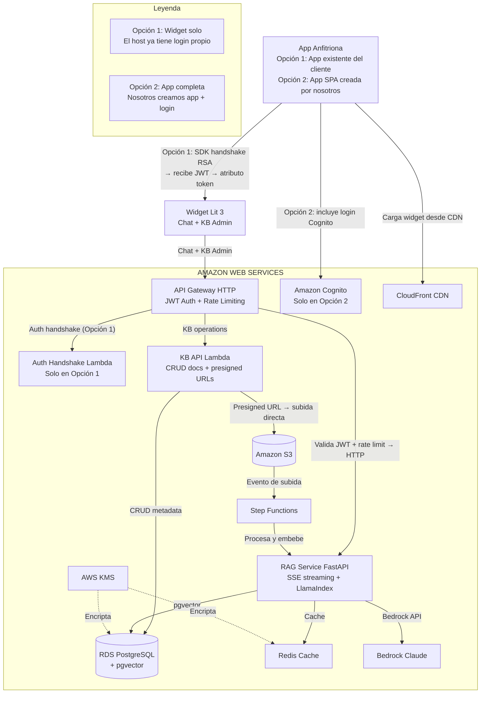
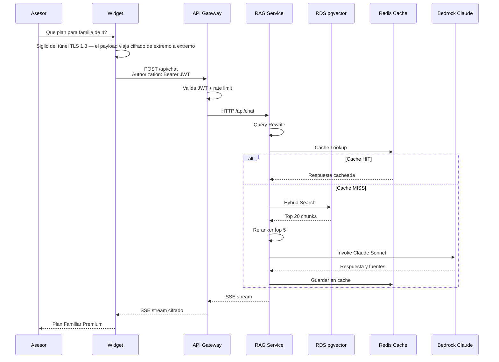
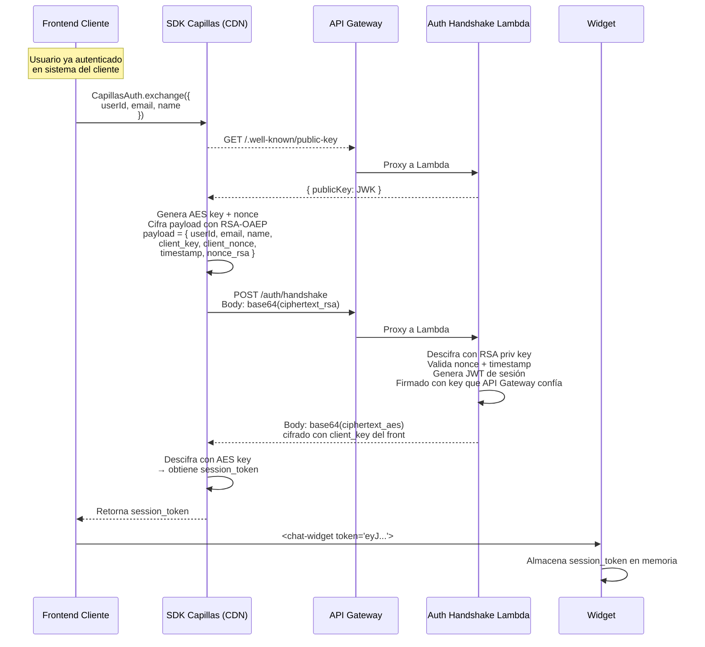
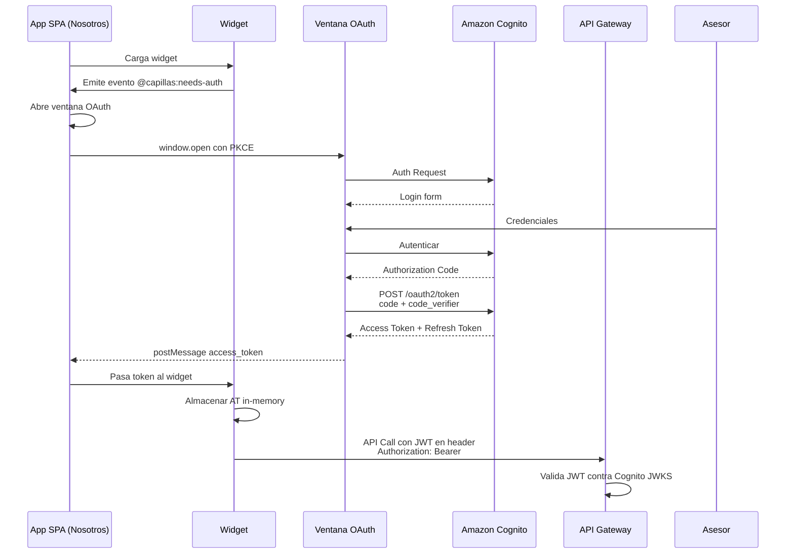
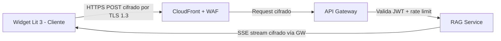
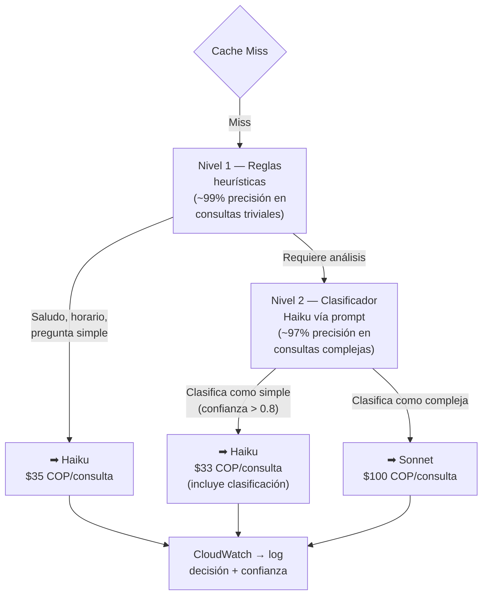
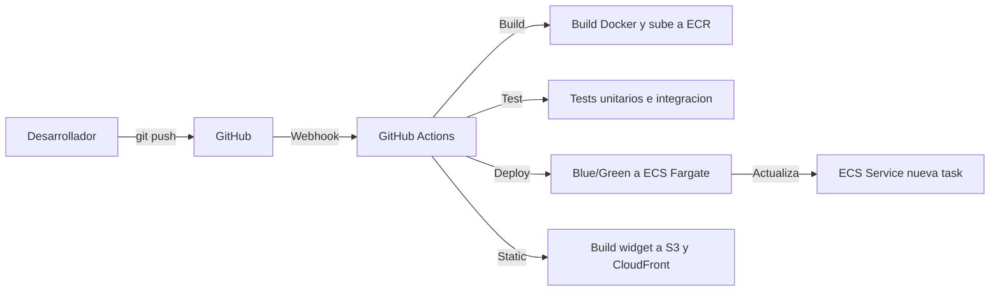
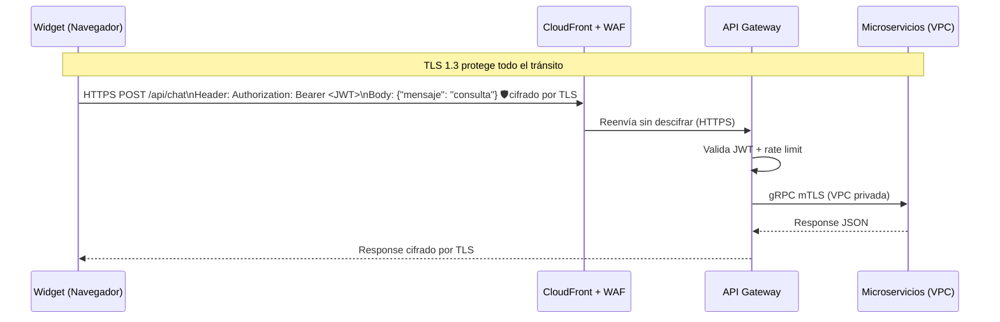
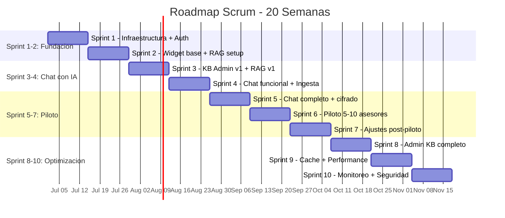

# PROPUESTA TECNOLÓGICA
## Sistema de Asesor Comercial Aumentado con IA — Capillas de la Fe

**Versión:** 1  
**Fecha:** Junio 2026  
**Clasificación:** Confidencial — Capillas de la Fe  
**Tasa de cambio:** $1 USD = $3,450 COP (referencia junio 2026)

---

## Índice

1. [Resumen Ejecutivo](#1-resumen-ejecutivo)
2. [Arquitectura del Sistema](#2-arquitectura-del-sistema)
3. [Stack Tecnológico Detallado](#3-stack-tecnológico-detallado)
4. [Comparativa Cloud Provider](#4-comparativa-cloud-provider)
5. [Seguridad](#5-seguridad)
6. [Plan de Implementación](#6-plan-de-implementación)
7. [Estimación de Costos](#7-estimación-de-costos)
8. [Modelos de Contratación y Precios](#8-modelos-de-contratación-y-precios)
9. [Referencias y Fuentes](#9-referencias-y-fuentes)

---

## 1. Resumen Ejecutivo

### 1.1 Objetivo del Sistema

Implementar un **Asistente Comercial Inteligente** basado en arquitectura RAG (Retrieval-Augmented Generation) que potencie a la fuerza de ventas de Capillas de la Fe con inteligencia artificial en tiempo real. El sistema permite a cada asesor acceder a información confiable, recomendaciones de planes, argumentos de venta personalizados y manejo de objeciones, todo desde un widget embebible en cualquier aplicación.

### 1.2 Stack Tecnológico Recomendado

| Capa | Tecnología | Especificación |
|------|-----------|----------------|
| **Frontend (Widget)** | [Lit 3](https://lit.dev/docs/) + [Custom Elements](https://developer.mozilla.org/en-US/docs/Web/API/Web_components) + [Vite IIFE](https://vite.dev/guide/build.html#library-mode) | Bundle ~20KB gzip, [Shadow DOM](https://developer.mozilla.org/en-US/docs/Web/API/Web_components/Using_shadow_DOM) nativo, 0 dependencias del host |
| **Autenticación** | [Amazon Cognito](https://docs.aws.amazon.com/cognito/latest/developerguide/what-is-amazon-cognito.html) + [OAuth 2.0](https://datatracker.ietf.org/doc/html/rfc6749) + [OIDC](https://openid.net/specs/openid-connect-core-1_0.html) + [PKCE](https://datatracker.ietf.org/doc/html/rfc7636) | 10K MAU gratis, MFA, SSO SAML/OIDC |
| **Backend** | [FastAPI](https://fastapi.tiangolo.com/) (Python 3.12) + [gRPC](https://grpc.io/docs/) | Async nativo, [SSE streaming](https://developer.mozilla.org/en-US/docs/Web/API/Server-sent_events), tipado fuerte |
| **RAG Orchestration** | [LlamaIndex](https://docs.llamaindex.ai/) (retrieval) + [LangChain](https://python.langchain.com/docs/) (agentes) | Mejor RAG out-of-box + agentes complejos |
| **Vector Database** | [RDS PostgreSQL](https://docs.aws.amazon.com/AmazonRDS/latest/UserGuide/Welcome.html) + [pgvector](https://github.com/pgvector/pgvector) | db.t4g.small — $28/mes 24/7 ($14/mes apagado nocturno). SQL + vectores en una DB, sin costo extra de licencia |
| **Embeddings** | [text-embedding-3-small](https://platform.openai.com/docs/guides/embeddings) (512d MRL) | ~$69 COP/1M tokens, 1,536 dims configurables |
| **LLM Principal** | [Claude Sonnet 4.6](https://aws.amazon.com/bedrock/claude/) (Bedrock) | ~$10.350/$51.750 COP por MTok, 200K contexto |
| **LLM Económico** | [Claude Haiku 4.5](https://aws.amazon.com/bedrock/claude/) (Bedrock) | ~$3.450/$17.250 COP por MTok, tareas simples alto volumen |
| **Caché** | [ElastiCache Redis](https://docs.aws.amazon.com/AmazonElastiCache/latest/red-ug/WhatIs.html) + [Semantic Cache](https://python.langchain.com/docs/how_to/contextual_compression/) (propuesta sujeta a pruebas — el negocio funerario tiene respuestas muy sensibles al contexto: una consulta de "planes para contratar" es distinta a "acabo de perder un ser querido", lo que puede reducir el hit rate del caché semántico) | Reduce costos LLM según escenario: **Optimista ~68%**, **Normal ~45%**, **Pesimista ~25%**. Latencia <10ms en cache hit |
| **Infraestructura** | [ECS Fargate](https://docs.aws.amazon.com/AmazonECS/latest/developerguide/AWS_Fargate.html) + [Lambda](https://docs.aws.amazon.com/lambda/latest/dg/welcome.html) + [S3](https://docs.aws.amazon.com/AmazonS3/latest/userguide/Welcome.html) + [CloudFront](https://docs.aws.amazon.com/AmazonCloudFront/latest/DeveloperGuide/Introduction.html) + [API Gateway HTTP](https://docs.aws.amazon.com/apigateway/latest/developerguide/http-api.html) | Serverless-first, sin Kubernetes. KB API en Lambda (escala a 0) |
| **Cifrado** | [TLS 1.3](https://datatracker.ietf.org/doc/html/rfc8446) + [HTTPS](https://developer.mozilla.org/en-US/docs/Web/HTTP/Guia_de_referencia/HTTPS) + [AWS KMS](https://docs.aws.amazon.com/kms/latest/developerguide/overview.html) + [ACM (TLS 1.3)](https://docs.aws.amazon.com/acm/latest/userguide/acm-overview.html) todo el canal + [mTLS](https://docs.aws.amazon.com/apigateway/latest/developerguide/rest-api-mutual-tls.html) entre microservicios | ACM gratuito, KMS ~$3.450/key/mes COP |
| **Observabilidad** | [CloudWatch](https://docs.aws.amazon.com/AmazonCloudWatch/latest/monitoring/WhatIsCloudWatch.html) + [X-Ray](https://docs.aws.amazon.com/xray/latest/devguide/aws-xray.html) | Logs, métricas (latencia, errores), alarmas y dashboards nativos AWS. Sin costos adicionales de herramientas externas |
| **CI/CD** | [GitHub Actions](https://docs.github.com/en/actions) + [ECR](https://docs.aws.amazon.com/AmazonECR/latest/userguide/what-is-ecr.html) + [ECS](https://docs.aws.amazon.com/AmazonECS/latest/developerguide/Welcome.html) | Despliegue automatizado [blue/green](https://docs.aws.amazon.com/AmazonECS/latest/developerguide/deployment-type-bluegreen.html) |

### 1.3 Costo Mensual de Infraestructura AWS (COP) (Los costos de nube varían según escenario de caché, routing y consumo. Ver sección 7 para desglose detallado)

> **Nota:** Esta tabla muestra exclusivamente el costo de los servicios en la nube AWS. No incluye desarrollo, soporte, mantenimiento ni margen de servicio. Para el costo total del servicio mensual (infra + soporte + margen), ver [Sección 8 — Modelos de Contratación](#8-modelos-de-contratación-y-precios).

| Etapa | Costo/mes (USD) | Costo/mes (COP) | Usuarios | Descripción |
|-------|-----------------|------------------|----------|-------------|
| **Desarrollo** | ~$146/mes | ~$504.000 | < 10 asesores | 1 ECS (RAG) + Lambda (KB + Auth), apagado nocturno |
| **Piloto (5-10 asesores)** | ~$220/mes | ~$759.000 | 5-10 asesores | Misma arquitectura que prod, dimensionamiento menor |
| **Producción (100 asesores)** | ~$917/mes | ~$3.163.000 | 100 asesores | 1 ECS (RAG) + Lambda + RDS, 24/7 |
| **Escalado (500+ asesores)** | ~$3.752/mes | ~$12.944.000 | 500+ asesores | HA completa, múltiples AZ, incluye infraestructura de red |

---

## 2. Arquitectura del Sistema

### 2.1 Modalidades de Despliegue

El sistema soporta **dos modalidades de despliegue** según la infraestructura que tenga Capillas de la Fe:

| Aspecto | Opción 1 — Widget solo | Opción 2 — App completa |
|---------|----------------------|------------------------|
| **¿Quién provee la app anfitriona?** | Capillas de la Fe (su app existente: WordPress, React, etc.) | Nosotros creamos una app SPA minimalista |
| **¿Quién maneja el login?** | Capillas de la Fe (su propio sistema de auth existente) | Nosotros ([Cognito](https://docs.aws.amazon.com/cognito/latest/developerguide/what-is-amazon-cognito.html) + [OAuth 2.0](https://datatracker.ietf.org/doc/html/rfc6749)) |
| **¿Cómo recibe el token el widget?** | Frontend usa SDK Capillas (CDN). SDK hace [handshake RSA](https://datatracker.ietf.org/doc/html/rfc8017) con Auth Lambda via [API Gateway](https://docs.aws.amazon.com/apigateway/latest/developerguide/http-api.html) → recibe [JWT](https://datatracker.ietf.org/doc/html/rfc7519) → lo pasa al widget vía atributo `token` | Flujo [OAuth 2.0](https://datatracker.ietf.org/doc/html/rfc6749) + [PKCE](https://datatracker.ietf.org/doc/html/rfc7636) manejado por el widget |
| **Widget muestra login UI** | ❌ No — el frontend obtiene token via SDK sin intervención del usuario | ✅ Sí — el widget abre ventana [OAuth](https://datatracker.ietf.org/doc/html/rfc6749) |
| **Cognito necesario** | ❌ No — la Auth Lambda genera y firma el [JWT](https://datatracker.ietf.org/doc/html/rfc7519) con su propia key. El frontend del cliente autentica usuarios con su sistema, llama a nuestro SDK (CDN), que hace [handshake RSA](https://datatracker.ietf.org/doc/html/rfc8017) con la Lambda via [API Gateway](https://docs.aws.amazon.com/apigateway/latest/developerguide/http-api.html) y recibe el [JWT](https://datatracker.ietf.org/doc/html/rfc7519) firmado por nosotros | ✅ Sí — [Cognito](https://docs.aws.amazon.com/cognito/latest/developerguide/what-is-amazon-cognito.html) maneja [OAuth 2.0](https://datatracker.ietf.org/doc/html/rfc6749) + [PKCE](https://datatracker.ietf.org/doc/html/rfc7636). Los tokens (Access, Refresh, ID) los genera Cognito |
| **Complejidad de integración** | Baja — el desarrollador del cliente agrega `<script>`, llama a `CapillasAuth.exchange()` y pasa el token al widget. No requiere configurar [OAuth](https://datatracker.ietf.org/doc/html/rfc6749), redirect URIs, ni flujos de autorización | Media — requiere configurar Cognito User Pool, Client IDs, OAuth scopes, redirect URIs, y manejar el flujo [PKCE](https://datatracker.ietf.org/doc/html/rfc7636) |
| **Ideal para** | Capillas ya tiene app con login propio | Capillas NO tiene app o quiere login gestionado |



### 2.2 Flujo de Consulta (Asesor → Respuesta)



> **Nota:** "Cache HIT" significa que la respuesta ya estaba guardada en caché (se entrega inmediatamente sin costo de IA). "Cache MISS" significa que no estaba guardada y hay que calcularla completa.

### 2.3 Flujo de Autenticación

#### Opción 1 — Auth delegada al Host (Capillas maneja login)

Cuando Capillas ya tiene su propio sistema de autenticación, el frontend del cliente obtiene un token de sesión mediante un **handshake cifrado** con una Lambda serverless. El cliente no escribe crypto — solo importa nuestro script CDN y llama a una función.



El cliente solo necesita importar nuestro SDK (alojado en CDN) y llamar a una función con los datos del usuario que ya tiene por su login (ID, nombre, email). El SDK internamente:

1. Obtiene la llave [RSA](https://datatracker.ietf.org/doc/html/rfc8017) pública de nuestra Lambda Auth desde un endpoint público en API Gateway
2. Genera una clave [AES-256](https://csrc.nist.gov/publications/detail/sp/800-38d/final) temporal y un número aleatorio de un solo uso (nonce)
3. Cifra los datos del usuario junto con la clave [AES](https://csrc.nist.gov/publications/detail/sp/800-38d/final) y el nonce usando [RSA](https://datatracker.ietf.org/doc/html/rfc8017)
4. Envía todo a nuestra Lambda Auth via API Gateway (`POST /auth/handshake`)
5. La Lambda descifra con su llave privada, valida que el nonce no se haya usado antes (anti-replay), y genera un [JWT](https://datatracker.ietf.org/doc/html/rfc7519) de sesión con vigencia de 15 minutos, firmado con una key que API Gateway reconoce
6. Devuelve el [JWT](https://datatracker.ietf.org/doc/html/rfc7519) cifrado con la clave [AES](https://csrc.nist.gov/publications/detail/sp/800-38d/final) que el SDK generó
7. El SDK descifra la respuesta y entrega el token al cliente

**Seguridad del handshake:**
- [RSA](https://datatracker.ietf.org/doc/html/rfc8017) cifra todo el payload → nadie en el medio puede leer los datos del usuario ni la clave [AES](https://csrc.nist.gov/publications/detail/sp/800-38d/final)
- La clave [AES](https://csrc.nist.gov/publications/detail/sp/800-38d/final) vive solo en memoria RAM del navegador y no se puede exportar ni leer desde la consola
- El nonce + timestamp evita que un atacante re-envíe una solicitud interceptada (replay attack)
- [CORS](https://developer.mozilla.org/en-US/docs/Web/HTTP/CORS) restringido al dominio del cliente bloquea handshakes desde sitios externos
- El token final es un [JWT](https://datatracker.ietf.org/doc/html/rfc7519) firmado por la Lambda con una key que [API Gateway](https://docs.aws.amazon.com/apigateway/latest/developerguide/http-api.html) reconoce → API Gateway valida el JWT en cada request sin depender de sistemas externos
- Todos los requests posteriores del widget viajan por [HTTPS](https://developer.mozilla.org/en-US/docs/Web/HTTP/Guia_de_referencia/HTTPS) con [TLS 1.3](https://datatracker.ietf.org/doc/html/rfc8446). El token [JWT](https://datatracker.ietf.org/doc/html/rfc7519) va en el header `Authorization: Bearer` dentro del canal cifrado

#### Opción 2 — Auth gestionada (Nosotros manejamos login y app)

Cuando Capillas no tiene app ni login, construimos una app SPA con [Cognito](https://docs.aws.amazon.com/cognito/latest/developerguide/what-is-amazon-cognito.html) + [OAuth 2.0](https://datatracker.ietf.org/doc/html/rfc6749) + [PKCE](https://datatracker.ietf.org/doc/html/rfc7636). El flujo PKCE permite que el **navegador** intercambie el código de autorización directamente con Cognito — no se necesita un backend intermedio. El Access Token [JWT](https://datatracker.ietf.org/doc/html/rfc7519) resultante se envía en el header `Authorization: Bearer` a [API Gateway](https://docs.aws.amazon.com/apigateway/latest/developerguide/http-api.html), que lo valida contra el JWKS de Cognito de forma nativa.



### 2.4 Flujo de Seguridad — TLS 1.3



---

## 3. Stack Tecnológico Detallado

### 3.1 Frontend — Widget Embebible

#### 3.1.1 Arquitectura del Widget

El widget se construye con **[Lit 3](https://lit.dev/docs/)** como [Web Component](https://developer.mozilla.org/en-US/docs/Web/API/Web_components) nativo, empaquetado como **IIFE** (Immediately Invoked Function Expression) mediante **[Vite](https://vite.dev/guide/build.html#library-mode)**. Esto permite instalarlo en cualquier aplicación web agregando un simple `<script>` tag, sin importar el framework del host.

**Requisito clave:** No depende de Module Federation, Webpack, ni ningún bundler del host. Funciona en WordPress, PHP, React, Angular, Vue, jQuery, HTML plano.

#### 3.1.2 Instalación

El widget se instala agregando un `<script>` tag y un [custom element](https://developer.mozilla.org/en-US/docs/Web/API/Web_components) en el HTML del host. Se configura mediante atributos HTML como `api-key`, `theme`, `position` e `idioma`. No requiere frameworks, bundlers ni dependencias adicionales.

#### 3.1.3 Stack del Widget

| Componente | Tecnología | Versión | Tamaño |
|------------|-----------|---------|--------|
| Framework | Lit | 3.x | ~5 KB gzip |
| Build | Vite | 6.x | — |
| Formato output | IIFE | — | ~20 KB gzip total |
| Shadow DOM | Nativo | — | CSS aislado automático |
| Cifrado | [TLS 1.3](https://datatracker.ietf.org/doc/html/rfc8446) + [HTTPS](https://developer.mozilla.org/en-US/docs/Web/HTTP/Guia_de_referencia/HTTPS) + [JWT](https://datatracker.ietf.org/doc/html/rfc7519) | Nativo del navegador + CloudFront |
| Testing | Web Test Runner | — | — |

#### 3.1.4 Flujo de Comunicación con el Host

El widget expone una API de comunicación bidireccional que soporta los dos modos de despliegue:

**Opción 1 — Widget solo (host maneja auth):** El host importa nuestro SDK de autenticación (CDN) y llama a una función con los datos del usuario. El SDK hace el handshake [RSA](https://datatracker.ietf.org/doc/html/rfc8017) con la Auth Lambda via [API Gateway](https://docs.aws.amazon.com/apigateway/latest/developerguide/http-api.html), recibe el [JWT](https://datatracker.ietf.org/doc/html/rfc7519) y lo retorna. El host pasa ese token al widget mediante atributo HTML, propiedad JS o postMessage.

**Opción 2 — App completa (nosotros manejamos auth):** La app SPA que nosotros construimos maneja el flujo [OAuth](https://datatracker.ietf.org/doc/html/rfc6749) con [Cognito](https://docs.aws.amazon.com/cognito/latest/developerguide/what-is-amazon-cognito.html). Obtiene el token mediante el flujo estándar (authorization code + [PKCE](https://datatracker.ietf.org/doc/html/rfc7636)) y se lo pasa al widget.

**Comunicación host ↔ widget:**
La comunicación entre el host y el widget es bidireccional. El host puede pasar el token al widget mediante atributo HTML, propiedad JavaScript o postMessage. El widget notifica al host cuando el token está por expirar mediante eventos DOM o postMessage.

#### 3.1.5 Manejo de Tokens en el Widget

El manejo de tokens difiere según la opción de despliegue. En ambos modos, el widget **nunca** almacena tokens en localStorage o sessionStorage — solo en memoria volátil.

**Opción 1 (Widget solo):** El host obtiene el token mediante el handshake [RSA](https://datatracker.ietf.org/doc/html/rfc8017) (ver sección 2.3). El token es un [JWT](https://datatracker.ietf.org/doc/html/rfc7519) firmado por la Auth Lambda con vigencia de 15 minutos. Cuando expira, el host repite el handshake para obtener uno nuevo.

**Opción 2 (App completa):** La app SPA maneja el flujo [OAuth](https://datatracker.ietf.org/doc/html/rfc6749) con [Cognito](https://docs.aws.amazon.com/cognito/latest/developerguide/what-is-amazon-cognito.html). Se utilizan tres tipos de token: Access Token ([JWT](https://datatracker.ietf.org/doc/html/rfc7519), 15 min, en memoria para API calls), Refresh Token (30 días, en cookie segura HttpOnly para renovar), e ID Token (1 hora, en memoria para perfil de usuario).

#### 3.1.6 Seguridad en el Widget

El widget utiliza [HTTPS](https://developer.mozilla.org/en-US/docs/Web/HTTP/Guia_de_referencia/HTTPS) con [TLS 1.3](https://datatracker.ietf.org/doc/html/rfc8446) para toda la comunicación. No se requiere cifrado adicional a nivel de aplicación — TLS 1.3 protege el payload y headers en tránsito de forma nativa, igual que en banca online y comercio electrónico.

El [JWT](https://datatracker.ietf.org/doc/html/rfc7519) de autenticación viaja en el header `Authorization: Bearer` dentro del túnel TLS. Tiene expiración de 15 minutos y se refresca automáticamente mediante refresh token rotativo.

**Seguridad web adicional:** [Content Security Policy](https://developer.mozilla.org/en-US/docs/Web/HTTP/Headers/Content-Security-Policy) (CSP) restringe qué scripts pueden ejecutarse en el widget. [HSTS](https://developer.mozilla.org/en-US/docs/Web/HTTP/Headers/Strict-Transport-Security) forza HTTPS. CORS limitado al dominio del cliente.

#### 3.1.7 Widget de Administración de Knowledge Base (KB Admin Widget)

Al igual que el widget de chat, el panel de administración de la base de conocimiento se construye como un **[Lit 3](https://lit.dev/docs/) [Custom Element](https://developer.mozilla.org/en-US/docs/Web/API/Web_components) empaquetado como IIFE**, con la misma seguridad [TLS 1.3](https://datatracker.ietf.org/doc/html/rfc8446) + [JWT](https://datatracker.ietf.org/doc/html/rfc7519). Esto permite **reutilizarlo en cualquier cliente** con un simple `<script>` tag, sin importar el framework del host. Los asesores NUNCA ven este panel — solo los administradores lo usan para gestionar documentos.

Se instala de la misma forma que el widget de chat: mediante un `<script>` tag y un custom element, con atributos de configuración.

**Funcionalidades:**

| Funcionalidad | Descripción |
|--------------|-------------|
| **Subida de documentos** | Arrastrar y soltar PDF, DOCX, MD, TXT. Todos se convierten internamente a Markdown preservando tablas y estructura. Carga batch. |
| **Listado de documentos** | Ver todos los documentos cargados, buscar por nombre/categoría |
| **Visor/descarga** | Visualizar el documento original en el navegador o descargarlo |
| **Metadatos** | Etiquetar documentos por categoría (planes, objetos, playbooks, clientes, reglas) |
| **Historial de ingesta** | Ver estado de cada documento (pendiente, procesando, indexado, error) |
| **Gestión de versiones** | Reemplazar/reindexar documentos sin perder el histórico |

**Stack:**

| Componente | Tecnología | Notas |
|------------|-----------|-------|
| Framework | Lit 3 | Mismo que el widget de chat |
| Build | Vite IIFE | Mismo bundle, mismo formato |
| Autenticación | Opción 1: token del host<br/>Opción 2: [Cognito](https://docs.aws.amazon.com/cognito/latest/developerguide/what-is-amazon-cognito.html) (rol admin) | Depende del modo de despliegue |
| Cifrado | [TLS 1.3](https://datatracker.ietf.org/doc/html/rfc8446) + [JWT](https://datatracker.ietf.org/doc/html/rfc7519) | **Misma estrategia que el chat** — canal cifrado por TLS |
| Hosting | [S3](https://docs.aws.amazon.com/AmazonS3/latest/userguide/Welcome.html) + [CloudFront](https://docs.aws.amazon.com/AmazonCloudFront/latest/DeveloperGuide/Introduction.html) | Mismo CDN, ruta `/admin/` |
| API | [Lambda](https://docs.aws.amazon.com/lambda/latest/dg/welcome.html) (Python 3.12) | Endpoints protegidos con [JWT](https://datatracker.ietf.org/doc/html/rfc7519) + [TLS 1.3](https://datatracker.ietf.org/doc/html/rfc8446). La Lambda escala a 0 cuando no hay actividad — solo se paga por uso |
| Pipeline ingesta | [S3](https://docs.aws.amazon.com/AmazonS3/latest/userguide/Welcome.html) → [Step Functions](https://docs.aws.amazon.com/step-functions/latest/dg/welcome.html) → [Lambda](https://docs.aws.amazon.com/lambda/latest/dg/welcome.html) → [pgvector](https://github.com/pgvector/pgvector) | Automático |

**Comunicación:** El KB Admin Widget se comunica con [API Gateway HTTP](https://docs.aws.amazon.com/apigateway/latest/developerguide/http-api.html) vía [HTTPS](https://developer.mozilla.org/en-US/docs/Web/HTTP/Guia_de_referencia/HTTPS) con [TLS 1.3](https://datatracker.ietf.org/doc/html/rfc8446). El token [JWT](https://datatracker.ietf.org/doc/html/rfc7519) viaja en el header `Authorization: Bearer`. API Gateway enruta las peticiones CRUD del KB Admin a la [Lambda](https://docs.aws.amazon.com/lambda/latest/dg/welcome.html) de Knowledge Base, que se conecta a [RDS](https://docs.aws.amazon.com/AmazonRDS/latest/UserGuide/Welcome.html) mediante [IAM Auth](https://docs.aws.amazon.com/AmazonRDS/latest/UserGuide/UsingWithRDS.IAMDBAuth.html).

**Flujo de ingesta de documentos:** El administrador inicia la subida desde el KB Admin Widget. El widget solicita una **URL prefirmada** ([presigned URL](https://docs.aws.amazon.com/AmazonS3/latest/userguide/using-presigned-url.html)) a la [Lambda KB API](https://docs.aws.amazon.com/lambda/latest/dg/welcome.html), que genera una URL con validez de 5 minutos. El widget sube el archivo directamente a [S3](https://docs.aws.amazon.com/AmazonS3/latest/userguide/Welcome.html) usando esa URL — el archivo nunca pasa por [API Gateway](https://docs.aws.amazon.com/apigateway/latest/developerguide/http-api.html) ni por la Lambda (evita el límite de 10MB de API Gateway y el tiempo de ejecución de Lambda). El archivo original se conserva intacto en S3.

Inmediatamente después de la subida, [S3](https://docs.aws.amazon.com/AmazonS3/latest/userguide/Welcome.html) dispara un evento que inicia el flujo automático en [Step Functions](https://docs.aws.amazon.com/step-functions/latest/dg/welcome.html): (1) **Convierte el documento a Markdown** — PDFs y DOCXs se transforman a Markdown preservando tablas, listas, títulos y jerarquía; TXT y MD se mantienen tal cual. El Markdown se almacena junto al original en S3. (2) Divide el Markdown en fragmentos semánticos. (3) Extrae metadatos (categoría, fecha, versión). (4) Genera vectores ([embeddings](https://platform.openai.com/docs/guides/embeddings)) con [Titan Embeddings V2](https://docs.aws.amazon.com/bedrock/latest/userguide/titan-embedding-models.html). (5) Almacena en [RDS](https://docs.aws.amazon.com/AmazonRDS/latest/UserGuide/Welcome.html) [pgvector](https://github.com/pgvector/pgvector). Los LLMs entienden Markdown de forma nativa — tablas, formato y jerarquía se preservan mucho mejor que con texto plano extraído de PDF.

> **Ventaja de la arquitectura Lambda + presigned URLs:** La Lambda de KB API solo se ejecuta cuando hay actividad administrativa (subir, listar, eliminar documentos). Con ~200 operaciones/mes y ~45 segundos por ejecución, el costo es inferior a **$1 USD/mes**. A diferencia de un servicio ECS que corre 24/7 (~$25/mes), la Lambda escala a 0 y solo consume recursos cuando se usa.

> **Flujo de trabajo para TI (actualización de planes):** El proceso manual para mantener la base de conocimiento actualizada es:
> 1. **Preparar** el documento nuevo (PDF, DOCX o MD) con las tarifas actualizadas siguiendo la misma estructura del anterior
> 2. **Subir** al KB Admin Panel, seleccionando la misma categoría y nombre identificador
> 3. **Confirmar** el reemplazo cuando el sistema pregunte "Ya existe un documento con este nombre. ¿Reemplazar versión anterior?"
> 4. **Verificar** el estado en el historial de ingesta (pasa de "procesando" a "indexado" en ~30-60s)
> 5. **Probar** con una consulta de prueba desde el panel o desde el widget de chat para confirmar que el asistente responde con la nueva información
> 6. El cambio es inmediato — desde el momento en que el estado cambia a "indexado", el asistente usa la nueva versión. No hay ventana de mantenimiento ni downtime

### 3.2 Backend — Microservicios

> **Nota sobre terminología:**
> - **[API Gateway](https://docs.aws.amazon.com/apigateway/latest/developerguide/http-api.html)**: punto de entrada único para todo el tráfico. Valida [JWT](https://datatracker.ietf.org/doc/html/rfc7519) de forma nativa (Cognito o Auth Lambda), aplica rate limiting por usuario, y enruta al servicio correspondiente.
> - **RAG Service**: servicio FastAPI que maneja tanto las consultas RAG como el [SSE streaming](https://developer.mozilla.org/en-US/docs/Web/API/Server-sent_events) y la orquestación de respuestas. Es el único backend interno. Se comunica con [RDS](https://docs.aws.amazon.com/AmazonRDS/latest/UserGuide/Welcome.html) (pgvector), [Redis](https://docs.aws.amazon.com/AmazonElastiCache/latest/red-ug/WhatIs.html) y [Bedrock](https://docs.aws.amazon.com/bedrock/latest/userguide/what-is-bedrock.html).
> - **[Lambda](https://docs.aws.amazon.com/lambda/latest/dg/welcome.html)**: la API de Knowledge Base y el Auth Handshake (Opción 1) se implementan como funciones Lambda serverless, ya que son operaciones esporádicas que no justifican un contenedor 24/7.

#### 3.2.1 Servicios y Tecnologías

| Servicio | Lenguaje | Framework | Cómputo | Observaciones |
|----------|----------|-----------|---------|---------------|
| **RAG Service** | [Python 3.12](https://docs.python.org/3.12/) | [FastAPI](https://fastapi.tiangolo.com/) + [LlamaIndex](https://docs.llamaindex.ai/) | [ECS Fargate](https://docs.aws.amazon.com/AmazonECS/latest/developerguide/AWS_Fargate.html) 1 vCPU, 2 GB | HTTP/[SSE](https://developer.mozilla.org/en-US/docs/Web/API/Server-sent_events), 2 réplicas. Entrada directa desde [API Gateway](https://docs.aws.amazon.com/apigateway/latest/developerguide/http-api.html). Orquestación + streaming + RAG |
| **Auth Handshake Lambda** | [Python 3.12](https://docs.python.org/3.12/) | — | [Lambda](https://docs.aws.amazon.com/lambda/latest/dg/welcome.html) 256 MB, 10s timeout | Solo Opción 1. Handshake [RSA](https://datatracker.ietf.org/doc/html/rfc8017) + generación de [JWT](https://datatracker.ietf.org/doc/html/rfc7519). Gatillado por [API Gateway HTTP](https://docs.aws.amazon.com/apigateway/latest/developerguide/http-api.html) |
| **Knowledge Base (KB) API** | [Python 3.12](https://docs.python.org/3.12/) | — | [Lambda](https://docs.aws.amazon.com/lambda/latest/dg/welcome.html) 512 MB, 30s timeout | CRUD de documentos + presigned URLs. Escala a 0, solo se paga por uso. Gatillado por [API Gateway HTTP](https://docs.aws.amazon.com/apigateway/latest/developerguide/http-api.html) |
| **Knowledge Base (KB) API** | [Python 3.12](https://docs.python.org/3.12/) | — | [Lambda](https://docs.aws.amazon.com/lambda/latest/dg/welcome.html) 512 MB, 30s timeout | CRUD de documentos + presigned URLs. Escala a 0, solo se paga por uso. Gatillado por [API Gateway HTTP](https://docs.aws.amazon.com/apigateway/latest/developerguide/http-api.html) |

#### 3.2.2 Comunicación entre Servicios

| De | A | Protocolo | Autenticación | Propósito |
|----|---|-----------|---------------|-----------|
| [CloudFront](https://docs.aws.amazon.com/AmazonCloudFront/latest/DeveloperGuide/Introduction.html) | [API Gateway](https://docs.aws.amazon.com/apigateway/latest/developerguide/http-api.html) | HTTPS (TLS 1.3) | [JWT](https://datatracker.ietf.org/doc/html/rfc7519) + [OAuth](https://datatracker.ietf.org/doc/html/rfc6749) | Solicitudes widget |
| [API Gateway](https://docs.aws.amazon.com/apigateway/latest/developerguide/http-api.html) | [RAG Service](https://docs.aws.amazon.com/AmazonECS/latest/developerguide/AWS_Fargate.html) | HTTPS (HTTP/1.1) | [JWT](https://datatracker.ietf.org/doc/html/rfc7519) validado (API Gateway) + VPC Link | Consultas chat + SSE streaming |
| [API Gateway](https://docs.aws.amazon.com/apigateway/latest/developerguide/http-api.html) | [KB API Lambda](https://docs.aws.amazon.com/lambda/latest/dg/welcome.html) | HTTPS (Lambda proxy) | [IAM](https://docs.aws.amazon.com/IAM/latest/UserGuide/introduction.html) | CRUD documentos + presigned URLs |
| [API Gateway](https://docs.aws.amazon.com/apigateway/latest/developerguide/http-api.html) | [Auth Handshake Lambda](https://docs.aws.amazon.com/lambda/latest/dg/welcome.html) | HTTPS (Lambda proxy) | [IAM](https://docs.aws.amazon.com/IAM/latest/UserGuide/introduction.html) | Handshake RSA Opción 1 |
| RAG | [Bedrock](https://docs.aws.amazon.com/bedrock/latest/userguide/what-is-bedrock.html) | AWS SDK | [IAM Role](https://docs.aws.amazon.com/IAM/latest/UserGuide/introduction.html) | InvokeModel |
| RAG | [RDS](https://docs.aws.amazon.com/AmazonRDS/latest/UserGuide/Welcome.html) | PostgreSQL (TLS) | [IAM Auth](https://docs.aws.amazon.com/AmazonRDS/latest/UserGuide/UsingWithRDS.IAMDBAuth.html) | Queries [pgvector](https://github.com/pgvector/pgvector) |
| RAG | [Redis](https://docs.aws.amazon.com/AmazonElastiCache/latest/red-ug/WhatIs.html) | Redis (TLS) | [IAM Auth](https://docs.aws.amazon.com/AmazonRDS/latest/UserGuide/UsingWithRDS.IAMDBAuth.html) | Cache |

#### 3.2.3 Pipeline RAG (Detalle)

> **Requisito de documentos:** Los PDFs se suben en su formato original (incluso con tablas complejas) — el sistema los convierte automáticamente a Markdown preservando la estructura. No se requiere preparación previa. Los PDFs escaneados (imágenes) necesitan OCR ([AWS Textract](https://docs.aws.amazon.com/textract/latest/dg/what-is.html)), recomendamos digitalizar a texto nativo antes de la ingesta. Todos los formatos (PDF, DOCX, MD, TXT) se unifican internamente a Markdown para mejor comprensión del LLM.

El pipeline RAG tiene dos flujos:

**Ingesta (offline/batch):** Los documentos pasan por [S3](https://docs.aws.amazon.com/AmazonS3/latest/userguide/Welcome.html) → [Step Functions](https://docs.aws.amazon.com/step-functions/latest/dg/welcome.html):
1. **Conversión a Markdown**: PDF y DOCX se transforman a Markdown (tablas, listas, títulos). TXT y MD se mantienen. El original se conserva intacto en S3.
2. **Chunking semántico**: El Markdown se divide en fragmentos respetando la estructura (no se rompen tablas ni secciones).
3. **Embeddings**: Se generan vectores con [Titan Embeddings V2](https://docs.aws.amazon.com/bedrock/latest/userguide/titan-embedding-models.html) y se almacenan en [RDS PostgreSQL](https://docs.aws.amazon.com/AmazonRDS/latest/UserGuide/Welcome.html) [pgvector](https://github.com/pgvector/pgvector) con índice [HNSW](https://github.com/pgvector/pgvector?tab=readme-ov-file#hnsw).
4. **Metadatos**: Cada chunk almacena el nombre del documento original, su versión, categoría y fecha de ingesta para poder citar la fuente en las respuestas.

> **Costo del procesamiento de documentos:** El embedding de documentos es muy económico — [Titan Embeddings V2](https://docs.aws.amazon.com/bedrock/latest/userguide/titan-embedding-models.html) cuesta ~$0.00002/1K tokens. Un documento de 10 páginas (~30K tokens) cuesta ~$0.0006 (~$2 COP) en embeddings. Incluso con ciclos de prueba (subir → eliminar → re-subir), el costo es marginal. El procesamiento (Markdown, chunking) se ejecuta en [Lambda](https://docs.aws.amazon.com/lambda/latest/dg/welcome.html) y [Step Functions](https://docs.aws.amazon.com/step-functions/latest/dg/welcome.html) — también de costo despreciable (~$0.001 por documento). El plan Estándar incluye procesamiento de hasta **100 documentos/mes** (nuevos o actualizaciones) dentro de la mensualidad. Excesos se facturan a $5.000 COP por documento adicional.
>
> **Definición de "documento":** Se considera **1 documento = 1 archivo subido**, independientemente de su número de páginas, tamaño en MB, o si contiene tablas, imágenes o texto. Un PDF de tarifas de 50 páginas cuenta como 1 documento, igual que un TXT de 1 página. Esto aplica tanto para cargas nuevas como para actualizaciones (reemplazar un archivo existente por una nueva versión cuenta como 1 documento adicional).

> **Versiones y reemplazo:** Cuando se sube una nueva versión del mismo documento, el pipeline: (a) marca los chunks antiguos como obsoletos, (b) indexa los nuevos, (c) elimina los antiguos atómicamente. El reemplazo es inmediato — no hay periodo de convivencia ni respuestas con información mezclada.

**Consulta (online/tiempo real):** La consulta del asesor pasa por reescritura (corrección ortográfica y expansión), revisa el caché semántico en [Redis](https://docs.aws.amazon.com/AmazonElastiCache/latest/red-ug/WhatIs.html), y si no encuentra respuesta (cache MISS) ejecuta [búsqueda híbrida (BM25)](https://www.elastic.co/guide/en/elasticsearch/reference/current/query-dsl-match-bool-prefix-query.html) + vectores + filtros), reordenamiento con [cross-encoder](https://www.sbert.net/examples/applications/cross-encoder/README.html), expansión padre-hijo, ensamblaje de contexto, y finalmente invoca [Claude Sonnet](https://docs.anthropic.com/en/docs/build-with-claude/prompt-engineering) para generar la respuesta vía streaming.

> **Citación de fuentes (toggleable):** La respuesta del asistente puede incluir una nota al pie indicando de qué documento se obtuvo la información. Ej: "*Información obtenida del documento 'Plan Familiar Premium — Tarifas 2026' (subido el 15/03/2026)*". El administrador puede **activar o desactivar** esta funcionalidad desde el KB Admin Panel. Durante el piloto, se recomienda mantenerla activada para que los asesores verifiquen la fuente y reporten si un documento tiene información incorrecta — así se distingue entre un error del modelo y un error en el documento fuente.

#### 3.2.4 Model Routing — Clasificador de Complejidad de Consulta

Para decidir si una consulta va a **Haiku** (económico) o **Sonnet** (completo), implementamos un clasificador de dos niveles que minimiza el costo sin sacrificar calidad.

**Arquitectura del Routing:**

> ⚠️ **Nota sobre esta estrategia:** El modelo de routing es una **propuesta sujeta a validación en pruebas**. Es una estrategia de reducción de costos, pero puede perjudicar la calidad de las respuestas si el clasificador se equivoca (ej. una consulta compleja sobre un plan funerario que el sistema clasifica como simple y responde con Haiku, dando una respuesta insuficiente). Si las pruebas muestran degradación en la calidad, se debe:
> 1. Ajustar los umbrales de confianza
> 2. Simplificar el routing (solo Nivel 1 o eliminarlo completamente)
> 3. Esto implicaría un ahorro menor al proyectado inicialmente



**Nivel 1 — Reglas Heurísticas (sin costo):**

Se ejecuta antes de cualquier llamada a [Bedrock](https://docs.aws.amazon.com/bedrock/latest/userguide/what-is-bedrock.html). Usa expresiones regulares y patrones de texto. Clasifica como **simple** si alguna regla hace match:

| Categoría | Patrón | Ejemplo |
|-----------|--------|---------|
| Saludos | `^(hola\|buenos\|buenas\|hey\|saludos)[\s\p{P}]?` | "Hola", "Buenos días" |
| Despedidas | `^(gracias\|chao\|bye\|adiós\|nos vemos)[\s\p{P}]?` | "Gracias", "Chao" |
| Afirmación/negación | `^(sí\|no\|ok\|dale\|listo\|claro)[\s\p{P}]?$` | "Sí", "OK" |
| Cortas sin verbo | longitud < 4 palabras sin verbo conjugado | "Horarios", "¿Qué planes?" |
| Ayuda explícita | `^(ayuda\|help\|qué puedes hacer\|qué haces)` | "Ayuda", "¿Qué puedes hacer?" |
| Repetición | `^(repite\|otra vez\|no entendí\|no escuché)` | "Repite por favor" |

**Clasificación por reglas (Nivel 1):** Sin costo de IA. Usa patrones de texto para identificar consultas simples (saludos, horarios, agradecimientos) y complejas (comparaciones, recomendaciones, objeciones). Si las reglas no pueden clasificar, pasa al Nivel 2.

**Clasificador Haiku (Nivel 2):** ⚠️ **IMPORTANTE:** Llamar al clasificador Haiku **incurre en costos de inferencia**. Cada consulta que pasa a Nivel 2 cuesta ~$2-3 COP por la clasificación, incluso si luego se determina que es simple. Si la clasificación determina que es simple, la respuesta se genera en la misma llamada (costo total ~$35 COP). Si determina que es compleja, se invoca Sonnet aparte (costo total ~$103-138 COP). Solo cuando las reglas no deciden.

**Flujo completo de decisión:** El proceso sigue el diagrama anterior: Cache Miss → Nivel 1 (reglas heurísticas sin costo) → si clasifica como simple, responde Haiku; si no clasifica, pasa al Nivel 2 (Haiku clasificador) → si clasifica como simple con alta confianza responde Haiku; si es compleja responde Sonnet.

**Ahorro estimado por escenario:**

> 📐 **Nota sobre los cálculos:** Los costos son aditivos por consulta. Una consulta que pasa por todo el pipeline (cache miss → Nivel 1 regex → Nivel 2 Haiku clasificador → Sonnet) cuesta ~$103-138 (el clasificador Haiku + la respuesta Sonnet, más los costos de embedding y búsqueda). Los porcentajes de distribución son aproximados y se ajustarán con datos reales de producción.

**Escenario Optimista** (cache semántico efectivo, routing bien afinado):

| Tipo de consulta | % del total | Costo/consulta | Aporte al promedio* |
|-----------------|------------|---------------|---------------------|
| Cache hit | 68% | ~$0 | $0 |
| Simple (Nivel 1 — Haiku) | 12% | ~$35 | ~$4.20 |
| Simple (Nivel 2 — Haiku clasifica + responde) | 8% | ~$35 | ~$2.80 |
| Compleja (Sonnet, sin clasificador intermedio) | 12% | ~$100 | ~$12.00 |
| **Costo promedio ponderado** | 100% | | **~$19/consulta** |

*\*Aporte al promedio = (% × costo/consulta). Ej: 12% × $35 = $4.20. Es el peso de cada tipo de consulta en el costo promedio final.*

**Escenario Normal** (caché moderado, routing con algunos fallos a Nivel 2):

| Tipo de consulta | % del total | Costo/consulta | Contribución al promedio |
|-----------------|------------|---------------|--------------------------|
| Cache hit | 45% | ~$0 | $0 |
| Simple (Nivel 1 — Haiku) | 10% | ~$35 | ~$3.50 |
| Simple (Nivel 2 — Haiku clasifica + responde) | 15% | ~$35 | ~$5.25 |
| Compleja (Sonnet vía clasificador Nivel 2) | 30% | ~$138* | ~$41.40 |
| **Costo promedio ponderado** | 100% | | **~$50/consulta** |

*$138 = ~$3 clasificador Haiku + ~$135 Sonnet. En la práctica la clasificación Haiku y la respuesta Sonnet son dos llamadas separadas.

**Escenario Pesimista** (caché poco efectivo, routing desactivado por calidad):

| Tipo de consulta | % del total | Costo/consulta | Contribución al promedio |
|-----------------|------------|---------------|--------------------------|
| Cache hit | 25% | ~$0 | $0 |
| Simple (Nivel 1 — Haiku) | 5% | ~$35 | ~$1.75 |
| Compleja (Sonnet directo, sin routing) | 70% | ~$120 | ~$84.00 |
| **Costo promedio ponderado** | 100% | | **~$86/consulta** |

**Comparativa sin routing ni caché (todas las consultas a Sonnet): ~$120/consulta**

**Consideraciones adicionales:**

| Aspecto | Detalle |
|---------|---------|
| **Latencia Nivel 1** | < 1ms (regex en memoria, no hay I/O) |
| **Latencia Nivel 2** | ~300ms (Haiku es rápido) vs ~800ms si fuera directo a Sonnet — la clasificación apenas añade 100-200ms extras sobre el tiempo de respuesta de la consulta simple |
| **Degradación graceful** | Si Haiku clasificador falla (timeout o error), se asume COMPLEJA y se envía a Sonnet — pérdida de ahorro, no de calidad |
| **Monitoreo** | Cada decisión se loguea en CloudWatch: `{"query": "hash", "nivel": 1|2, "modelo": "haiku"|"sonnet", "confianza": 0.95}` |
| **Ajuste de umbrales** | El umbral de confianza (0.8) se ajusta según datos reales de producción. Si el log muestra consultas complejas mal clasificadas como simples, se sube el umbral |
| **Override manual** | El system prompt de Sonnet puede detectar inconsistencias y forzar re-consulta si detecta que la respuesta Haiku fue insuficiente |
| **Fallback por longitud** | Consultas con más de 150 tokens se envían directamente a Sonnet sin clasificar (asumimos que son complejas por su extensión) |

**Actualización del pipeline RAG con routing:** El modelo de routing se ejecuta **antes** de la búsqueda vectorial. Si la consulta es simple (saludo, horario), responde directamente con Haiku sin ejecutar [Hybrid Search](https://www.elastic.co/guide/en/elasticsearch/reference/current/query-dsl-match-bool-prefix-query.html), Reranker ni ningún otro paso costoso. Solo las consultas clasificadas como complejas pasan por el pipeline completo de retrieval. Esto ahorra cómputo y latencia, además de costo de IA.

### 3.3 Infraestructura AWS

#### 3.3.1 Servicios AWS Utilizados

| Servicio | Uso | Justificación |
|----------|-----|---------------|
| **[Cognito](https://docs.aws.amazon.com/cognito/latest/developerguide/what-is-amazon-cognito.html)** | Autenticación y autorización | 10K MAU gratis, [OAuth 2.0](https://datatracker.ietf.org/doc/html/rfc6749)/[OIDC](https://openid.net/specs/openid-connect-core-1_0.html), MFA, SSO |
| **[API Gateway HTTP](https://docs.aws.amazon.com/apigateway/latest/developerguide/http-api.html)** | API entry point | $1/1M requests (vs $3.50 REST), [JWT](https://datatracker.ietf.org/doc/html/rfc7519) auth nativo |
| **[ECS Fargate](https://docs.aws.amazon.com/AmazonECS/latest/developerguide/AWS_Fargate.html)** | Orquestación de microservicios (RAG) | Sin Kubernetes, ~$50-250/mes, auto-escalado |
| **[Lambda](https://docs.aws.amazon.com/lambda/latest/dg/welcome.html)** | KB API (CRUD documentos + presigned URLs) | Sin costo en reposo, solo se paga por ejecución. ~$0.50/mes para el volumen del proyecto |
| **[RDS](https://docs.aws.amazon.com/AmazonRDS/latest/UserGuide/Welcome.html) + [pgvector](https://github.com/pgvector/pgvector)** | Base de datos principal + vectores | [pgvector](https://github.com/pgvector/pgvector) gratis, datos relacionales + vectores en una DB |
| **[Bedrock](https://docs.aws.amazon.com/bedrock/latest/userguide/what-is-bedrock.html)** | LLM (Claude) + Embeddings (Titan) | Sin mínimo, pago por token, [Guardrails](https://docs.aws.amazon.com/bedrock/latest/userguide/guardrails.html). ⚠️ Cognito NO controla gasto de Bedrock. Para limitar por asesor se implementa middleware en RAG Service que lleva conteo de tokens/usuario en [DynamoDB](https://docs.aws.amazon.com/amazondynamodb/latest/developerguide/Introduction.html) y rechaza si excede su cupo. Las consultas que excedan el límite se facturan como excedente |
| **[ElastiCache (Redis)](https://docs.aws.amazon.com/AmazonElastiCache/latest/red-ug/WhatIs.html)** | Semantic cache, sesiones | Reduce costos LLM según escenario: **Optimista ~68%**, **Normal ~45%**, **Pesimista ~25%** |
| **[S3](https://docs.aws.amazon.com/AmazonS3/latest/userguide/Welcome.html) + [CloudFront](https://docs.aws.amazon.com/AmazonCloudFront/latest/DeveloperGuide/Introduction.html)** | Hosting widget estático | Transferencia S3→CF gratis, free tier 1TB/mes |
| **[KMS](https://docs.aws.amazon.com/kms/latest/developerguide/overview.html)** | Cifrado de datos en reposo | $1/key/mes (~$3.450 COP), integración nativa |
| **[ACM](https://docs.aws.amazon.com/acm/latest/userguide/acm-overview.html)** | Certificados TLS/SSL | GRATIS, renovación automática |
| **[CloudWatch](https://docs.aws.amazon.com/AmazonCloudWatch/latest/monitoring/WhatIsCloudWatch.html) + [X-Ray](https://docs.aws.amazon.com/xray/latest/devguide/aws-xray.html)** | Monitoreo y tracing | Incluido con AWS |
| **[Step Functions](https://docs.aws.amazon.com/step-functions/latest/dg/welcome.html)** | Orquestación de ingesta de documentos | Flujos async con retry/error handling |
| **[ECR](https://docs.aws.amazon.com/AmazonECR/latest/userguide/what-is-ecr.html)** | Registro de imágenes Docker | Sin costo de almacenamiento |
| **[VPC](https://docs.aws.amazon.com/vpc/latest/userguide/what-is-amazon-vpc.html) + Subnets + Security Groups** | Red privada para microservicios | Gratis (el VPC en sí no tiene costo). Incluye subnets públicas/privadas, route tables, internet gateway |
| **[NAT Gateway](https://docs.aws.amazon.com/vpc/latest/userguide/vpc-nat-gateway.html)** | Salida a internet desde subnets privadas | ~$33/mes + $0.045/GB procesado (~$50-70/mes con tráfico típico). Alternativa más barata: [VPC Gateway Endpoints](https://docs.aws.amazon.com/vpc/latest/privatelink/gateway-endpoints.html) para [S3](https://docs.aws.amazon.com/AmazonS3/latest/userguide/Welcome.html)/[DynamoDB](https://docs.aws.amazon.com/amazondynamodb/latest/developerguide/Introduction.html) (gratis) |
| **IPv4 Públicos** | IPs elásticas para NAT Gateway, balanceadores | $0.005/hr ≈ $3.60/mes por IP. Estimar 2-3 IPs |
| **[AWS WAF](https://docs.aws.amazon.com/waf/latest/developerguide/waf-chapter.html)** | Protección web en el edge + rate limiting, integrado con [CloudFront](https://docs.aws.amazon.com/AmazonCloudFront/latest/DeveloperGuide/Introduction.html) | $5/mes por Web ACL + $0.60/1M requests. ~$15-25/mes con tráfico típico |
| **[Route53](https://docs.aws.amazon.com/Route53/latest/DeveloperGuide/Welcome.html)** | DNS, dominio, health checks | $0.50/zone/mes + ~$12/año por dominio .com |
| **[CloudWatch](https://docs.aws.amazon.com/AmazonCloudWatch/latest/monitoring/WhatIsCloudWatch.html) Logs** | Logs de microservicios y auditoría | $0.50/GB ingerido (primeros 5GB gratis). ~$5-10/mes con retención 30 días |
| **[Secrets Manager](https://docs.aws.amazon.com/secretsmanager/latest/userguide/intro.html)** | Gestión de credenciales y API keys | $0.40/secret/mes + $0.05/10K llamadas. ~$8-15/mes para 20-30 secrets |
| **[ECR](https://docs.aws.amazon.com/AmazonECR/latest/userguide/what-is-ecr.html)** | Registro de imágenes Docker | $0.10/GB/mes de storage. ~$1-3/mes con limpieza automática |
| **[EC2 Instance Connect Endpoint](https://docs.aws.amazon.com/AWSEC2/latest/UserGuide/ec2-instance-connect-endpoint.html)** | Acceso seguro a DB sin bastion host | **Gratis** (reemplaza al bastion host tradicional ~$3-15/mes) |

> **Nota sobre servicios de red:** Servicios como [VPC](https://docs.aws.amazon.com/vpc/latest/userguide/what-is-amazon-vpc.html), [NAT Gateway](https://docs.aws.amazon.com/vpc/latest/userguide/vpc-nat-gateway.html), [WAF](https://docs.aws.amazon.com/waf/latest/developerguide/waf-chapter.html) y [Route53](https://docs.aws.amazon.com/Route53/latest/DeveloperGuide/Welcome.html) son "infraestructura invisible" — el cliente no los ve pero son necesarios para operar. Estimado adicional de ~$80-130/mes sobre la tabla de costos base.

#### 3.3.2 Recursos y Dimensionamiento por Ambiente

El sistema tiene un **stack único** que se replica en todos los ambientes (desarrollo, piloto y producción). La diferencia está en el dimensionamiento, no en la arquitectura. Esto garantiza que lo que funciona en desarrollo funciona igual en producción.

| Ambiente | Propósito | Apagado nocturno | Período |
|----------|-----------|------------------|---------|
| **Desarrollo** | Dev, pruebas, demos, sprints | ✅ ECS y RDS apagados 12h/día (noche y findes). Se enciende bajo demanda vía script o schedule | Meses 1-4 (luego se mantiene) |
| **Piloto** | 5-10 asesores reales | ❌ 24/7. Si el horario de uso lo permite, se puede apagar en franjas sin actividad | Meses 5-6 (~2 meses) |
| **Producción** | 100+ asesores | ❌ 24/7 | Desde mes 7 |
| **Escalado** | 500+ asesores | ❌ 24/7 | Desde mes 11-12 |

**Dimensionamiento base por servicio (aplica a todos los ambientes):**

| Servicio | Cómputo | Réplicas | Dev (apagado 12h) | Prod/Piloto 24/7 |
|----------|---------|----------|-------------------|-------------------|
| **RAG Service** | [ECS Fargate](https://docs.aws.amazon.com/AmazonECS/latest/developerguide/AWS_Fargate.html) 1 vCPU, 2 GB | 2 | ~$40/mes (12h) | ~$80/mes |
| **Auth Handshake Lambda** | [Lambda](https://docs.aws.amazon.com/lambda/latest/dg/welcome.html) 256 MB | — | < $0.10/mes | < $0.10/mes |
| **KB API** | [Lambda](https://docs.aws.amazon.com/lambda/latest/dg/welcome.html) 512 MB | — | < $1/mes | < $1/mes |
| **RDS pgvector** | db.t4g.small, 50 GB gp3 | 1 | ~$14/mes (12h) | ~$28/mes |
| **Redis** | ElastiCache Serverless 0.5 GB | 1 | — | ~$20/mes |
| **Total servicios** | | | **~$55/mes** | **~$129/mes** |

El ahorro del KB en Lambda vs ECS se aplica a **todos los ambientes**: ~$24.50/mes USD (~$84.500 COP/mes) por ambiente. En desarrollo el ahorro es ~$12/mes (ECS apagado 12h vs Lambda bajo demanda). Además, se eliminó el servicio BFF (0.5 vCPU, 1 GB, 2 réplicas) — un ahorro adicional de ~$50/mes por ambiente 24/7 (~$25/mes en desarrollo por apagado nocturno). También se eliminó el Analytics ECS (0.25 vCPU, 0.5 GB) — ~$25/mes por ambiente 24/7 (~$12/mes en desarrollo). El cambio de Aurora Serverless v2 a RDS db.t4g.small ahorra ~$52/mes en producción 24/7 (~$14/mes en desarrollo nocturno). Toda la observabilidad se maneja con CloudWatch nativo.

> **Nota:** Los costos de infraestructura adicional (VPC, NAT Gateway, WAF, Route53, CloudWatch Logs, Secrets Manager) suman ~$80-130/mes sin importar cuántos ambientes haya — ver detalle en [sección 3.3.1](#331-servicios-aws-utilizados). Estos costos fijos se comparten entre ambientes cuando usan la misma VPC.

### 3.4 CI/CD — Pipeline de Despliegue Continuo

> **Costos de CI/CD:** GitHub Actions tiene un free tier de 2.000 min/mes (suficiente para este proyecto). ECR storage ~$1-3/mes. Costos adicionales mínimos. Si se supera el free tier: $0.006/min adicional.

#### 3.4.1 Arquitectura del Pipeline



#### 3.4.2 Flujo de Despliegue por Servicio

| Paso | Acción | Herramienta | Tiempo estimado |
|------|--------|-------------|-----------------|
| 1 | Push a rama `main` o `feat/*` | git | — |
| 2 | Trigger workflow por servicio afectado | GitHub Actions (path filter) | ~1s |
| 3 | Linting y type checking | [ruff](https://docs.astral.sh/ruff/) (Python) / eslint (TS) | ~30s |
| 4 | Tests unitarios | [pytest](https://docs.pytest.org/) / web-test-runner | ~2min |
| 5 | Build imagen Docker | Docker Buildx + cache [ECR](https://docs.aws.amazon.com/AmazonECR/latest/userguide/what-is-ecr.html) | ~3min |
| 6 | Escaneo de vulnerabilidades | [Trivy](https://trivy.dev/) / [Snyk](https://snyk.io/) | ~1min |
| 7 | Push a [ECR](https://docs.aws.amazon.com/AmazonECR/latest/userguide/what-is-ecr.html) | Docker push | ~1min |
| 8 | Actualizar task definition [ECS](https://docs.aws.amazon.com/AmazonECS/latest/developerguide/AWS_Fargate.html) | AWS CLI + register-task-definition | ~10s |
| 9 | Despliegue Blue/Green | ECS deploy (CodeDeploy) | ~5min |
| 10 | Health check + rollback automático | [CloudWatch](https://docs.aws.amazon.com/AmazonCloudWatch/latest/monitoring/WhatIsCloudWatch.html) + CodeDeploy | ~2min |
| **Total** | | | **~15min** |

#### 3.4.3 Repositorios y Estrategia de Branching

| Rama | Propósito | CI/CD |
|------|-----------|-------|
| `main` | Producción | Deploy automático a ECS prod |
| `staging` | Pre-producción | Deploy automático a ECS staging |
| `feat/*` | Features | Tests + build, sin deploy |
| `fix/*` | Hotfixes | Tests + build + deploy directo a staging |
| `infra/*` | Cambios de infraestructura | [Terraform](https://developer.hashicorp.com/terraform/docs) plan + apply automático |

#### 3.4.4 Secretos y Variables de Entorno

| Secreto | Gestión | Rotación |
|---------|---------|----------|
| AWS Credentials (deploy) | GitHub Actions Secrets + [OIDC](https://openid.net/specs/openid-connect-core-1_0.html) | Sin rotación (OIDC) |
| API Keys | [AWS Secrets Manager](https://docs.aws.amazon.com/secretsmanager/latest/userguide/intro.html) | Cada 30 días |
| DB Credentials | [AWS Secrets Manager](https://docs.aws.amazon.com/secretsmanager/latest/userguide/intro.html) + [RDS IAM](https://docs.aws.amazon.com/AmazonRDS/latest/UserGuide/UsingWithRDS.IAMDBAuth.html) | Automática |
| Environment vars | GitHub Actions Variables + Parameter Store | Manual |

#### 3.4.5 Estrategia de Calidad

1. **Pre-commit hooks**: [ruff](https://docs.astral.sh/ruff/), [mypy](https://mypy.readthedocs.io/), eslint (local)
2. **Pull Request checks**: tests + lint + build obligatorios
3. **Aprobación manual**: required reviewers en rama `main`
4. **Despliegue progresivo**: Blue/Green con 10% de tráfico por 5 minutos
5. **Rollback automático**: si health check falla > 3 veces en 2 minutos
6. **Monitoreo post-deploy**: [CloudWatch](https://docs.aws.amazon.com/AmazonCloudWatch/latest/monitoring/WhatIsCloudWatch.html) alarms + Slack notification

### 3.5 Pipeline de Evaluación de Modelo (RAGAS)

Para garantizar la calidad y confiabilidad de las respuestas del asistente —crítico en el sector funerario donde un error en precios, edades o coberturas puede tener implicaciones legales— implementamos un pipeline de evaluación automatizada basado en **RAGAS** (RAG Assessment) y **DeepEval**.

**Métricas de evaluación:**

| Métrica | Qué mide | Threshold | Por qué es crítica |
|---------|----------|-----------|-------------------|
| **Faithfulness** | Afirmaciones generadas vs documentos recuperados | > 0.95 | Un precio o condición inventado = riesgo legal |
| **Context Precision** | Los documentos relevantes aparecen primero | > 0.90 | El asesor debe recibir la info correcta rápido |
| **Answer Relevancy** | La respuesta responde directamente a la consulta | > 0.85 | Evita respuestas genéricas o evasivas |
| **Context Recall** | El retrieval encontró todos los documentos necesarios | > 0.80 | No omitir información relevante |
| **Regulatory Compliance** | Cumplimiento normativa funeraria colombiana | 100% | Métrica personalizada para el dominio |

**Arquitectura del pipeline:**

El sistema opera en dos modalidades:

1. **CI Gate (cada PR/deploy):** DeepEval sobre dataset semilla de 100-200 ejemplos (casos felices, bordes, adversariales). Usa Claude Haiku como judge (rápido, económico, ~$0.01-0.02/ejecución). Si Faithfulness < 0.95 o Context Precision < 0.90, **bloquea el deploy**. Tiempo estimado: < 3 minutos.

2. **Manual Sweep (bajo demanda):** RAGAS sobre dataset de 500-2000 ejemplos. Se ejecuta **solo cuando un humano lo dispara** (ideal antes de un release mayor, ante una queja de calidad, o después de actualizar el KB). Usa Claude Haiku como judge default por costo (~$0.50-1.50/ejecución completa). Opcionalmente se puede cambiar a Claude Sonnet para una validación más profunda (~$2-5/ejecución). Genera reporte con métricas P50, P90, P99. Tiempo estimado: 15-30 minutos.

> **Costo de ejecución:** El pipeline consume tokens de LLM (Haiku para CI gate y default en manual sweep). En el **Modelo A** (el cliente administra su nube), los costos de ejecución corren por cuenta del cliente. En el **Modelo B** (servicio gestionado), los costos son marginales (~$0.01-0.02 por CI gate + ~$0.50-1.50 por cada ejecución manual) y se absorben sin impacto en la mensualidad.


---

## 4. Comparativa Cloud Provider

### 4.1 Comparativa por Componente

#### 4.1.1 Autenticación (Auth)

| Aspecto | AWS Cognito | Azure Entra External ID | GCP Firebase Auth |
|---------|------------|------------------------|-------------------|
| **Nombre exacto** | Amazon Cognito (User Pool) | Microsoft Entra External ID | Firebase Authentication |
| **Free Tier** | 10,000 MAU gratis | 50,000 MAU gratis | 50,000 MAU gratis |
| **Precio extra** | $0.0055/MAU (~$19 COP) | ~$0.033/MAU (~$114 COP) (P1) | $0.0055/MAU (~$19 COP) (50k-100k) |
| **OAuth 2.0/OIDC** | Sí | Sí | Sí (Blaze/Identity) |
| **MFA** | SMS, TOTP, Biometric | SMS, Voice | Solo SMS |
| **SSO (SAML/OIDC)** | Sí (Enterprise SSO $0.015/MAU ~$52 COP) | Sí (nativo) | Sí (Identity Platform) |
| **Custom UI** | Sí (Hosted UI personalizable) | Sí | Limitado |
| **Valoración** | ⭐⭐⭐⭐⭐ | ⭐⭐⭐⭐ | ⭐⭐⭐⭐ |

**Recomendación: [Amazon Cognito](https://docs.aws.amazon.com/cognito/latest/developerguide/what-is-amazon-cognito.html)** — Mejor balance costo/features, 10K MAU gratis, integración nativa con [API Gateway](https://docs.aws.amazon.com/apigateway/latest/developerguide/http-api.html).

#### 4.1.2 API Gateway

| Aspecto | AWS API Gateway | Azure API Management | GCP Apigee / LB |
|---------|----------------|---------------------|-----------------|
| **Opción económica** | HTTP API: $1/1M (~$3.450 COP) | Consumption: ~$3.50/1M (~$12.075 COP) | LB + Armor: ~$30/mes (~$103.500 COP) |
| **Opción completa** | REST API: $3.50/1M (~$12.075 COP) | Basic v2: ~$150/mes (~$517.500 COP) | Apigee: desde $500/mes (~$1.725.000 COP) |
| **WAF** | AWS WAF ($5/mo + $0.60/GB) (~$17.250 + $2.070 COP) | Azure WAF (incluido en Front Door) | Cloud Armor ($3-5/mo) (~$10.350-17.250 COP) |
| **JWT Auth nativo** | Sí (HTTP API) | Sí | No nativo |
| **Rate limiting** | Sí | Sí (políticas) | Sí (Armor) |
| **Free Tier** | 1M calls/mes x 12 meses | Consumption: 1M gratis | No |
| **Valoración** | ⭐⭐⭐⭐⭐ | ⭐⭐⭐ | ⭐⭐⭐ |

**Recomendación: AWS API Gateway HTTP** — 71% más barato que REST API, [JWT](https://datatracker.ietf.org/doc/html/rfc7519) auth nativo, suficiente para este caso.

#### 4.1.3 Contenedores / Compute

| Aspecto | AWS ECS Fargate | Azure Container Apps | GCP Cloud Run |
|---------|----------------|---------------------|---------------|
| **Costo base** | $0 (solo pago por uso) | $0 (consumption plan) | $0 (free tier 2M req) |
| **vCPU-hora** | $0.04048 (~$140 COP)/vCPU-hr | $0.0864 (~$298 COP)/vCPU-hr | $0.000024/seg (~$0.086/hr ~$297 COP) |
| **Escala a 0** | Sí | Sí | Sí |
| **Cold start** | ~100-300ms | ~200-500ms | ~100-500ms |
| **Cluster fee** | $0 | $0 | $0 |
| **Complexidad ops** | Baja | Baja | Muy baja |
| **GPU support** | No (ECS) / Sí (EKS) | Limitado | Limitado |
| **Costo típico/mes (USD)** | ~$50-300 | ~$100-300 | ~$150-300 |
| **Costo típico/mes (COP)** | ~$172.500-1.035.000 | ~$345.000-1.035.000 | ~$517.500-1.035.000 |
| **Valoración** | ⭐⭐⭐⭐⭐ | ⭐⭐⭐⭐ | ⭐⭐⭐⭐⭐ |

**Recomendación: [AWS ECS Fargate](https://docs.aws.amazon.com/AmazonECS/latest/developerguide/AWS_Fargate.html)** — Control plane gratis, operación zero-ops, más barato que AKS, no requiere DevOps dedicado.

#### 4.1.4 Vector Database

| Aspecto | RDS pgvector | Azure AI Search | GCP AlloyDB pgvector |
|---------|----------------|-----------------|----------------------|
| **Costo mínimo (USD)** | ~$43/mes | $73/mes (Basic) | ~$200-400/mes |
| **Costo mínimo (COP)** | ~$148.000/mes | ~$252.000/mes | ~$690.000-1.380.000/mes |
| **Precio 10M vectores (USD)** | ~$60/mes | $245/mes (S1) | ~$300-600/mes |
| **Precio 10M vectores (COP)** | ~$207.000/mes | ~$845.000/mes | ~$1.035.000-2.070.000/mes |
| **Escala a 0** | Sí (Serverless v2) | No | No (instance-based) |
| **Hybrid search** | Manual (tsvector + pgvector) | Nativo (AI Search) | Manual |
| **SQL + vectores** | Sí (misma DB) | No | Sí (misma DB) |
| **Performance HNSW** | Muy buena | Excelente (GPU) | Muy buena |
| **Costo idle (USD)** | ~$43/mes (~$148.000 COP) | $73/mes (~$252.000 COP) | ~$200/mes (~$690.000 COP) (AlloyDB min) |
| **Valoración** | ⭐⭐⭐⭐⭐ | ⭐⭐⭐ | ⭐⭐⭐ |

**Recomendación: [RDS PostgreSQL](https://docs.aws.amazon.com/AmazonRDS/latest/UserGuide/Welcome.html) + [pgvector](https://github.com/pgvector/pgvector)** — Más barato que Aurora Serverless, OpenSearch, Azure AI Search y AlloyDB. Misma DB para datos operacionales y vectores. En desarrollo se apaga 12h/día para ahorrar ~50%.

#### 4.1.5 LLM / Modelos

| Aspecto | AWS Bedrock (Claude) | Azure OpenAI (GPT-4o) | GCP Vertex AI (Gemini) |
|---------|---------------------|----------------------|----------------------|
| **Modelo principal** | Claude Sonnet 4.6 | GPT-4o | Gemini 2.5 Flash |
| **Precio input/1M tok (USD)** | $3.00 | $2.50 | $0.30 |
| **Precio input/1M tok (COP)** | ~$10.350 | ~$8.625 | ~$1.035 |
| **Precio output/1M tok (USD)** | $15.00 | $10.00 | $2.50 |
| **Precio output/1M tok (COP)** | ~$51.750 | ~$34.500 | ~$8.625 |
| **Modelo económico** | Claude Haiku 4.5 ($1/$5) (~$3.450/$17.250 COP) | GPT-4o-mini ($0.15/$0.60) (~$518/$2.070 COP) | Gemini 2.0 Flash ($0.10/$0.40) (~$345/$1.380 COP) |
| **Contexto máximo** | 200K tokens | 128K tokens | 1M tokens |
| **Batch (50% off)** | Sí | No | Sí |
| **Prompt caching** | No nativo | Sí (hasta 50% ahorro) | Sí (hasta 90% contexto repetido) |
| **Disponibilidad LATAM** | sa-east-1 (SP) | Brazil South | us-central1 |
| **Calidad español** | Excelente | Excelente | Muy buena |
| **Valoración** | ⭐⭐⭐⭐⭐ | ⭐⭐⭐⭐⭐ | ⭐⭐⭐⭐ |

**Recomendación: Claude en [Bedrock](https://docs.aws.amazon.com/bedrock/latest/userguide/what-is-bedrock.html)** — Mejor calidad conversacional para español, 200K contexto, sin mínimo, integración nativa AWS, [Guardrails](https://docs.aws.amazon.com/bedrock/latest/userguide/guardrails.html), [Knowledge Bases](https://docs.aws.amazon.com/bedrock/latest/userguide/knowledge-base.html).

#### 4.1.6 Hosting Widget (CDN + Estáticos)

| Aspecto | AWS S3 + CloudFront | Azure Blob + Front Door | GCP GCS + CDN |
|---------|--------------------|------------------------|---------------|
| **Free Tier** | 1TB/mes transfer + 10M requests | Siempre | Sí |
| **Egress LATAM** | $0.110/GB (~$380 COP) | ~$0.082/GB (~$283 COP) | ~$0.08-0.12/GB (~$276-414 COP) |
| **S3 → CDN transfer** | **Gratis** (desde late 2024) | Gratis (origen Azure) | Gratis (origen GCP) |
| **Costo típico/mes (USD)** | $0-15 | ~$25 | $10-30 |
| **Costo típico/mes (COP)** | $0-~$51.750 | ~$86.250 | ~$34.500-103.500 |
| **Valoración** | ⭐⭐⭐⭐⭐ | ⭐⭐⭐ | ⭐⭐⭐⭐ |

**Recomendación: [S3](https://docs.aws.amazon.com/AmazonS3/latest/userguide/Welcome.html) + [CloudFront](https://docs.aws.amazon.com/AmazonCloudFront/latest/DeveloperGuide/Introduction.html)** — Transferencia S3→CF gratis, free tier de 1TB/mes.

> **Nota importante:** La tabla comparativa de costos de AWS vs Azure vs GCP incluye servicios directos (compute, DB, LLM). Excluye servicios de red e infraestructura de soporte ([VPC](https://docs.aws.amazon.com/vpc/latest/userguide/what-is-amazon-vpc.html), [NAT Gateway](https://docs.aws.amazon.com/vpc/latest/userguide/vpc-nat-gateway.html), [WAF](https://docs.aws.amazon.com/waf/latest/developerguide/waf-chapter.html), [Route53](https://docs.aws.amazon.com/Route53/latest/DeveloperGuide/Welcome.html), [CloudWatch](https://docs.aws.amazon.com/AmazonCloudWatch/latest/monitoring/WhatIsCloudWatch.html), [Secrets Manager](https://docs.aws.amazon.com/secretsmanager/latest/userguide/intro.html)) que son necesarios pero aplican a cualquier proveedor cloud. Para AWS, estos servicios adicionales suman ~$80-130/mes. Ver detalle en sección 7.

#### 4.1.7 Resumen Comparativo de Costos (USD y COP)

| Componente | AWS (USD) | AWS (COP) | Azure (USD) | Azure (COP) | GCP (USD) | GCP (COP) |
|-----------|-----------|-----------|-------------|-------------|-----------|-----------|
| Auth | $0 (10K MAU) | $0 | $0 (50K MAU) | $0 | $0 (50K MAU) | $0 |
| API Gateway | $1-5 | ~$3.450-17.250 | $0-5 | ~$0-17.250 | $30-50 | ~$103.500-172.500 |
| Compute | $50-300 | ~$172.500-1.035.000 | $100-300 | ~$345.000-1.035.000 | $150-300 | ~$517.500-1.035.000 |
| Vector DB | $43-70 | ~$148.000-241.500 | $73-245 | ~$252.000-845.000 | $200-400 | ~$690.000-1.380.000 |
| LLM | $35-200 | ~$120.750-690.000 | $200-500 | ~$690.000-1.725.000 | $50-200 | ~$172.500-690.000 |
| Hosting Widget | $0-15 | ~$0-51.750 | ~$25 | ~$86.250 | $10-30 | ~$34.500-103.500 |
| Embeddings | $0-2 | ~$0-6.900 | $5-10 | ~$17.250-34.500 | $5-20 | ~$17.250-69.000 |
| Storage convs | $50-150 | ~$172.500-517.500 | $25-50 | ~$86.250-172.500 | $10-30 | ~$34.500-103.500 |
| Cache | ~$20 | ~$69.000 | ~$30 | ~$103.500 | ~$20 | ~$69.000 |
| Cifrado | $1-5 | ~$3.450-17.250 | ~$10 | ~$34.500 | $2-5 | ~$6.900-17.250 |
| Infraestructura adicional | ~$80-130 | ~$276.000-448.500 | ~$80-130 | ~$276.000-448.500 | ~$80-130 | ~$276.000-448.500 |
| **TOTAL/mes** | **~$280-930** | **~$966.000-3.208.500** | **~$880-1.530** | **~$3.036.000-5.278.500** | **~$480-1.130** | **~$1.656.000-3.898.500** |

> **Nota sobre precios en COP y riesgo cambiario:** Todos los precios de servicios cloud están en USD. Las equivalencias en COP usan la TRM de referencia ($1 USD = $3.450 COP, junio 2026) solo como referencia. El costo real en COP dependerá de la TRM del momento del pago. Históricamente el COP ha fluctuado entre $3.000 y $4.500 en los últimos 5 años. **Nuestros servicios de soporte y mantenimiento (Modelo B) tienen precios fijos en COP**, pero el componente de infraestructura AWS varía con el dólar.
>
> **Estrategia de manejo cambiario recomendada:**
> 1. **Índice de precios en USD** — Las mensualidades del servicio se fijan en USD y se convierten a COP a la TRM del día de facturación
> 2. **Cuenta multicurrency** — Usar Wise, Bancolombia cuenta USD o similar para mantener los pagos del cliente en dólares y pagar AWS directamente sin convertir
> 3. **Clouxter** — Partner AWS que factura en COP con tasa de cambio fija mensual, eliminando la volatilidad
> 4. **Buffer FX** — Reservar 5-10% del presupuesto mensual de AWS como contingencia por fluctuación cambiaria
> 5. **Reporte mensual** — Se entrega al cliente un reporte detallado de costos AWS reales del mes, para total transparencia

### 4.2 Justificación de AWS como Proveedor Recomendado

#### 4.2.1 Razones Principales

1. **Costo más bajo en todos los componentes críticos:**
   - [RDS PostgreSQL](https://docs.aws.amazon.com/AmazonRDS/latest/UserGuide/Welcome.html) + [pgvector](https://github.com/pgvector/pgvector): ~$55.000 COP/mes 24/7 (~$28/mes USD) vs ~$148.000-241.500 COP de Aurora Serverless vs ~$252.000-845.000 COP de Azure AI Search vs ~$690.000-1.380.000 COP de GCP AlloyDB
   - [ECS Fargate](https://docs.aws.amazon.com/AmazonECS/latest/developerguide/AWS_Fargate.html) sin cluster fee ($0) vs AKS (~$73/mes ≈ $252.000 COP) vs GKE (~$73/mes ≈ $252.000 COP)
   - [API Gateway HTTP](https://docs.aws.amazon.com/apigateway/latest/developerguide/http-api.html) a ~$3.450 COP/1M requests vs competencia
   - [CloudFront](https://docs.aws.amazon.com/AmazonCloudFront/latest/DeveloperGuide/Introduction.html) con free tier de 1TB/mes

2. **Mejor ecosistema para RAG en producción:**
   - [Bedrock](https://docs.aws.amazon.com/bedrock/latest/userguide/what-is-bedrock.html) con Claude (mejor LLM conversacional) + Titan Embeddings (más baratos) integrados
   - [Bedrock Knowledge Bases](https://docs.aws.amazon.com/bedrock/latest/userguide/knowledge-base.html) para RAG gestionado
   - [Guardrails](https://docs.aws.amazon.com/bedrock/latest/userguide/guardrails.html) para seguridad de outputs
   - [Step Functions](https://docs.aws.amazon.com/step-functions/latest/dg/welcome.html) para orquestación de ingesta

3. **Presencia LATAM madura:**
   - Regiones principales: **us-east-1 (N. Virginia)** es la mejor opción desde Colombia (latencia ~59ms vs ~91ms sa-east-1). [Bedrock](https://docs.aws.amazon.com/bedrock/latest/userguide/what-is-bedrock.html), [Cognito](https://docs.aws.amazon.com/cognito/latest/developerguide/what-is-amazon-cognito.html), y todos los servicios críticos están disponibles en us-east-1. Ver prueba de latencia: [AWS Health Dashboard](https://clients.amazonworkspaces.com/Health.html)
   - [Bedrock](https://docs.aws.amazon.com/bedrock/latest/userguide/what-is-bedrock.html) disponible tanto en us-east-1 como sa-east-1 con Claude, Titan, Llama, Mistral
   - Latencia desde Colombia: **us-east-1: ~59ms**, us-east-2: ~69ms, **sa-east-1: ~91ms**

4. **Operación sin equipo DevOps dedicado:**
   - [ECS Fargate](https://docs.aws.amazon.com/AmazonECS/latest/developerguide/AWS_Fargate.html) no requiere expertise en Kubernetes
   - [RDS PostgreSQL](https://docs.aws.amazon.com/AmazonRDS/latest/UserGuide/Welcome.html) se apaga en desarrollo 12h/día vía script (ahorro ~50% en compute)
   - [Cognito](https://docs.aws.amazon.com/cognito/latest/developerguide/what-is-amazon-cognito.html) es gestionado
   - [Bedrock](https://docs.aws.amazon.com/bedrock/latest/userguide/what-is-bedrock.html) es serverless

5. **Seguridad a nivel de transporte (TLS 1.3):**
   - [CloudFront](https://docs.aws.amazon.com/AmazonCloudFront/latest/DeveloperGuide/Introduction.html) con [TLS 1.3](https://datatracker.ietf.org/doc/html/rfc8446) cifra todo el tránsito
   - Certificados gestionados por [ACM](https://docs.aws.amazon.com/acm/latest/userguide/acm-overview.html) sin costo adicional
   - [HSTS](https://developer.mozilla.org/en-US/docs/Web/HTTP/Headers/Strict-Transport-Security) + [CSP](https://developer.mozilla.org/en-US/docs/Web/HTTP/Headers/Content-Security-Policy) como capas adicionales

6. **Portabilidad futura:**
   - El stack ([FastAPI](https://fastapi.tiangolo.com/) + [pgvector](https://github.com/pgvector/pgvector) + [Lit](https://lit.dev/docs/) widget) es portable a cualquier cloud
   - Sin vendor lock-in fuerte (a diferencia de Azure OpenAI Service)

#### 4.2.2 Referencias de Precios (2025-2026)

| Servicio | Precio (USD) | Precio (COP) | Fuente |
|----------|-------------|--------------|--------|
| Cognito Essentials | $0 (10K MAU gratis) | $0 | [aws.amazon.com/cognito/pricing](https://aws.amazon.com/cognito/pricing/) |
| API Gateway HTTP | $1.00/1M requests | ~$3.450 COP | [aws.amazon.com/api-gateway/pricing](https://aws.amazon.com/api-gateway/pricing/) |
| ECS Fargate | $0.04048/vCPU-hr + $0.004445/GB-hr | ~$140 + ~$15 COP | [aws.amazon.com/ecs/pricing](https://aws.amazon.com/ecs/pricing/) |
| RDS db.t4g.small | $0.017/hr + storage $0.08/GB-mes gp3 | ~$59 COP/hr, ~$276 COP/GB-mes | [aws.amazon.com/rds/pricing](https://aws.amazon.com/rds/pricing/) |
| Bedrock Claude Sonnet 4.6 | $3.00/MTok input, $15.00/MTok output | ~$10.350/ $51.750 COP | [aws.amazon.com/bedrock/pricing](https://aws.amazon.com/bedrock/pricing/) |
| Bedrock Claude Haiku 4.5 | $1.00/MTok input, $5.00/MTok output | ~$3.450/ $17.250 COP | [aws.amazon.com/bedrock/pricing](https://aws.amazon.com/bedrock/pricing/) |
| Titan Embeddings V2 | $0.00002/1K tokens (~$0.02/1M tokens) | ~$69 COP/1M tokens | [aws.amazon.com/bedrock/pricing](https://aws.amazon.com/bedrock/pricing/) |
| CloudFront | $0.085/GB (Norteamérica), 1TB free tier | ~$293 COP/GB | [aws.amazon.com/cloudfront/pricing](https://aws.amazon.com/cloudfront/pricing/) |
| S3 Standard | $0.023/GB-mes | ~$79 COP/GB-mes | [aws.amazon.com/s3/pricing](https://aws.amazon.com/s3/pricing/) |
| KMS | $1/key/mes + $0.03/10,000 requests | ~$3.450/key/mes + ~$104 COP | [aws.amazon.com/kms/pricing](https://aws.amazon.com/kms/pricing/) |
| ACM | GRATIS | $0 | [aws.amazon.com/acm/pricing](https://aws.amazon.com/acm/pricing/) |
| ElastiCache (Redis) | ~$0.034/GB-hr (serverless) | ~$117 COP/GB-hr | [aws.amazon.com/elasticache/pricing](https://aws.amazon.com/elasticache/pricing/) |

---

## 5. Seguridad

### 5.1 Matriz de Amenazas y Mitigaciones

| Amenaza | Mitigación | Implementación |
|---------|-----------|----------------|
| **MITM** | [TLS 1.3](https://datatracker.ietf.org/doc/html/rfc8446) con PFS obligatorio (ECDHE) + [HSTS](https://developer.mozilla.org/en-US/docs/Web/HTTP/Headers/Strict-Transport-Security) | ACM gratis, HSTS header, Certificate Transparency |
| **Inter-sevicio** | [mTLS](https://docs.aws.amazon.com/apigateway/latest/developerguide/rest-api-mutual-tls.html) con certificados de cliente | Istio service mesh o API Gateway mTLS |
| **XSS** | [Shadow DOM](https://developer.mozilla.org/en-US/docs/Web/API/Web_components/Using_shadow_DOM) + [CSP](https://developer.mozilla.org/en-US/docs/Web/HTTP/CSP) + sanitización de inputs | Shadow DOM (open) por defecto, CSP headers |
| **Token theft** | Access token in-memory (15 min), Refresh token HttpOnly | Variable JS + Secure cookie |
| **CSRF** | [SameSite](https://developer.mozilla.org/en-US/docs/Web/HTTP/Headers/Set-Cookie/SameSite)=Strict + Origin validation | Cookies configuradas con SameSite |
| **Data leakage (LLM)** | PII stripping antes de llamar a [Bedrock](https://docs.aws.amazon.com/bedrock/latest/userguide/what-is-bedrock.html). Data leakage = fuga de datos personales del usuario (nombres, teléfonos, direcciones) que se envían al LLM y podrían filtrarse en respuestas a otros usuarios, quedar en logs del proveedor, o ser usados para entrenamiento. Se mitiga reemplazando PII con tokens anónimos ("Cliente-001") antes de enviar a Claude | Filtro automático en RAG Service con [Microsoft Presidio](https://microsoft.github.io/presidio/) |
| **API abuse** | Rate limiting + [JWT](https://datatracker.ietf.org/doc/html/rfc7519) validation + [WAF](https://docs.aws.amazon.com/waf/latest/developerguide/waf-chapter.html) | [API Gateway](https://docs.aws.amazon.com/apigateway/latest/developerguide/http-api.html) (100 req/min/asesor) |
| **Injection (prompt)** | Separación system/user prompt + input sanitization | [Prompt engineering](https://docs.anthropic.com/en/docs/build-with-claude/prompt-engineering) estructurado |
| **Key compromise** | [AWS KMS](https://docs.aws.amazon.com/kms/latest/developerguide/overview.html) + [Secrets Manager](https://docs.aws.amazon.com/secretsmanager/latest/userguide/intro.html) + rotación automática | Rotación cada 30 días |
| **Data at rest** | [KMS](https://docs.aws.amazon.com/kms/latest/developerguide/overview.html) encryption en todos los servicios | RDS, S3, Redis con KMS |
| **Payload interception** | [TLS 1.3](https://datatracker.ietf.org/doc/html/rfc8446) cifra todo el canal — el payload viaja protegido de extremo a extremo | Canal HTTPS estándar con certificados [ACM](https://docs.aws.amazon.com/acm/latest/userguide/acm-overview.html) |

### 5.2 Seguridad en el Tránsito — TLS 1.3 + Buenas Prácticas

Utilizamos las capas de seguridad estándar de la industria que protegen bancos, hospitales y comercio electrónico. No implementamos cifrado personalizado a nivel de aplicación porque **TLS 1.3 ya cifra todo el payload, los headers y los parámetros** en tránsito. Un atacante que intercepte el tráfico ve bytes cifrados, no JSON plano.

#### 5.2.1 Capas de Seguridad

| Capa | Mecanismo | Detalle |
|------|-----------|---------|
| **Transporte** | [TLS 1.3](https://datatracker.ietf.org/doc/html/rfc8446) + [HTTPS](https://developer.mozilla.org/en-US/docs/Web/HTTP/Guia_de_referencia/HTTPS) | Todo el tráfico viaja cifrado. TLS 1.3 reduce el handshake a 1-RTT (< 100ms) y elimina cifrados inseguros. [ACM](https://docs.aws.amazon.com/acm/latest/userguide/acm-overview.html) gestiona los certificados automáticamente (gratis) |
| **Autenticación** | [OAuth 2.0](https://datatracker.ietf.org/doc/html/rfc6749) + [OIDC](https://openid.net/specs/openid-connect-core-1_0.html) + [JWT](https://datatracker.ietf.org/doc/html/rfc7519) | Tokens de acceso de **15 minutos** de vida útil, refresh tokens rotativos. El token viaja en header `Authorization: Bearer` dentro del túnel TLS |
| **Seguridad web** | [HSTS](https://developer.mozilla.org/en-US/docs/Web/HTTP/Headers/Strict-Transport-Security) + [CSP](https://developer.mozilla.org/en-US/docs/Web/HTTP/Headers/Content-Security-Policy) + CORS | HSTS forza HTTPS. CSP limita qué scripts pueden ejecutarse. CORS restringido al dominio del cliente |
| **Service-to-service** | [mTLS](https://docs.aws.amazon.com/apigateway/latest/developerguide/rest-api-mutual-tls.html) entre servicios | Comunicación interna RAG ↔ otros servicios autenticada con certificados mutuos. La KB API (Lambda) se comunica vía API Gateway (HTTPS + JWT) |
| **Rate limiting** | [API Gateway](https://docs.aws.amazon.com/apigateway/latest/developerguide/http-api-throttling.html) por usuario | Límite de requests por asesor para evitar abusos |
| **Datos en reposo** | [AWS KMS](https://docs.aws.amazon.com/kms/latest/developerguide/overview.html) | Bases de datos y S3 cifrados con claves gestionadas por KMS, rotación automática anual |

#### 5.2.2 Flujo de Comunicación



> **¿Por qué no necesitamos cifrado extra?** TLS 1.3 es el mismo estándar que protege la banca online, el comercio electrónico y las comunicaciones médicas. Un atacante que capture el tráfico solo ve una secuencia de bytes cifrados. No puede leer el JSON, los headers, ni los parámetros. Para comprometerlo necesitaría el private key del servidor (protegido por AWS KMS / ACM) o malware en el dispositivo del asesor (donde el cifrado a nivel aplicación tampoco ayuda porque el atacante lee los datos antes de cifrarlos).

#### 5.2.3 Comparativa: Enfoque Propuesto (TLS 1.3) vs Alternativas

| Aspecto | TLS 1.3 + JWT (nuestro enfoque) | X-Cypher (AES-256-GCM custom) | mTLS solo |
|---------|--------------------------------|-------------------------------|-----------|
| **Cifrado payload** | ✅ TLS lo cubre | ✅ Extra | ❌ No |
| **Protección MITM** | ✅ Suficiente | ✅ Defensa en profundidad | ✅ Canal |
| **Complejidad operativa** | 🟢 Baja (certificados ACM auto) | 🟡 Media (Lambda@Edge + keys) | 🟡 Media (PKI) |
| **Depuración** | 🟢 Normal (herramientas estándar) | 🔴 Difícil (todo cifrado) | 🟢 Normal |
| **Latencia extra** | ~0ms | ~2-5ms | ~0ms |
| **Mantenimiento** | 🟢 Casi nulo | 🟡 Rotación de keys | 🟡 Rotación de certificados |

**Decisión:** TLS 1.3 + JWT es suficiente para este caso de uso. No sacrificamos seguridad — bancos y hospitales usan la misma combinación.

### 5.3 Privacidad de Datos — Ley 1581 de 2012 (Colombia)

| Requisito Legal | Implementación |
|----------------|---------------|
| **Consentimiento** | El asesor informa al cliente del uso de IA. Consentimiento explícito antes de guardar datos personales |
| **Finalidad** | Datos solo para mejorar asesoría comercial. No para entrenar modelos externos |
| **Circulación restringida** | Datos no salen del entorno AWS. Anonimización PII antes de [Bedrock](https://docs.aws.amazon.com/bedrock/latest/userguide/what-is-bedrock.html) |
| **Derechos ARCO** | Endpoints para exportar/eliminar datos de un cliente |
| **Notificación brechas** | Sistema de alertas + procedimiento para reportar a SIC (15 días hábiles). La Superintendencia de Industria y Comercio (SIC) es la autoridad colombiana de protección de datos. Si hay una violación de seguridad que exponga datos personales, la ley 1581 exige notificar a la SIC dentro de 15 días hábiles desde que se tuvo conocimiento del incidente. También hay que notificar a los titulares de los datos afectados. Las multas pueden llegar a 2.000 salarios mínimos (~$2.600M COP) |
| **Minimización** | Solo recolectar datos necesarios para la asesoría |
| **Cifrado en tránsito** | [TLS 1.3](https://datatracker.ietf.org/doc/html/rfc8446) cifra todo el canal. Datos protegidos durante todo el tránsito |

**Pipeline de anonimización antes del LLM:** Antes de que cualquier consulta llegue a [Bedrock](https://docs.aws.amazon.com/bedrock/latest/userguide/what-is-bedrock.html), se ejecuta un pipeline que detecta datos personales (nombres, documentos, teléfonos, direcciones) mediante expresiones regulares y reconocimiento de entidades, los reemplaza con tokens anónimos ("Cliente-001", "60 años"), verifica que no haya fugas, y solo entonces envía la consulta anonimizada a Claude. Claude nunca recibe datos personales.

> **Implementación y costo:** Usamos **[Microsoft Presidio](https://microsoft.github.io/presidio/)** (open source, licencia MIT, 8.8K estrellas) como librería Python. **100% gratuito** — sin costo de licencia, sin costo por documento ni por consulta. Corre en el RAG Service como paso previo a la llamada a Bedrock, dentro del mismo contenedor [ECS Fargate](https://docs.aws.amazon.com/AmazonECS/latest/developerguide/AWS_Fargate.html) ya presupuestado en las tablas de costos (no añade instancias adicionales ni servicios AWS extra). Detecta 40+ tipos de entidades (nombres, CC, NIT, teléfonos, direcciones, emails, placas). Opcionalmente se puede usar [AWS Comprehend](https://docs.aws.amazon.com/comprehend/latest/dg/what-is.html) para PII como respaldo, pero Presidio es suficiente sin costos variables.

### 5.4 Mitigación de Alucinaciones

Dado el riesgo legal del sector funerario (una respuesta errónea sobre cobertura de edad o precio puede generar una reclamación), implementamos un sistema de capas para evitar que el asistente invente información:

| Capa | Mecanismo | Detalle |
|------|-----------|---------|
| **System Prompt estricto** | Instrucción base del modelo | El prompt de sistema de Claude incluye explícitamente: *"Solo responde con información que exista en los documentos proporcionados. Si no encuentras la respuesta en los documentos, di 'No tengo esa información, consulta con auditoría'. No inventes precios, edades, coberturas ni condiciones. No asumas rangos no especificados."* |
| **Validación de contexto** | Verificación post-generación | El RAG Service compara la respuesta generada con los chunks recuperados. Si la respuesta contiene información numérica (edades, precios, fechas) que no está en los chunks, fuerza una advertencia al asesor: *"Esta información no pudo ser verificada en los documentos. Consulta con auditoría antes de compartirla."* |
| **Umbral de confianza en retrieval** | Mínimo de similitud para usar un chunk | Si el chunk recuperado tiene similitud < 0.75 con la consulta, se excluye del contexto. Si tras excluir los de baja confianza el contexto queda vacío, el asistente responde: *"No encontré información suficiente en los documentos cargados. Consulta con auditoría."* |
| **Fallback por falta de contexto** | Respuesta segura por defecto | Si el pipeline completo no logra armar un contexto con al menos 2 chunks de confianza > 0.75, no se invoca al LLM. El RAG Service devuelve directamente el mensaje de "No tengo información suficiente" sin consumir Bedrock. |

> **Impacto en costos:** Las validaciones post-generación añaden latencia (~200ms) pero evitan respuestas erróneas con riesgo legal. El fallback por falta de contexto ahorra costos de Bedrock al no invocar al LLM cuando no hay información suficiente.

### 5.6 Panel de Control de Optimizaciones

Las optimizaciones de costo (caché semántico y routing Haiku/Sonnet) son configurables mediante un panel de administración alojado en el mismo [KB Admin Panel](docs/...). El panel permite activar/desactivar cada optimización y ajustar umbrales en tiempo real, sin necesidad de desplegar código nuevo.

#### 5.6.1 Toggles Disponibles

| Optimización | Control | Impacto al desactivar |
|-------------|---------|----------------------|
| **Caché semántico** | ON/OFF + umbral de similitud (0.80 - 0.99) | Todas las consultas van al LLM. El costo LLM aumenta ~45% (ver tabla en sección 7.3) |
| **Routing Haiku** | ON/OFF | Todas las consultas usan Sonnet. El costo LLM aumenta ~18% (ver tabla en sección 7.3) |

#### 5.6.2 Flujo de Activación y Facturación

Cada cambio en los toggles queda registrado con timestamp y usuario que lo realizó. Si se desactiva una optimización, el sistema calcula automáticamente el **ajuste prorrateado** para la factura del mes:

```
Ajuste = (días del mes con optimización desactivada / total días del mes) × incremento mensual
```

**Ejemplo:** Cliente pide desactivar caché por 10 días en un mes de 30 días:
- Incremento mensual por caché desactivado: ~$1.690.000 COP
- Ajuste: 10/30 × $1.690.000 = **$563.000 COP adicionales en la factura del mes**

El ajuste se refleja automáticamente en la siguiente factura sin intervención manual.

#### 5.6.3 Modelos de Acceso

| Modelo | ¿Quién administra los toggles? | Flujo de cambios |
|--------|-------------------------------|------------------|
| **Modelo A** (Cliente administra Cloud) | El cliente tiene acceso al panel de control directamente desde el KB Admin. Al desactivar una optimización, el sistema muestra un aviso: *"Al desactivar esta optimización el costo mensual aumentará ~$X. ¿Desea continuar?"*. El cambio es inmediato y el ajuste de costo aparece en su reporte mensual. | El cliente decide autónomamente; el sistema le informa el impacto |
| **Modelo B** (Nosotros administramos Cloud) | Solo el equipo técnico (integrador) tiene acceso al panel. El cliente solicita el cambio por los canales de soporte. El equipo lo evalúa, lo ejecuta si aplica, y el ajuste se refleja automáticamente en la factura del mes siguiente. | El cliente solicita → el integrador evalúa y ejecuta → el sistema ajusta la factura automáticamente |

> **¿Por qué dos modelos?** En el Modelo A el cliente es dueño de su infraestructura y debe poder tomar decisiones operativas sin intermediarios. En el Modelo B nosotros administramos todo — el cliente no debería poder desactivar optimizaciones sin que evaluemos el impacto en la calidad del servicio y en los costos que nosotros asumimos.

| Secreto | Almacenamiento | Rotación |
|---------|---------------|----------|
| API Keys [Bedrock](https://docs.aws.amazon.com/bedrock/latest/userguide/what-is-bedrock.html) | [AWS Secrets Manager](https://docs.aws.amazon.com/secretsmanager/latest/userguide/intro.html) + [KMS](https://docs.aws.amazon.com/kms/latest/developerguide/overview.html) | Cada 30 días |
| DB Credentials | [AWS Secrets Manager](https://docs.aws.amazon.com/secretsmanager/latest/userguide/intro.html) + [RDS IAM Auth](https://docs.aws.amazon.com/AmazonRDS/latest/UserGuide/UsingWithRDS.IAMDBAuth.html) | Automática (IAM) |
| [JWT](https://datatracker.ietf.org/doc/html/rfc7519) Signing Keys | [Cognito](https://docs.aws.amazon.com/cognito/latest/developerguide/what-is-amazon-cognito.html) (gestionado) | Automática |
| KMS Keys | [AWS KMS](https://docs.aws.amazon.com/kms/latest/developerguide/overview.html) | Anual (rotación automática) |
| SSL/TLS Certs | [AWS ACM](https://docs.aws.amazon.com/acm/latest/userguide/acm-overview.html) | Automática (gratis) |

---

## 6. Plan de Implementación — Scrum con Entregas Incrementales

### 6.1 Metodología

El proyecto se desarrolla con **Scrum** adaptado a un equipo de 1 persona (desarrollador full-stack). Cada **sprint de 2 semanas** produce un incremento funcional desplegado en ambiente de Desarrollo para que el cliente vea el progreso y dé feedback.

| Rol | Quién |
|-----|-------|
| Product Owner | Cliente (Capillas de la Fe) |
| Scrum Master / Dev | Nosotros |
| Sprint Review (demo) | Cada 2 semanas, miércoles, 1 hora |
| Sprint Planning | Cada 2 semanas, después del review |
| Daily sync | 3 veces por semana, 15 min (chat asíncrono) |
| Herramienta | GitHub Projects o Trello |

### 6.2 Ambientes

Todos los ambientes usan el **mismo stack** (RAG + KB Lambda + RDS + Redis). La diferencia está en el dimensionamiento y el schedule de apagado:

| Ambiente | Propósito | Apagado nocturno | Período |
|----------|-----------|------------------|---------|
| **Desarrollo** | Dev, pruebas, demos, sprints | ✅ ECS y RDS apagados en horario no laboral | Durante todo el proyecto |
| **Piloto** | 5-10 asesores reales | ❌ 24/7 (o según horario del cliente) | Temporal (~2 meses, sprints 6-7) |
| **Producción** | Asesores reales (100+) | ❌ 24/7 | Desde sprint 8 en adelante |

> **Flujo:** Durante los sprints 1-5 solo existe Desarrollo (apagado nocturno). En los sprints 6-7 se agrega el ambiente de Piloto (no se apaga). Si el piloto es exitoso, el ambiente de Piloto se convierte en Producción o se crea uno nuevo. Si se requiere escalar a 500+ asesores, se ajusta el dimensionamiento del ambiente de producción existente (escalamiento vertical, no horizontal — no se crea un ambiente nuevo).
>
> **Apagado nocturno en Desarrollo:** Se implementa un script (AWS CLI + EventBridge) que apaga los ECS services y detiene la instancia RDS a las 8pm y los enciende a las 7am, de lunes a viernes. Los fines de semana permanece apagado. En desarrollo no se cobra por los servicios apagados — solo storage (RDS) y datos (S3). El ahorro es ~50% vs un ambiente 24/7.


### 6.3 Sprints y Roadmap



### 6.4 Detalle de Sprints

#### Sprint 1: Infraestructura + Auth (semana 1-2)

| Actividad | Entregable |
|-----------|------------|
| Setup cuenta AWS, [IAM](https://docs.aws.amazon.com/IAM/latest/UserGuide/introduction.html), [VPC](https://docs.aws.amazon.com/vpc/latest/userguide/what-is-amazon-vpc.html), Security Groups | Infraestructura base [Terraform](https://developer.hashicorp.com/terraform/docs) |
| [API Gateway HTTP](https://docs.aws.amazon.com/apigateway/latest/developerguide/http-api.html) + [WAF](https://docs.aws.amazon.com/waf/latest/developerguide/waf-chapter.html) + JWT Authorizer | Entry point con auth + rate limiting |
| **Opción 2:** [Cognito](https://docs.aws.amazon.com/cognito/latest/developerguide/what-is-amazon-cognito.html) User Pool, [OAuth 2.0](https://datatracker.ietf.org/doc/html/rfc6749), [PKCE](https://datatracker.ietf.org/doc/html/rfc7636) | Auth service funcional (solo si aplica) |
| **Opción 2:** App SPA base con login | Host app con login integrado (solo si aplica) |
| **Opción 1:** Auth Handshake Lambda + endpoint en [API Gateway](https://docs.aws.amazon.com/apigateway/latest/developerguide/http-api.html) | Handshake [RSA](https://datatracker.ietf.org/doc/html/rfc8017) funcional (solo si aplica) |
| Widget embebible recibe token desde host | Mecanismo de auth delegado funcional |
| CI/CD: [GitHub Actions](https://docs.github.com/en/actions) + [ECR](https://docs.aws.amazon.com/AmazonECR/latest/userguide/what-is-ecr.html) + [ECS](https://docs.aws.amazon.com/AmazonECS/latest/developerguide/AWS_Fargate.html) | Pipeline de deploy a Desarrollo |
| **Demo 1:** Widget cargado en host de prueba con token funcional | ✅ |

#### Sprint 2: Widget base + RAG Service setup (semana 3-4)

| Actividad | Entregable |
|-----------|------------|
| Widget [Lit 3](https://lit.dev/docs/) con [Custom Element](https://developer.mozilla.org/en-US/docs/Web/API/Web_components), [Shadow DOM](https://developer.mozilla.org/en-US/docs/Web/API/Web_components/Using_shadow_DOM) | Widget embebible ~20KB |
| RAG Service ([FastAPI](https://fastapi.tiangolo.com/)) con [SSE streaming](https://developer.mozilla.org/en-US/docs/Web/API/Server-sent_events) + endpoint chat | RAG Service desplegado en Desarrollo |
| API Gateway → RAG Service via VPC Link | Ruteo funcional con JWT validation |
| **Demo 2:** Widget cargado en host de prueba, chat request responde desde RAG | ✅ |

#### Sprint 3: RAG simple + KB Admin v1 (semana 5-6)

| Actividad | Entregable |
|-----------|------------|
| [RDS PostgreSQL](https://docs.aws.amazon.com/AmazonRDS/latest/UserGuide/Welcome.html) + [pgvector](https://github.com/pgvector/pgvector) | Vector DB operativa en Desarrollo |
| Pipeline de ingesta: [S3](https://docs.aws.amazon.com/AmazonS3/latest/userguide/Welcome.html) → [Step Functions](https://docs.aws.amazon.com/step-functions/latest/dg/welcome.html) → [pgvector](https://github.com/pgvector/pgvector) | Ingesta de documentos funcional |
| KB Admin Panel v1 (subir documentos, ver estado) | Panel admin básico en Desarrollo |
| **Demo 3:** Admin sube documento, se indexa en pgvector | ✅ |

#### Sprint 4: Chat funcional + Ingesta (semana 7-8)

| Actividad | Entregable |
|-----------|------------|
| RAG Service ([LlamaIndex](https://docs.llamaindex.ai/)): chunking, embedding, retrieval | RAG v1 en Desarrollo |
| [Claude Sonnet](https://docs.anthropic.com/en/docs/build-with-claude/prompt-engineering) en [Bedrock](https://docs.aws.amazon.com/bedrock/latest/userguide/what-is-bedrock.html) + [prompt engineering](https://docs.anthropic.com/en/docs/build-with-claude/prompt-engineering) | Chat funcional con IA |
| Widget conectado a RAG via [API Gateway](https://docs.aws.amazon.com/apigateway/latest/developerguide/http-api.html) | Asistente responde preguntas en Desarrollo |
| **Demo 4:** Asesor prueba el chat con documentos reales | ✅ |

#### Sprint 5: Chat completo con cifrado (semana 9-10)

| Actividad | Entregable |
|-----------|------------|
| TLS 1.3 + HSTS + seguridad web completa | Seguridad reforzada en QA |
| [SSE](https://developer.mozilla.org/en-US/docs/Web/API/Server-sent_events) streaming cifrado | Respuestas en tiempo real cifradas |
| PII stripping antes de LLM | Privacidad de datos operativa |
| Refinamiento de prompts + calidad respuestas | Chat listo para piloto |
| **Demo 5:** Todo el flujo cifrado: widget → API Gateway → RAG → [Bedrock](https://docs.aws.amazon.com/bedrock/latest/userguide/what-is-bedrock.html) → respuesta SSE | ✅ |

#### Sprint 6: Piloto 5-10 asesores (semana 11-12)

| Actividad | Entregable |
|-----------|------------|
| Despliegue a producción | Widget + backend en producción |
| Onboarding 5-10 asesores reales | Asesores usando el sistema |
| Monitoreo: [CloudWatch](https://docs.aws.amazon.com/AmazonCloudWatch/latest/monitoring/WhatIsCloudWatch.html) + [X-Ray](https://docs.aws.amazon.com/xray/latest/devguide/aws-xray.html) | Observabilidad operativa |
| **Reunión alignment:** Feedback de asesores, ajustes priorizados | ✅ |

#### Sprint 7: Ajustes post-piloto (semana 13-14)

| Actividad | Entregable |
|-----------|------------|
| Correcciones según feedback de asesores | V2 del asistente |
| Mejoras de UX en widget | Widget refinado |
| Ajustes de prompts y RAG basados en logs reales | RAG mejorado |
| **Demo 7:** Versión mejorada del asistente en producción | ✅ |

#### Sprint 8: Admin KB completo (semana 15-16)

| Actividad | Entregable |
|-----------|------------|
| KB Admin Panel completo | Panel con todas las funcionalidades |
| Listado, visor y descarga de documentos | Admin gestiona documentos desde el panel |
| Pipeline de reindexación y versiones | Documentos actualizables sin downtime |
| **Demo 8:** Admin gestiona toda la KB desde el panel | ✅ |

#### Sprint 9: Cache + Performance (semana 17-18)

| Actividad | Entregable |
|-----------|------------|
| [Redis](https://docs.aws.amazon.com/AmazonElastiCache/latest/red-ug/WhatIs.html) Semantic Cache (umbral 0.92) | Cache operativo, ~68% menos llamadas a LLM |
| Optimización de latencia (target: p95 < 2s) | Rendimiento optimizado |
| [Fargate](https://docs.aws.amazon.com/AmazonECS/latest/developerguide/AWS_Fargate.html) auto-scaling + [Savings Plans](https://docs.aws.amazon.com/savingsplans/latest/userguide/what-is-savings-plans.html) | Costos optimizados |
| **Demo 9:** Rendimiento medido y documentado | ✅ |

#### Sprint 10: Monitoreo + Seguridad (semana 19-20)

| Actividad | Entregable |
|-----------|------------|
| [CloudWatch](https://docs.aws.amazon.com/AmazonCloudWatch/latest/monitoring/WhatIsCloudWatch.html) dashboards + metric filters + alarms | Dashboard de latencia P50/P90/P99, tasa de errores, request count |
| Logs estructurados JSON desde RAG ECS (query, respuesta, tokens, modelo) | Evaluación de respuestas vía Logs Insights + pipeline RAGAS |
| Hardening de seguridad ([WAF](https://docs.aws.amazon.com/waf/latest/developerguide/waf-chapter.html), rate limiting, audit) | Seguridad reforzada |
| Documentación técnica + manuales | Documentación completa |
| **Demo 10:** Sistema completo entregado, documentación final | ✅ |

### 6.5 Ceremonias y Reuniones

| Ceremonia | Frecuencia | Duración | Participantes |
|-----------|-----------|----------|---------------|
| **Sprint Review / Demo** | Cada 2 semanas | 1 hora | Cliente + Desarrollo |
| **Sprint Planning** | Cada 2 semanas | 30-45 min | Cliente + Desarrollo |
| **Daily sync** | 3 veces/semana | 15 min | Desarrollo (reporta avances) |
| **Reunión de alineamiento** | Cada 4 semanas | 1 hora | Cliente + Desarrollo (roadmap, prioridades) |
| **Retrospectiva** | Cada 4 semanas | 30 min | Desarrollo (mejora continua) |

### 6.6 Piloto y Feedback Loop

Después del Sprint 5 (MVP funcional en QA), se despliega a producción con 5-10 asesores reales durante 2 semanas. Durante ese período se recolecta feedback mediante encuestas integradas en el widget, logs de conversaciones (con consentimiento) y entrevistas con asesores. El Sprint 7 se dedica a ajustes basados en ese feedback, y los sprints 8-10 continúan con features adicionales y escalamiento.

---

## 7. Estimación de Costos

### 7.1 Costos Mensuales Detallados — AWS (USD y COP)

> **Supuestos para costos LLM:** Las estimaciones de Bedrock asumen los siguientes volúmenes de conversación por asesor:
> - **Cada asesor** realiza ~30 consultas/día en promedio*
> - **Cada consulta** tiene ~30 palabras de input (~40 tokens) y recibe ~150 palabras de respuesta (~200 tokens)
> - **Total por asesor:** ~600 consultas/mes (~144K tokens/mes)
> - **100 asesores:** ~60.000 consultas/mes (~14.4M tokens/mes + ~10M por embeddings)
> - *\*Un asesor comercial de campo puede hacer 50-100 visitas/día pero no todas generan una consulta al sistema. Estimamos que ~30 visitas resultan en una interacción con el asistente. Este número se ajustará con datos reales de producción.*
> - Los costos varían significativamente según el modelo usado (Sonnet vs Haiku) y la efectividad del caché y routing. Ver escenarios en [sección 3.2.4](#324-model-routing--clasificador-de-complejidad-de-consulta)
>
> **Servicios de infraestructura adicionales:** Las tablas incluyen una fila "Infraestructura adicional" que cubre [VPC](https://docs.aws.amazon.com/vpc/latest/userguide/what-is-amazon-vpc.html) (gratis), [NAT Gateway](https://docs.aws.amazon.com/vpc/latest/userguide/vpc-nat-gateway.html) (~$33-50/mes), [WAF](https://docs.aws.amazon.com/waf/latest/developerguide/waf-chapter.html) (~$15-25/mes), [Route53](https://docs.aws.amazon.com/Route53/latest/DeveloperGuide/Welcome.html) (~$0.50/mes), [CloudWatch](https://docs.aws.amazon.com/AmazonCloudWatch/latest/monitoring/WhatIsCloudWatch.html) Logs (~$5-15/mes), [Secrets Manager](https://docs.aws.amazon.com/secretsmanager/latest/userguide/intro.html) (~$8-15/mes), y [ECR](https://docs.aws.amazon.com/AmazonECR/latest/userguide/what-is-ecr.html) (~$1-3/mes). Ver detalle en [sección 3.3.1](#331-servicios-aws-utilizados).

Tasa de cambio: $1 USD = $3,450 COP

#### Desarrollo (apagado nocturno — 12h/día, 5d/semana ~50% compute)

| Servicio | Configuración | Costo/mes (USD) | Costo/mes (COP) |
|----------|--------------|-----------------|------------------|
| Cognito | Essentials, < 10 MAU | $0.00 | $0 |
| API Gateway HTTP | 10K requests/mes | $0.01 | ~$35 |
| ECS Fargate | RAG, apagado 12h/día | ~$40 | ~$138.000 |
| [Lambda KB API](https://docs.aws.amazon.com/lambda/latest/dg/welcome.html) | CRUD + presigned URLs. ~50 invocaciones/mes | ~$0.10 | ~$345 |
| Auth Handshake Lambda | Opción 1: handshakes RSA | < $0.10 | ~$345 |
| RDS db.t4g.small | 50 GB gp3, apagado 12h/día (storage siempre activo) | ~$16 | ~$55.200 |
| Bedrock (Claude Haiku) | 1K conversaciones/mes (pruebas) | ~$5 | ~$17.250 |
| Titan Embeddings | 500 documentos | ~$0.01 | ~$35 |
| ElastiCache (Redis) | Serverless, 0.5 GB (auto-pause cuando sin uso) | ~$10 | ~$34.500 |
| S3 + CloudFront | 5 GB, 10K requests | ~$2 | ~$6.900 |
| Step Functions | Pruebas de ingesta | ~$1 | ~$3.450 |
| CloudWatch Logs + metric filters | Logs + métricas de latencia y errores + alarmas | ~$10 | ~$34.500 |
| KMS + ACM | 2 keys | ~$2 | ~$6.900 |
| Infraestructura adicional compartida | VPC, NAT, WAF, Route53, Secrets | ~$60 | ~$207.000 |
| **Total Desarrollo** | | **~$146/mes** | **~$504.380/mes** |

> **Nota:** Los servicios ECS y RDS se apagan automáticamente vía EventBridge + script fuera del horario laboral (8pm-7am + findes). Los servicios serverless (Lambda, API Gateway, Cognito, Bedrock) no se apagan porque su costo es marginal y escalan a 0. La infraestructura adicional (VPC, NAT, WAF) es compartida entre ambientes y no se apaga. El ahorro por apagado es de ~50% sobre el compute del ambiente. La eliminación del BFF ahorra ~$25/mes adicionales en desarrollo y ~$50/mes en producción. El ahorro del KB en Lambda vs ECS es de **~$12/mes USD** (~$41.400 COP/mes) en este ambiente.

#### Producción (100 asesores)

| Servicio | Configuración | Costo/mes (USD) | Costo/mes (COP) |
|----------|--------------|-----------------|------------------|
| Cognito | Essentials, 100 MAU | $0.00 | $0 |
| API Gateway HTTP | 3M requests/mes (60K consultas × ~50 llamadas internas) | $3.00 | ~$10.350 |
| ECS Fargate | RAG, 2-4 réplicas | ~$80 | ~$276.000 |
| [Lambda KB API](https://docs.aws.amazon.com/lambda/latest/dg/welcome.html) | CRUD documentos + presigned URLs. ~200 invocaciones/mes × 45s | ~$0.50 | ~$1.725 |
| Auth Handshake Lambda | Opción 1: handshakes RSA | < $0.10 | ~$345 |
| RDS db.t4g.small | 50 GB gp3, 24/7 | ~$28 | ~$96.600 |
| Bedrock (Claude Sonnet + Haiku) | 60K conversaciones/mes (6× respecto a estimación anterior) | ~$600 | ~$2.070.000 |
| Titan Embeddings | 10K documentos/mes | ~$0.20 | ~$690 |
| ElastiCache (Redis) | Serverless, 2 GB (más volumen de caché) | ~$30 | ~$103.500 |
| S3 + CloudFront (widget + KB Admin) | 20 GB, 100K requests | ~$7 | ~$24.150 |
| Step Functions | Ingesta documentos + pipeline KB | ~$5 | ~$17.250 |
| CloudWatch + X-Ray + metric filters | Logs, métricas (latencia, errores), dashboards, alarmas | ~$60 | ~$207.000 |
| KMS + ACM | 3 keys | ~$3 | ~$10.350 |
| Infraestructura adicional | VPC, NAT, WAF, Route53, Logs, Secrets, GitHub Actions | ~$100 | ~$345.000 |
| **Total Producción** | | **~$917/mes** | **~$3.162.815/mes** |

> **Ahorro combinado en Producción (KB Lambda + BFF + Analytics + RDS):** KB Lambda ahorra ~$24.50/mes vs ECS 24/7. Eliminar BFF ahorra ~$50/mes. Eliminar Analytics ahorra ~$25/mes. RDS db.t4g.small en vez de Aurora ahorra ~$52/mes. Total: **~$151.50/mes USD** (~$522.675 COP/mes) por ambiente 24/7.

#### Escalado (500+ asesores)

| Servicio | Configuración | Costo/mes (USD) | Costo/mes (COP) |
|----------|--------------|-----------------|------------------|
| Cognito | Essentials, 500-1000 MAU | ~$3 | ~$10.350 |
| API Gateway HTTP | 15M requests/mes (300K consultas × ~50 llamadas internas) | $15.00 | ~$51.750 |
| ECS Fargate | RAG, 3-6 réplicas | ~$230 | ~$793.500 |
| [Lambda KB API](https://docs.aws.amazon.com/lambda/latest/dg/welcome.html) | CRUD documentos + presigned URLs. ~500 invocaciones/mes × 45s | ~$1 | ~$3.450 |
| RDS db.t4g.large | 100 GB gp3, HA multi-AZ | ~$112 | ~$386.400 |
| Bedrock (Sonnet + Haiku routing) | 300K conversaciones/mes (6× respecto a estimación anterior) | ~$3.000 | ~$10.350.000 |
| Titan Embeddings | 50K documentos/mes | ~$1 | ~$3.450 |
| ElastiCache (Redis) | Serverless, 10 GB (5× más volumen de caché) | ~$80 | ~$276.000 |
| S3 + CloudFront | 100 GB, 500K requests | ~$20 | ~$69.000 |
| Step Functions | Ingesta + workflows | ~$20 | ~$69.000 |
| CloudWatch + X-Ray + metric filters | Logs + métricas + dashboards + alarmas | ~$150 | ~$517.500 |
| KMS + ACM | 5 keys | ~$5 | ~$17.250 |
| Infraestructura adicional | VPC, NAT, WAF, Route53, Logs, Secrets, CI/CD | ~$130 | ~$448.500 |
| **Total Escalado** | | **~$3.752/mes** | **~$12.944.400/mes** |
| **Total Escalado** | | **~$3.752/mes** | **~$12.944.400/mes** |

### 7.2 Proyección Anual

| Mes | Fase | Ambientes activos | Costo AWS/mes (COP) | Costo AWS/mes (USD) |
|-----|------|-------------------|---------------------|---------------------|
| 1-4 | Desarrollo (sprints 1-4) | Desarrollo (apagado nocturno) | ~$504.000/mes | ~$146/mes |
| 5-6 | Piloto 5-10 asesores (sprints 5-6) | Desarrollo + Piloto 24/7 | ~$1.263.000/mes | ~$366/mes |
| 7-10 | Producción 100 asesores (sprints 7-10) | Desarrollo + Producción | ~$3.667.000/mes | ~$1.063/mes |
| 11-12 | Escalamiento 200-500 (sprints 11-12) | Desarrollo + Escalado | ~$13.448.000/mes | ~$3.898/mes |
| **Total Año 1** | **Proyección AWS** | | **~$46.000.000-51.000.000/año** | **~$13.350-14.800/año** |

### 7.3 Estrategias de Optimización de Costos

> **Nota importante:** Las siguientes estrategias de optimización están **sujetas a los resultados de las pruebas** con datos y consultas reales de Capillas de la Fe. El ahorro real depende de:
> - La efectividad del caché semántico (qué tan similares son las consultas entre asesores)
> - La precisión del clasificador de routing (qué tan bien distingue consultas simples de complejas)
> - El comportamiento de uso de los asesores (volumen, tipo de consultas)
>
> Se recomienda operar con el **escenario normal** como presupuesto base, y migrar al optimista solo si las métricas de producción lo confirman después de al menos 2 meses de operación.

| Estrategia | Ahorro (escenarios) | Implementación |
|-----------|---------------------|---------------|
| **Semantic Cache** (Redis) | **Optimista 68% / Normal 45% / Pesimista 25%** en costos LLM | Umbral similitud 0.92, ajustable. **⚠️ Riesgo para el sector funerario:** Una consulta sobre "planes para contratar" es muy distinta a "acabo de perder un ser querido". El caché puede devolver respuestas contextualmente inapropiadas si el umbral de similitud es muy bajo. Se recomienda: (a) umbral conservador (≥0.95), (b) desactivar el caché para consultas con tono emocional detectado, (c) monitorear manualmente durante el piloto |
| **Routing inteligente** (Sonnet ↔ Haiku) | **Optimista 30% / Normal 18% / Pesimista 0%** (si se desactiva por calidad) | Tareas simples → Haiku, complejas → Sonnet |
| **Eliminación del BFF** | **~$50/mes (24/7) por ambiente** | API Gateway → RAG ECS directo. El RAG Service maneja SSE streaming y orquestación. Ahorro fijo, sin depender de patrones de uso |
| **[API Gateway + JWT Authorizer](https://docs.aws.amazon.com/apigateway/latest/developerguide/http-api-jwt-authorizer.html)** | **~$25/mes** vs tener un servicio ECS dedicado a auth | Auth delegada a API Gateway (JWT validation nativa). Opción 2 usa Cognito directo (PKCE), Opción 1 usa Lambda handshake (~$0.10/mes) |
| **[Savings Plans](https://docs.aws.amazon.com/savingsplans/latest/userguide/what-is-savings-plans.html)** (1 año) | 30-50% en compute | Comprometerse a $50/mes (~$172.500 COP/mes) |
| **[Batch Bedrock](https://docs.aws.amazon.com/bedrock/latest/userguide/batch-inference.html)** | 50% en inferencia para procesamiento por lotes. Batch Bedrock permite enviar cientos de prompts en un archivo JSONL a [S3](https://docs.aws.amazon.com/AmazonS3/latest/userguide/Welcome.html), [Bedrock](https://docs.aws.amazon.com/bedrock/latest/userguide/what-is-bedrock.html) los procesa asincrónicamente (hasta 24h) a mitad de precio. Ideal para: ingestas nocturnas de documentos, generación de metadata, resúmenes automáticos de documentos, procesamiento de histórico de conversaciones | Procesamiento nocturno de documentos |
| **[KB API en Lambda](https://docs.aws.amazon.com/lambda/latest/dg/welcome.html)** | **~$24/mes** (~$83.000 COP/mes) vs un servicio ECS 24/7 | Las operaciones del KB Admin (subir, listar, eliminar) son esporádicas. Lambda escala a 0 y solo cobra por uso. A ~200 operaciones/mes × ~45s, el costo es < $1/mes vs ~$25/mes de un ECS 0.5 vCPU 24/7 |
| **[CloudFront free tier](https://aws.amazon.com/free/)** | 1TB/mes gratis | Aprovechar los primeros meses |
| **[S3 Intelligent Tiering](https://docs.aws.amazon.com/AmazonS3/latest/userguide/intelligent-tiering.html)** | Hasta 40% en storage | Datos de conversaciones con acceso variable |
| **Escenarios de ahorro combinado total** | **Optimista: ~65% / Normal: ~45% / Pesimista: ~20%** sobre el costo total de infraestructura | **En números (prod 100 ases):** base ~$3.16M COP/mes → Optimista ~$1.1M; Normal ~$1.7M; Pesimista ~$2.5M. **Las tablas de sección 7 muestran costos SIN descuento** — son los costos base. Los descuentos de optimización se aplican sobre esos valores. Adicionalmente, la eliminación del BFF, Analytics, uso de RDS en vez de Aurora y reemplazo de servicios ECS por Lambda (KB API) reducen la base estructural de costos |

---

## 8. Modelos de Contratación y Precios

Este proyecto se ofrece bajo dos modelos de contratación. Cada modelo tiene **dos variantes** según el modo de despliegue (ver [2.1 Modalidades de Despliegue](#21-modalidades-de-despliegue)).

### 8.1 Modelo A: Desarrollo por Proyecto (Cliente administra Cloud)

El cliente contrata el desarrollo, implementación y entrega del sistema. El cliente crea y paga su cuenta de AWS directamente. Nosotros entregamos el código, la documentación y el acompañamiento en el deploy inicial.

#### 8.1.1 Alcance

| Componente | Opción 1<br/>Widget solo | Opción 2<br/>App completa |
|-----------|:------------------------:|:--------------------------:|
| Frontend (Widget Lit 3) | ✅ Desarrollo completo | ✅ Desarrollo completo |
| App anfitriona SPA con login | ❌ A cargo del cliente | ✅ Desarrollo completo |
| Backend (RAG, KB Lambda) | ✅ Desarrollo completo | ✅ Desarrollo completo |
| Infraestructura AWS | ❌ A cargo del cliente (cuenta AWS) | ❌ A cargo del cliente (cuenta AWS) |
| CI/CD (GitHub Actions) | ✅ Pipeline completo | ✅ Pipeline completo |
| Autenticación ([Cognito](https://docs.aws.amazon.com/cognito/latest/developerguide/what-is-amazon-cognito.html) + [OAuth](https://datatracker.ietf.org/doc/html/rfc6749)) | ❌ El cliente usa su propio auth | ✅ Configuración completa |
| Widget + RAG integrados | ✅ End-to-end | ✅ End-to-end |
| Piloto con 5-10 asesores | ✅ Acompañamiento 2 semanas | ✅ Acompañamiento 2 semanas |
| Documentación técnica | ✅ | ✅ |
| Capacitación equipo cliente | ✅ 2 sesiones de 2 horas c/u | ✅ 2 sesiones de 2 horas c/u |
| **Cuenta AWS, soporte cloud, mantenimiento** | ❌ A cargo del cliente | ❌ A cargo del cliente |

#### 8.1.2 Estimación de Esfuerzo y Costo

> **Aclaración importante:** En el Modelo A, el cobro es **exclusivamente por el desarrollo del software**. El cliente crea y paga su propia cuenta de AWS directamente — la infraestructura es 100% responsabilidad del cliente. Nosotros entregamos el código fuente y documentación técnica, pero **no realizamos labores de DevOps ni operamos la infraestructura cloud**. El cliente es libre de usar los servicios y proveedores cloud que prefiera, no necesariamente los propuestos en este documento. Nuestro desarrollo se adaptará a la nube y servicios que el cliente seleccione.
> **Pipeline de evaluación de modelo:** El desarrollo del sistema de evaluación continua (RAGAS + DeepEval) está **incluido en el precio de desarrollo**. Los **costos de ejecución** del pipeline (tokens de LLM para el judge, cómputo AWS) corren por cuenta de Capillas de la Fe, ya que el pipeline se ejecuta sobre su infraestructura AWS. Esto aplica tanto para el CI gate (cada PR) como para el manual sweep (bajo demanda).

| Duración | Opción | Horas/sem | Total horas | Precio (COP) | Equivale a ~$/hr* |
|----------|--------|-----------|-------------|--------------|-------------------|
| **4 meses** | Opción 1 — Widget solo | 16 hrs/sem | ~256 hrs | **$38.000.000** | ~$148.000/hr (~$43 USD/hr) |
| **4 meses** | Opción 2 — App completa | 20 hrs/sem | ~320 hrs | **$48.000.000** | ~$150.000/hr (~$43 USD/hr) |
| **6 meses** | Opción 1 — Widget solo | 16 hrs/sem | ~384 hrs | **$56.000.000** | ~$146.000/hr (~$42 USD/hr) |
| **6 meses** | Opción 2 — App completa | 20 hrs/sem | ~480 hrs | **$70.000.000** | ~$146.000/hr (~$42 USD/hr) |
| **3 meses (intensivo)** | Opción 2 — App completa | 40 hrs/sem | ~480 hrs | **$65.000.000** | ~$135.000/hr (~$39 USD/hr) |

> **Diferencia entre opciones:** La Opción 1 (widget solo) requiere ~20% menos horas porque no incluye construir la app anfitriona ni configurar [Cognito](https://docs.aws.amazon.com/cognito/latest/developerguide/what-is-amazon-cognito.html). El cliente usa su propio sistema de autenticación y su propia app existente.
>
> **¿Es un buen precio?** Para el contexto colombiano:
> - Desarrollador full-stack senior freelance: $100K-150K COP/hr ($29-$43 USD/hr)
> - DevOps engineer freelance: $120K-180K COP/hr ($35-$52 USD/hr)
> - Arquitecto cloud freelance: $150K-250K COP/hr ($43-$72 USD/hr)
> - QA/tester freelance: $80K-120K COP/hr ($23-$35 USD/hr)
>
> Este proyecto requiere un solo recurso cubriendo **los 4 roles simultáneamente**. A $150.000 COP/hr:
> - 4 meses ($48M) = **$12M/mes** — justo por debajo de la media de un perfil multidisciplinario
> - Si se contrataran por separado: desarrollador (~$8M/mes) + devops (~$9M/mes) + arquitecto (~$10M/mes) + tester (~$6M/mes) = **~$33M/mes**
> - El ahorro para el cliente es de ~64% vs contratar 4 personas distintas
>
> **¿Cómo se compara con el mercado colombiano?** Según referencias del sector consultadas en 2026:
> - Sistema RAG corporativo en Colombia: $25M - $70M COP (Gulupa Digital)
> - Agente autónomo con integraciones: $17M - $52M COP (Consolidación Digital)
> - Agente IA avanzado: $7M - $15M+ COP (JortegaWD)
> - Nuestro precio para un **sistema completo** (widget + 3 microservicios + KB Lambda + KB Admin + CI/CD + pipeline de evaluación) está dentro del rango de mercado y representa un ahorro significativo vs contratar los 4 roles técnicos por separado.

#### 8.1.3 Flujo de Pagos Sugerido

| Hito | % | Monto (4 meses) | Entrega |
|------|---|-----------------|---------|
| Firma de contrato | 30% | $14.400.000 | Propuesta aceptada |
| Fase 1 completa (semana 5) | 25% | $12.000.000 | Auth + Widget + CI/CD funcional |
| Fase 2 completa (semana 10) | 25% | $12.000.000 | RAG pipeline completo |
| Fase 3 completa + entrega (semana 15) | 20% | $9.600.000 | Sistema funcional + documentación |

### 8.2 Modelo B: Servicio Mensual (Nosotros administramos Cloud)

Nosotros creamos y administramos la cuenta AWS, el hosting, la infraestructura y el soporte continuo. El cliente paga una mensualidad que cubre costos de infraestructura + mantenimiento + soporte.

> **Nota sobre precios:** En este modelo, el precio mensual es **el mismo para Opción 1 y Opción 2**. La diferencia está únicamente en el **setup inicial** (la Opción 2 requiere desarrollar la app SPA anfitriona + [Cognito](https://docs.aws.amazon.com/cognito/latest/developerguide/what-is-amazon-cognito.html)). La mensualidad cubre el mismo soporte, mantenimiento e infraestructura base, independientemente de quién maneje el login. El cliente no paga más caro cada mes por tener su propio auth.

> ⚠️ **Importante:** Como el sistema se construye desde cero, los primeros meses no hay ingresos por uso (no hay asesores usando el sistema). Necesitamos asegurar el flujo de caja desde el inicio para cubrir costos de AWS, dominios, desarrollo y operación.

#### 8.2.1 Condiciones Contractuales

| Aspecto | Término |
|---------|---------|
| **Duración mínima del contrato** | **12 meses** (para recuperar inversión inicial) |
| **Modalidad de despliegue** | Opción 1 (Widget solo) o Opción 2 (App completa) |
| **Facturación** | Mensual, anticipada (días 1 de cada mes) |
| **Forma de pago** | Transferencia electrónica o débito |
| **Penalización por cancelación anticipada** | Pago del 50% de los meses restantes del contrato |
| **Incremento anual** | 10% sobre la mensualidad (ajuste IPC + mejora continua) |
| **Medio de pago** | Factura electrónica con soporte IVA |

#### 8.2.2 Flujo de Pagos — Mes a Mes

| Mes | Concepto | Opción 1<br/>Widget solo<br/>y Opción 2<br/>App completa (COP) | Notas |
|-----|----------|:----------------------------------------------------------:|-------|
| **Mes 0** | Setup + primera mensualidad | **$15.000.000** (Op. 1) / **$18.500.000** (Op. 2) | La diferencia en setup (~$3.5M) es por desarrollar la app anfitriona + [Cognito](https://docs.aws.amazon.com/cognito/latest/developerguide/what-is-amazon-cognito.html) en Op. 2 |
| **Mes 1** | Desarrollo (sprints 1-2) | ✅ Incluido | Infraestructura Desarrollo operativa, primeras demos |
| **Mes 2** | Mensualidad | **$4.500.000** | Desarrollo continúa (sprints 3-4) |
| **Mes 3** | Mensualidad | **$4.500.000** | Sprint 5: MVP funcional en Desarrollo |
| **Mes 4** | Mensualidad | **$4.500.000** | Sprint 6: Piloto 5-10 asesores |
| **Mes 5-12** | Mensualidad | **$5.500.000/mes** | Operación continua + mejoras |

> **Mensualidad reducida durante desarrollo:** Durante los meses 2-4 no hay asesores reales consumiendo recursos de producción — solo infraestructura Desarrollo (~$158K/mes vs ~$1M/mes en producción). Ofrecemos una mensualidad reducida de **$4.500.000/mes** para los meses 2-4. A partir del mes 5 (producción real) aplica la mensualidad completa de $5.500.000. Esto reduce el año 1 en ~$9M.
| **Total Año 1 (Op. 1)** | | **$15.000.000 + (3 × $4.500.000) + (8 × $5.500.000) = $72.500.000** | Setup + mensualidades |
| **Total Año 1 (Op. 2)** | | **$18.500.000 + (3 × $4.500.000) + (8 × $5.500.000) = $76.000.000** | Setup + mensualidades |

#### 8.2.3 Qué Pasa Si el Cliente Cancela Antes de los 12 Meses

> **¿Cómo funciona la penalización?** Si el cliente cancela antes de los 12 meses, nosotros perdemos la inversión inicial (setup, desarrollo, capacidad reservada) y el ingreso esperado. La penalización es el **50% del valor de los meses restantes** del contrato. Por ejemplo, si el cliente cancela en el mes 3 (quedan 9 meses: mes 4 a $4.5M + meses 5-12 a $5.5M = $48.5M), paga $24.25M como compensación. Esto es estándar en servicios B2B con inversión inicial alta.

| Cancelación en mes | Ya pagó (COP) | Penalización (COP) | Total recuperado (COP) |
|-------------------|---------------|-------------------|------------------------|
| Mes 1 | $15.000.000 / $18.500.000 | 50% × $57.5M (meses 2-12) = **$28.750.000** | **$43.750.000 / $47.250.000** |
| Mes 3 | $24.000.000 / $27.500.000 | 50% × $48.5M (meses 4-12) = **$24.250.000** | **$48.250.000 / $51.750.000** |
| Mes 6 | $34.000.000 / $37.500.000 | 50% × $33M (meses 7-12) = **$16.500.000** | **$50.500.000 / $54.000.000** |
| Mes 12 | $72.500.000 / $76.000.000 | $0 (completó el contrato) | **$72.500.000 / $76.000.000** |

#### 8.2.4 Inversión Inicial (Setup) — Incluido en el Mes 0

| Concepto | Opción 1<br/>Widget solo | Opción 2<br/>App completa |
|----------|:------------------------:|:-------------------------:|
| Creación de cuenta AWS, IAM, organización multi-cuenta | $2.500.000 | $2.500.000 |
| Configuración de infraestructura base ([VPC](https://docs.aws.amazon.com/vpc/latest/userguide/what-is-amazon-vpc.html), subnets, [Terraform](https://developer.hashicorp.com/terraform/docs)) | $3.000.000 | $3.000.000 |
| Registro de dominio + certificados SSL + CDN | $1.000.000 | $1.000.000 |
| App SPA anfitriona con login ([Cognito](https://docs.aws.amazon.com/cognito/latest/developerguide/what-is-amazon-cognito.html) + [OAuth](https://datatracker.ietf.org/doc/html/rfc6749)) | ❌ No aplica | $2.000.000 |
| Integración del widget con sistema existente del cliente | $2.000.000 | $1.000.000 |
| Onboarding + capacitación inicial (2 sesiones) | $500.000 | $500.000 |
| Personalización de tema/colores/marca | $500.000 | $1.000.000 |
| **Total Setup** | **$9.500.000** | **$11.000.000** |

#### 8.2.5 Mensualidad por Plan

> **Nota:** Los precios varían según el consumo real de tokens de los asesores y la efectividad de las optimizaciones (caché, routing). Los rangos cubren los 3 escenarios (optimista → normal → pesimista). **El precio mensual es el mismo para Opción 1 y 2** — la diferencia está solo en el setup inicial (sección 8.2.2).
>
> Se entrega un **reporte mensual detallado** con costos AWS reales, uso por asesor, y llamadas a Bedrock, para total transparencia.

| Plan | Conversaciones/mes | Precio mensual (COP) | Costo AWS estimado (COP) | Ideal para |
|------|-------------------|:--------------------:|:------------------------:|------------|
| **Básico** | Hasta 5.000 | **$3.500.000 - $4.500.000** | ~$1.5M - $2M | Piloto, < 10 asesores |
| **Estándar** | Hasta 60.000 | **$5.500.000** | ~$3.5M | Producción, ~100 asesores |
| **Premium** | Hasta 300.000 | **$10.000.000 - $12.000.000** | ~$7M - $10M | Escalado, ~500 asesores |
| **Ilimitado** | Sin límite | **$15.000.000 - $18.000.000** | ~$10M - $15M | Gran volumen |

> **¿Qué incluye la mensualidad?** Infraestructura AWS (producción), mantenimiento de servicios (ECS + Lambda), soporte técnico en **horario laboral L-V 8am-6pm** (soporte fuera de este horario tiene costo adicional de $120.000 COP/hr, ver sección 8.2.9), actualizaciones de seguridad, monitoreo 24/7, backups diarios, SSL/TLS, dominio CDN, reportes mensuales de uso, **KB Admin Panel**, pipeline de ingesta de documentos.

#### 8.2.6 Desglose de Costos del Plan Estándar

> **Notas:**
> - **Ambiente de Desarrollo no incluido:** El ambiente de desarrollo y pruebas es **costo interno del proveedor** — no se traslada al cliente. El cliente paga exclusivamente por la infraestructura de producción que sus asesores utilizan.
> - **Pipeline de evaluación incluido:** El sistema de evaluación continua (RAGAS + DeepEval) es parte de nuestro control de calidad y está incluido en la mensualidad sin costo adicional para el cliente.
> - **Costo AWS con buffer:** Incluye un **buffer de ~15%** sobre el costo estimado de infraestructura AWS para cubrir fluctuaciones en consumo de asesores, variación cambiaria USD/COP, o picos inesperados en Bedrock. Si el costo real es menor, el ahorro se traslada al mes siguiente. Si es mayor, el buffer lo absorbe.
> - **Precio unificado:** No hay diferencia de mensualidad entre Opción 1 y 2. La única diferencia está en el setup inicial.
> - **Ahorro por optimizaciones sujeto a validación en piloto:** Las optimizaciones (caché semántico y routing inteligente) están incluidas. Si durante el piloto se determina que deben desactivarse, el precio se ajusta.

| Componente | Costo mensual (COP) |
|------------|:-------------------:|
| Infraestructura AWS producción (100 ases, escenario Normal + buffer 15%) | ~$3.400.000 |
| Dominio + CDN + SSL/TLS | ~$100.000 |
| **Honorarios de gestión técnica** (soporte, mantenimiento, monitoreo, actualizaciones de seguridad, gestión KB, utilidad) | **~$2.000.000** |
| **Precio al cliente** | **$5.500.000** |

> **¿Qué incluyen los honorarios de gestión técnica?**
> - **Soporte en horario laboral (L-V 8am-6pm):** Resolución de dudas, bugs, y solicitudes del equipo de Capillas. Sin límite de horas. Fuera de este horario aplica cargo extra ($120.000/hr, ver sección 8.2.9).
> - **Mantenimiento post-estabilización:** Esfuerzo estimado de ~6-10 hrs/mes para correcciones, mejoras menores, y ajustes que surjan con el uso real.
> - **Monitoreo 24/7 automatizado:** Alertas de disponibilidad, errores, y degradación en los servicios (RAG, Lambda KB) vía CloudWatch. No se monitorea manualmente — el sistema alerta cuando algo pasa y nosotros respondemos.
> - **Actualizaciones de seguridad:** Dependencias (npm, pip), parches críticos de contenedores, renovación de certificados SSL. Se aplican a medida que los proveedores liberan parches, no en releases mensuales fijos.
> - **Gestión de KB Admin:** Procesamiento de los documentos que el cliente sube a la plataforma — chunking, embedding, y carga a pgvector. Hasta 100 documentos/mes.
> - **Utilidad incluida:** Todo lo anterior incluye nuestro margen. No hay cargos ocultos ni markup sobre AWS.
>
> El precio del plan Estándar ($5.500.000) asume escenario de optimización Normal sobre costos de infraestructura AWS y hasta **100 documentos/mes** procesados (1 documento = 1 archivo, sin importar páginas o peso). El ambiente de desarrollo, el pipeline de evaluación de modelo y las herramientas de monitoreo son costos internos del proveedor. Si durante el piloto los optimizadores resultaran inaplicables, el precio se ajusta en la renovación.


#### 8.2.7 Comparativa de Mercado

Para referencia, estos son los precios de mercado de soluciones comparables en Colombia (2026):

| Competidor | Producto | Precio/mes | Diferenciación |
|------------|----------|-----------|----------------|
| **FunerarIA** | IA para funerarias (SaaS) | ~$5.170.000 (Professional) | Pre-build, 7 agentes, 200 casos/mes |
| **Agentik** | Agente IA Colombia | $749.000/mes | WhatsApp, 1.000 conv/mes, bot simple |
| **Mentora** | Agente IA + integraciones | Desde $190.000/mes (mantenimiento) | Implementación desde $4.890.000 |
| **Gulupa Digital** | Sistema RAG corporativo | $3-10M infra + $2-6M mantenimiento | Solo RAG, sin widget ni KB Admin |
| **Nuestra propuesta** | RAG + widget + KB + 60K conv/mes | **$5.500.000** | **Full custom, 100 asesores, pipeline evaluación** |

> Nuestra solución es la única que combina: widget embebible custom, 3 microservicios + Lambda, KB Admin, pipeline de evaluación continua y soporte gestionado — todo por un precio competitivo frente a soluciones parciales del mercado.

#### 8.2.8 Mecanismo de Ajuste Cambiario (TRM)

Todos los costos de infraestructura AWS se facturan en **USD** (dólares americanos). Nuestra tarifa al cliente está denominada en **COP** (pesos colombianos). Para manejar la variación cambiaria ofrecemos dos opciones:

##### Opción A: Precio en USD, Facturación en COP a TRM

Fijamos el precio base del servicio en **USD** y facturamos en COP aplicando la TRM del día de facturación.

| Aspecto | Detalle |
|---------|---------|
| **Precio base** | **$1,594 USD/mes** — equivalente a $5.500.000 COP a TRM $3,450 |
| **Facturación** | $1,594 USD × TRM del día hábil anterior a la fecha de facturación |
| **Frecuencia** | Mensual, día 1 de cada mes |
| **Fuente TRM** | [Banco de la República](https://www.banrep.gov.co/es/estadisticas/trm) — tasa representativa del mercado del último día hábil |
| **Ejemplo** | TRM a $4,200 → factura = $1,594 × 4,200 = **$6,694,800 COP**. TRM a $3,200 → factura = $1,594 × 3,200 = **$5,100,800 COP** |
| **Riesgo para el cliente** | El monto en COP varía cada mes, pero el precio real en USD es fijo y conocido de antemano |
| **Ventaja** | Justo para ambas partes: el precio refleja el costo real del servicio sin que ninguna parte especule con la TRM |

> **Ventaja fiscal:** Para el cliente, facturar en USD vinculado a TRM es transparente ante la DIAN. La factura electrónica debe emitirse en COP (Ley 1819 de 2016), pero puede indicar la TRM usada como referencia de cálculo.

##### Opción B (Híbrida): Precio Fijo con Franja de Tolerancia

Combinamos la predictibilidad del peso fijo con un mecanismo de ajuste automático si la TRM supera un umbral.

| Aspecto | Detalle |
|---------|---------|
| **Precio base** | $5.500.000 COP/mes — fijo **mientras la TRM se mantenga entre $3,105 y $3,795** (rango de ±10% sobre $3,450) |
| **Ajuste automático** | Si la TRM supera $3,795, el precio aumenta en la misma proporción que el excedente sobre $3,795 |
| **Fórmula** | `Precio = $5.500.000 + (TRM_actual - 3,795) × $462` |
| **Frecuencia de ajuste** | Mensual, basado en la TRM promedio de los últimos 3 meses (para evitar picos puntuales) |
| **Ajuste a la baja** | Si la TRM baja de $3,105, el precio se reduce con la misma fórmula (simétrico) |

**Ejemplos:**
| TRM del mes | Cálculo | Precio (COP) |
|:-----------:|---------|:------------:|
| $3,450 | Sin ajuste (dentro de la franja) | **$5,500,000** |
| $3,600 | Sin ajuste (dentro de la franja de ±10%) | **$5,500,000** |
| $4,200 | $5.5M + (4,200 - 3,795) × $462 = $5.5M + $187,110 | **$5,687,110** |
| $4,800 | $5.5M + (4,800 - 3,795) × $462 = $5.5M + $464,310 | **$5,964,310** |
| $3,000 | $5.5M - (3,105 - 3,000) × $462 = $5.5M - $48,510 | **$5,451,490** |

**Detalle de la fórmula:** El factor $462 representa el precio del plan Estándar ($5.5M) dividido por la TRM base ($3,450), multiplicado por un factor de cobertura: `$5,500,000 / $3,450 = $1,594 USD` → por cada peso que sube la TRM sobre el umbral, el ajuste es de `$1,594 × 0.29 = $462 COP`. El factor 0.29 refleja que los costos AWS representan ~29% del precio al cliente (el resto es margen + mantenimiento, que son en COP).

> **¿Cuál opción recomendamos?** Para un contrato de 12 meses con un cliente institucional en Colombia, la **Opción B** ofrece el mejor balance: el cliente tiene predictibilidad en ±10% de TRM (que cubre el ~80% de los escenarios históricos), y el integrador está protegido contra movimientos extremos del dólar. Si el cliente prefiere máxima simplicidad, la **Opción A** es la más transparente.

#### 8.2.9 Excedentes y Penalizaciones

| Concepto | Costo adicional |
|----------|-----------------|
| Conversación extra (sobre el límite del plan) | $1.000 COP por conversación |
| Asesor adicional (sobre el límite del plan) | $50.000 COP/mes por asesor |
| Soporte fuera de horario laboral (urgencias) | $120.000 COP/hr |
| Personalización adicional de features | Cotización aparte |
| Capacitación adicional (sesión de 2 horas) | $250.000 COP/sesión |

#### 8.2.10 SLA (Acuerdo de Nivel de Servicio)

| Métrica | Compromiso |
|---------|-----------|
| Disponibilidad del widget | 99.5% (tiempo mensual) |
| Tiempo de respuesta (p95) | < 3 segundos. Este tiempo está ligado a la latencia del modelo LLM: a mayor cantidad de texto en la consulta, mayor tiempo de procesamiento. Para una consulta típica de ~40 tokens de input y ~200 tokens de output (una pregunta de 30 palabras con respuesta de 150 palabras), [Claude Haiku](https://docs.anthropic.com/en/docs/build-with-claude/prompt-engineering) responde en ~300-500ms y [Claude Sonnet](https://docs.anthropic.com/en/docs/build-with-claude/prompt-engineering) en ~800-1500ms. El tiempo de <3s incluye el pipeline completo: búsqueda vectorial, generación y streaming |
| Tiempo de resolución de incidentes críticos | < 4 horas (horario laboral) |
| Tiempo de resolución de incidentes menores | < 24 horas |
| Frecuencia de backups | Diario automático |
| Ventana de mantenimiento programado | Domingos 2am-4am. Durante esta ventana se realizan: actualizaciones de seguridad, parches de dependencias, optimización de base de datos (VACUUM, reindex), limpieza de logs, renovación de certificados, y despliegues programados |

#### 8.2.11 Entregables y Calendario de Pagos (Modelo B)

> **Entregables del Modelo A:** En el Modelo A (desarrollo por proyecto), los entregables son los mismos que en el Modelo B (ver tabla abajo), pero el pago se realiza por hitos según la tabla de la sección 8.1.3. Se entrega código fuente completo y documentación técnica. **No se incluye infraestructura como código (Terraform) ni pipeline CI/CD**, ya que en este modelo el cliente es 100% responsable de la infraestructura y DevOps. El cliente NO recibe soporte continuo ni administración de infraestructura.

| Sprint | Semana | Demo para el cliente | Pago |
|--------|--------|---------------------|------|
| **Setup** | 0 | — | **$15.000.000** (Op. 1) / **$18.500.000** (Op. 2)<br/>Mes 0 |
| Sprint 1 | 1-2 | Infraestructura + Auth funcional en Desarrollo | — |
| Sprint 2 | 3-4 | Widget + RAG base en Desarrollo | **$7.500.000**<br/>Mes 2 |
| Sprint 3 | 5-6 | KB Admin v1 + RAG simple en Desarrollo | — |
| Sprint 4 | 7-8 | Chat funcional con IA en Desarrollo | **$7.500.000**<br/>Mes 3 |
| Sprint 5 | 9-10 | Chat completo cifrado + PII | — |
| Sprint 6 | 11-12 | **Piloto en producción (5-10 asesores)** | **$7.500.000**<br/>Mes 4 |
| Sprint 7 | 13-14 | Ajustes post-piloto | — |
| Sprint 8 | 15-16 | KB Admin completo | **$7.500.000**<br/>Mes 5 |
| Sprint 9 | 17-18 | Cache + performance | — |
| Sprint 10 | 19-20 | Monitoreo + seguridad + documentación | **$7.500.000**<br/>Mes 6+ |

### 8.3 Comparativa y Recomendación

| Aspecto | Modelo A (Desarrollo) | Modelo B<br/>(Widget o App completa) |
|---------|----------------------|:-----------------------------------:|
| **Inversión inicial** | $48M (todo desarrollo) | **$15M** (Op. 1) / **$18.5M** (Op. 2) |
| **Costo mensual** | $0 (solo desarrollo) | **$5.500.000/mes** (único para ambas opciones) |
| **Costo año 1 total** | ~$48M (desarrollo) + AWS ~$25M = **~$73M** | **$81M** (Op. 1) / **$84.5M** (Op. 2) |
| **Costo año 2+** | AWS: ~$56M + soporte externo: ~$108M = **~$164M/año** | **$66M/año** |
| **App anfitriona** | ❌ A cargo del cliente | ✅ Incluida en Op. 2 / ❌ A cargo del cliente en Op. 1 |
| **Auth / Login** | ❌ A cargo del cliente | ✅ Nosotros (Op. 2) / ❌ A cargo del cliente (Op. 1) |
| **Soporte continuo** | ❌ No incluido | ✅ Incluido |
| **Riesgo de cancelación** | Bajo (pago por hitos) | Mitigado (contrato 12 meses) |
| **Quién opera AWS** | Cliente | Nosotros |
| **KB Admin Panel** | ✅ Incluido | ✅ Incluido |
| **Pipeline de ingesta** | ✅ Incluido | ✅ Incluido |

**Recomendación:** Para Capillas de la Fe, la mejor opción depende de su situación actual:

| Si Capillas... | Recomendación |
|---------------|---------------|
| **Ya tiene app web con login propio** | **Modelo B — Opción 1** (~$15M setup + $5.5M/mes). Solo instala los widgets y pasa el token. |
| **No tiene app ni sistema de auth** | **Modelo B — Opción 2** (~$18.5M setup + $5.5M/mes). Incluye app SPA con login completo. |
| **Quiere tener el control total de su infraestructura** | **Modelo A** ($48M upfront). Recibe el código y lo opera internamente. |

> 💡 **Periodo de prueba:** Si el cliente duda, ofrecemos **3 meses de prueba** con contrato mensual. Si continúa, firma el anual. Si no, recuperamos costos de setup + AWS.

---

## 9. Referencias y Fuentes

### 8.1 Precios Oficiales AWS

- Amazon Cognito Pricing: https://aws.amazon.com/cognito/pricing/
- API Gateway Pricing: https://aws.amazon.com/api-gateway/pricing/
- Amazon ECS Pricing: https://aws.amazon.com/ecs/pricing/
- Amazon Bedrock Pricing: https://aws.amazon.com/bedrock/pricing/
- Amazon CloudFront Pricing: https://aws.amazon.com/cloudfront/pricing/
- Amazon S3 Pricing: https://aws.amazon.com/s3/pricing/
- AWS KMS Pricing: https://aws.amazon.com/kms/pricing/
- AWS ACM Pricing: https://aws.amazon.com/acm/pricing/
- ElastiCache Pricing: https://aws.amazon.com/elasticache/pricing/
- Lambda@Edge Pricing: https://aws.amazon.com/lambda/pricing/ (aplica si se usa para otro propósito)

### 8.2 Precios Oficiales Azure

- Entra External ID Pricing: https://azure.microsoft.com/pricing/details/active-directory/external-identities/
- API Management Pricing: https://azure.microsoft.com/pricing/details/api-management/
- Container Apps Pricing: https://azure.microsoft.com/pricing/details/container-apps/
- AI Search Pricing: https://azure.microsoft.com/pricing/details/search/
- OpenAI Service Pricing: https://azure.microsoft.com/pricing/details/cognitive-services/openai-service/

### 8.3 Precios Oficiales GCP

- Firebase Pricing: https://firebase.google.com/pricing
- Cloud Run Pricing: https://cloud.google.com/run/pricing
- AlloyDB Pricing: https://cloud.google.com/alloydb/pricing
- Vertex AI Pricing: https://cloud.google.com/vertex-ai/pricing
- Cloud Storage Pricing: https://cloud.google.com/storage/pricing

### 8.4 Tecnologías y Frameworks

- Lit 3 Documentation: https://lit.dev/docs/
- FastAPI Documentation: https://fastapi.tiangolo.com/
- LlamaIndex Documentation: https://docs.llamaindex.ai/
- LangChain Documentation: https://python.langchain.com/docs/
- pgvector GitHub: https://github.com/pgvector/pgvector
- OAuth 2.0 RFC 6749: https://datatracker.ietf.org/doc/html/rfc6749
- OAuth 2.1 BCP (RFC 9700): https://datatracker.ietf.org/doc/rfc9700/

- RAGAS Evaluation: https://docs.ragas.io/
- DeepEval (Confident AI): https://docs.confident-ai.com/
### 8.5 Seguridad y Cumplimiento

- OWASP Top 10: https://owasp.org/www-project-top-ten/
- AES-GCM NIST: https://csrc.nist.gov/publications/detail/sp/800-38d/final
- PBKDF2 NIST: https://csrc.nist.gov/publications/detail/sp/800-132/final
- Ley 1581 de 2012 (Colombia): https://www.funcionpublica.gov.co/eva/gestornormativo/norma.php?i=49981
- SIC — Protección de Datos: https://www.sic.gov.co/proteccion-de-datos-personales
- RFC 9700 — OAuth Security BCP: https://www.rfc-editor.org/rfc/rfc9700

### 8.6 Benchmarks y Estándares

- MTEB Leaderboard (Embeddings): https://huggingface.co/spaces/mteb/leaderboard
- RAGAS Evaluation: https://docs.ragas.io/
- Bedrock Knowledge Bases: https://aws.amazon.com/bedrock/knowledge-bases/
- Claude Prompt Engineering: https://docs.anthropic.com/en/docs/build-with-claude/prompt-engineering

---

*Documento generado con asistencia de IA agentic. Versión 1 — Junio 2026.*

*Para preguntas o ajustes: equipo de desarrollo.*
