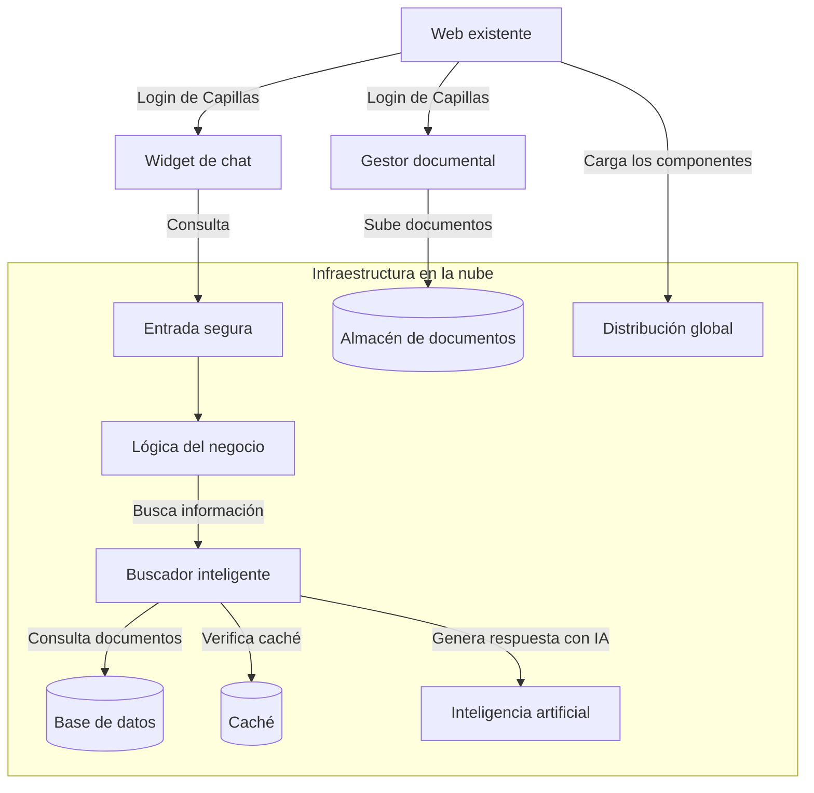
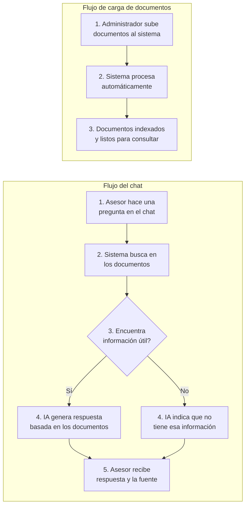
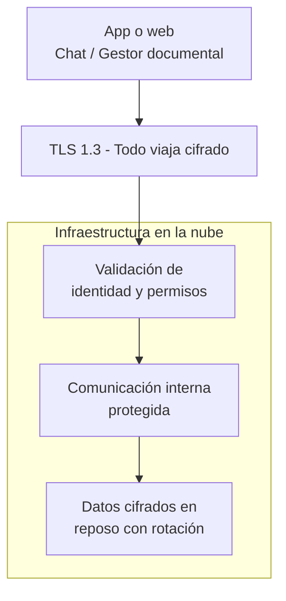

# PROPUESTA TECNOLÓGICA
## Sistema de Asesor Comercial Aumentado con IA
## Índice

1. [Stack Tecnológico](#1-stack-tecnológico)
2. [Arquitectura del Sistema](#2-arquitectura-del-sistema)
3. [Stack Tecnológico Detallado](#3-stack-tecnológico-detallado)
4. [Comparativa Cloud Provider](#4-comparativa-cloud-provider)
5. [Seguridad](#5-seguridad)
6. [Plan de Implementación](#6-plan-de-implementación)
7. [Estimación de Costos](#7-estimación-de-costos)
8. [Modelos de Contratación y Precios](#8-modelos-de-contratación-y-precios)
9. [Referencias y Fuentes](#9-referencias-y-fuentes)

---

## 1. Stack Tecnológico

| Capa | Tecnología | Por qué es importante |
|------|-----------|----------------------|
| **Widget (chat en web)** | [Lit 3](https://lit.dev/docs/) - componente web, compatible con cualquier navegador moderno. | Se actualiza desde la nube. Funciona en cualquier dispositivo. |
| **Gestor documental** | Panel web para carga y administración de documentos. | El chat funciona con la información que se cargue aquí. |
| **Autenticación** | [Amazon Cognito](https://docs.aws.amazon.com/cognito/latest/developerguide/what-is-amazon-cognito.html) - sistema de login gestionado por AWS | Cada asesor tiene su propio usuario y contraseña. Se puede activar doble factor de autenticación. |
| **Backend (lógica del negocio)** | [FastAPI](https://fastapi.tiangolo.com/) (Python) + [gRPC](https://grpc.io/docs/) - tecnología moderna de APIs, la misma que usan empresas como Uber y Netflix | Procesa cada consulta en milisegundos. Soporta cientos de asesores simultáneos. |
| **Buscador inteligente (RAG)** | [LlamaIndex](https://docs.llamaindex.ai/) - motor de búsqueda aumentada con IA, el estándar de la industria para sistemas de preguntas y respuestas sobre documentos propios | Busca en los documentos para responder con información real. Cada respuesta viene con la fuente de dónde se obtuvo. |
| **Base de datos de documentos** | [Aurora Serverless v2](https://docs.aws.amazon.com/AmazonRDS/latest/AuroraUserGuide/aurora-serverless-v2.html) + [pgvector](https://github.com/pgvector/pgvector) - base de datos que entiende texto | Almacena y organiza los documentos. Cuando nadie la usa, se apaga para ahorrar costos. |
| **Generación de respuestas** | [Claude Sonnet](https://aws.amazon.com/bedrock/claude/) + [Claude Haiku](https://aws.amazon.com/bedrock/claude/) - modelos de inteligencia artificial de última generación | Sonnet genera respuestas detalladas para preguntas complejas. Haiku responde preguntas simples más rápido y más económico. |
| **Caché de respuestas** | [Redis](https://docs.aws.amazon.com/AmazonElastiCache/latest/red-ug/WhatIs.html) - memoria de alta velocidad que guarda respuestas temporales | Si dos asesores preguntan lo mismo, la segunda respuesta se entrega en milisegundos sin volver a pagar por IA. |
| **Infraestructura** | [AWS](https://aws.amazon.com/) - la nube más usada del mundo, sin servidores que administrar | No hay servidores físicos que mantener. |
| **Seguridad** | [Cifrado TLS 1.3](https://datatracker.ietf.org/doc/html/rfc8446) + [AWS KMS](https://docs.aws.amazon.com/kms/latest/developerguide/overview.html) para llaves de cifrado | Todos los datos viajan y se almacenan cifrados. |
| **Monitoreo** | [OpenTelemetry](https://opentelemetry.io/docs/) + [LangFuse](https://langfuse.com/) + [Grafana](https://grafana.com/docs/) - panel de control en tiempo real | Monitoreo en tiempo real. |
| **Actualizaciones automáticas** | [GitHub Actions](https://docs.github.com/en/actions) + [ECS](https://docs.aws.amazon.com/AmazonECS/latest/developerguide/Welcome.html) - despliegue continuo | Cada mejora o corrección se publica en minutos sin intervencion manual. |

### 1.1 Costo Mensual de Infraestructura AWS

TRM de referencia: **$1 USD = $3,450 COP**.

| Etapa | Costo/mes (USD) | Costo/mes (COP) | Usuarios | Descripción |
|-------|-----------------|------------------|----------|-------------|
| **MVP / Desarrollo** | ~$150-170/mes | ~$521.000-586.000 | < 10 | 1-2 microservicios, instancias pequeñas + QA |
| **Producción (100 ases)** | ~$625-750/mes | ~$2.150.000-2.580.000 | ~100 | 4-5 servicios, HA parcial |
| **Escalado (500+ ases)** | ~$1.440-1.560/mes | ~$4.955.000-5.382.000 | 500+ | HA completa, múltiples AZ |

---

## 2. Arquitectura del Sistema

### 2.1 Modalidades de Despliegue

Existen **dos formas** de implementarlo:

| Aspecto | Opción 1 - Widget solo | Opción 2 - App completa |
|---------|----------------------|------------------------|
| **¿Quién pone la página web?** | Capillas - su web actual | Nosotros - aplicación web liviana |
| **¿Quién maneja el login?** | Capillas - su propio login | Nosotros |
| **¿Qué tiene que hacer Capillas?** | Agregar dos líneas de código en su web: una para el chat y otra para el gestor documental. El login de Capillas protege ambos. | Nada - nosotros manejamos todo |
| **¿Muestra pantalla de login?** | No - el usuario ya está autenticado por Capillas | Sí - nuestra app abre una ventana de login y protege ambos componentes |
| **¿Qué tan difícil es implementar?** | **Mínimo** - Agrega un script | **Medio** - Requiere configurar usuarios y permisos iniciales |

> **¿Cuál elegir?** Si ya se tiene una página web y sistema de login, la Opción 1 es más rápida y económica. Si no se tiene o se quiere simplificar, la Opción 2 incluye todo listo.

**Opción 1 — Widget solo (Capillas ya tiene login):**

**Opción 2 — App completa (Nosotros manejamos todo):**

---

## 2.2 Flujo del Sistema

**Fácil de mantener:** Cuando cambien tarifas, productos o condiciones, se sube el documento actualizado al gestor documental. El sistema lo procesa y el chat empieza a usar la nueva información de inmediato.

## 2.3 Flujo de Seguridad

**Datos personales:** Antes de llegar a la IA, cualquier información personal (nombres, documentos, teléfonos, direcciones, etc.) se reemplaza con datos anónimos. La IA nunca recibe información personal.

---

*Documento en construcción. Secciones se agregarán progresivamente.*