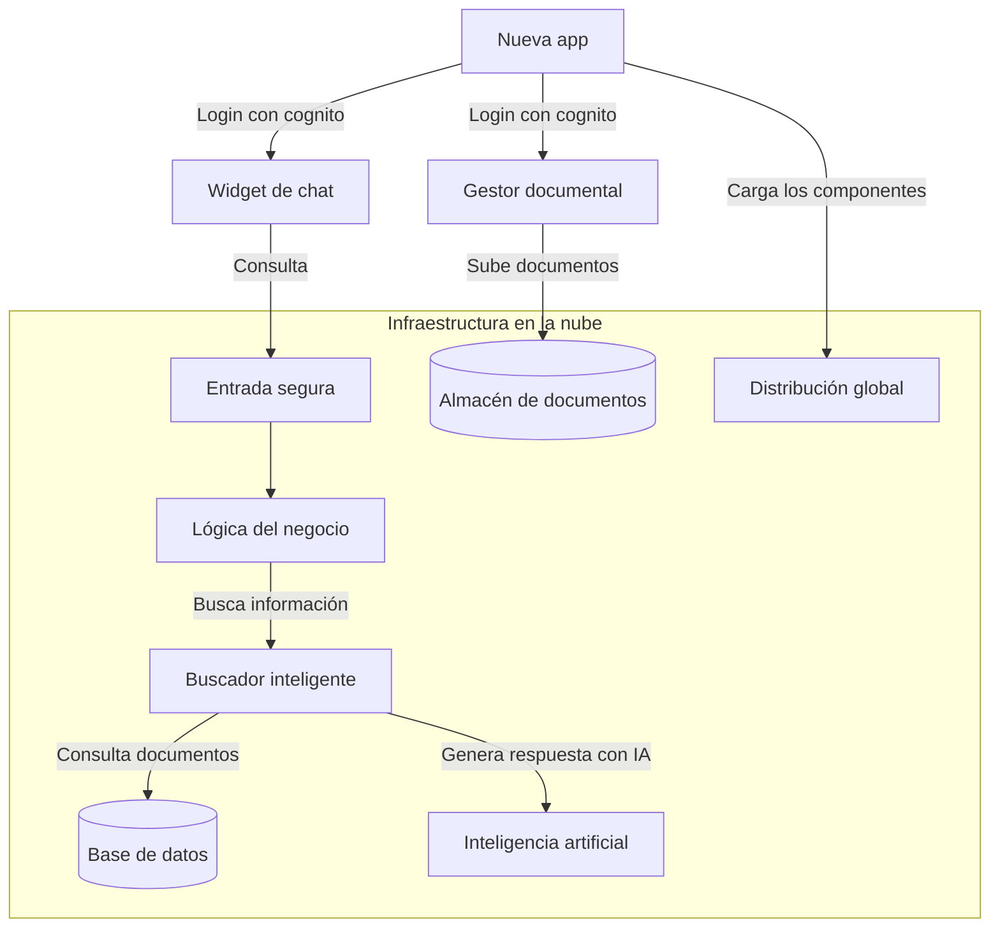
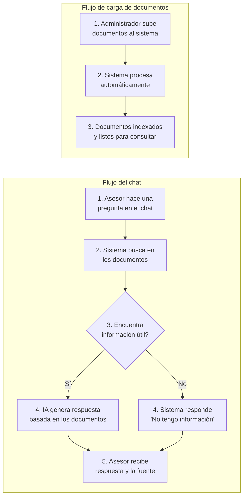
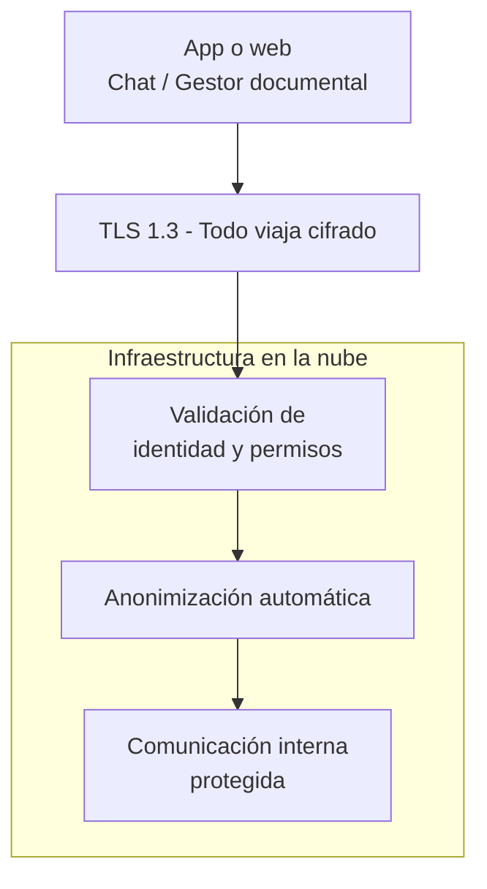

# PROPUESTA TECNOLÓGICA
## Sistema de asesor comercial aumentado con IA

Asistente conversacional con IA que se integra en la web. Los asesores preguntan sobre planes, tarifas y coberturas, y el sistema responde al instante basado en sus propios documentos.

## Índice

1. [Stack tecnológico](#1-stack-tecnológico)
2. [Arquitectura del sistema](#2-arquitectura-del-sistema)
3. [Costos de Infraestructura](#3-costos-de-infraestructura)
4. [Planes y Precios](#4-planes-y-precios)
5. [Preguntas Frecuentes](#5-preguntas-frecuentes)

---

## 1. Stack tecnológico

| Capa | Tecnología | Por qué es importante |
|------|-----------|----------------------|
| **Widget (chat en web)** | [Lit 3](https://lit.dev/docs/) - componente web, compatible con cualquier navegador moderno. | Se actualiza desde la nube. Funciona en cualquier dispositivo: computador, tableta o celular. |
| **Gestor documental** | Panel web para carga y administración de documentos. | El chat funciona con la información que se cargue aquí. |
| **Autenticación** | [Amazon Cognito](https://docs.aws.amazon.com/cognito/latest/developerguide/what-is-amazon-cognito.html) - sistema de login gestionado por AWS | Cada asesor tiene su propio usuario y contraseña. Se puede activar doble factor de autenticación. |
| **Backend (lógica del negocio)** | [FastAPI](https://fastapi.tiangolo.com/) (Python) + [gRPC](https://grpc.io/docs/) - tecnología moderna de APIs probada a gran escala | Procesa cada consulta en milisegundos. Soporta cientos de asesores simultáneos. |
| **Buscador inteligente (RAG)** | [LlamaIndex](https://docs.llamaindex.ai/) - motor de búsqueda aumentada con IA, el estándar de la industria para sistemas de preguntas y respuestas sobre documentos propios | Busca en los documentos para responder con información real. Cada respuesta viene con la fuente de dónde se obtuvo. |
| **Base de datos de documentos** | [RDS PostgreSQL](https://aws.amazon.com/rds/postgresql/) + [pgvector](https://github.com/pgvector/pgvector) - base de datos relacional con capacidad de búsqueda vectorial | Almacena y organiza los documentos. Tiene un costo fijo predecible. Se puede apagar fuera de horario laboral para ahorrar en desarrollo y piloto. |
| **Generación de respuestas** | [Claude Sonnet 4.6](https://aws.amazon.com/bedrock/claude/) - el modelo de inteligencia artificial más reciente de Anthropic en AWS Bedrock | Genera respuestas detalladas basadas en los documentos cargados |
| **Infraestructura** | [AWS](https://aws.amazon.com/) - la nube más usada del mundo, sin servidores que administrar | No hay servidores físicos que mantener. |
| **Seguridad** | [Cifrado TLS 1.3](https://datatracker.ietf.org/doc/html/rfc8446) para la información en tránsito | La información viaja cifrada. Se almacenan los documentos y sus índices, y los chats se guardan anonimizados por un tiempo definido. |
| **Monitoreo** | [OpenTelemetry](https://opentelemetry.io/docs/) + [LangFuse](https://langfuse.com/) + [Grafana](https://grafana.com/docs/) - panel de control en tiempo real | Monitoreo en tiempo real. |
| **Actualizaciones automáticas** | [GitHub Actions](https://docs.github.com/en/actions) + [ECS](https://docs.aws.amazon.com/AmazonECS/latest/developerguide/Welcome.html) - despliegue continuo | Cada mejora o corrección se publica en minutos sin intervención manual. |

---

## 2. Arquitectura del sistema

### 2.1 Modalidades de despliegue

Existen **dos formas** de implementarlo:

| Aspecto | Opción 1 - Widget solo | Opción 2 - App completa |
|---------|----------------------|------------------------|
| **¿Quién pone la página web?** | Capillas - su web actual | Nosotros - aplicación web liviana |
| **¿Quién maneja el login?** | Capillas - su propio login | Nosotros |
| **¿Qué tiene que hacer Capillas?** | Agregar dos líneas de código en su web: una para el chat y otra para el gestor documental. El login de Capillas protege ambos. | Nada - nosotros manejamos todo |
| **¿Muestra pantalla de login?** | No - el usuario ya está autenticado por Capillas | Sí - nuestra app abre una ventana de login y protege ambos componentes |
| **¿Qué tan difícil es implementar?** | **Mínimo** - Agrega un script | **Medio** - Requiere configurar usuarios y permisos iniciales |

> **¿Cuál elegir?** Si ya se tiene una página web y sistema de login, la Opción 1 es más rápida y económica. Si no se tiene o se quiere simplificar, la Opción 2 incluye todo listo.

**Opción 1 — Widget solo:**

**Opción 2 — App completa:**

---

### 2.2 Así funciona en el día a día

**Doña Luz** llega a una sede de Capillas porque falleció su esposo. Quiere saber si el plan que contrataron cubre cremación y cuánto cuesta actualizarlo.

**María, la asesora**, abre el chat en su computador y escribe: *«¿El plan comprado en 2020 cubre cremación?»*. En segundos, el sistema responde: *«Sí, el plan incluye cremación. La actualización al plan vigente tiene un valor de $X.»* María lee la respuesta a Doña Luz. Todo tomó 10 segundos, sin carpetas ni supervisores.

**Cuando cambian las tarifas:** El administrador sube el nuevo PDF de precios al gestor documental. El sistema lo procesa automáticamente. Al minuto siguiente, todos los asesores responden con los nuevos precios.

### 2.3 Flujo del sistema

**Fácil de mantener:** Cuando cambien tarifas, productos o condiciones, se sube el documento actualizado al gestor documental. El sistema lo procesa y el chat empieza a usar la nueva información de inmediato.

### 2.4 Flujo de seguridad

### 2.5 Privacidad de datos personales

El sistema está diseñado para no almacenar datos personales de clientes. Nuestras bases de datos solo contienen información de conocimiento (tarifas, planes, procesos). Si un asesor menciona un nombre, documento o teléfono en el chat, un filtro automático lo reemplaza con datos anónimos de forma irreversible antes de que llegue al modelo de IA o se guarde en los registros. El sistema está diseñado para que la IA no reciba información personal.

Los chats anonimizados se guardan por un tiempo definido por el negocio para monitoreo de calidad. Como la anonimización es irreversible, no contienen datos personales ni es posible reconstruirlos.

Los documentos que se suben al sistema (tarifas, planes, coberturas) no deberían contener datos personales de clientes. Si por algún motivo necesitaran almacenar documentación con información sensible, lo evaluamos para implementar las medidas adicionales que apliquen.

---

### 2.6 Matriz de amenazas y mitigaciones

| Amenaza | ¿Qué pasaría? | Cómo lo evitamos |
|---|---|---|
| **Interceptación de datos** | Alguien intercepta la comunicación entre el asesor y el sistema | Todo viaja cifrado con TLS 1.3. Un atacante solo ve datos cifrados |
| **Fuga de datos personales** | La IA recibe nombres, documentos o teléfonos de clientes y podrían filtrarse | Un filtro automático reemplaza cualquier dato personal con información anónima antes de llegar a la IA |
| **Robo de sesión** | Alguien roba el token de acceso y se hace pasar por un asesor | Los tokens expiran cada 15 minutos y se renuevan automáticamente. |
| **Uso malicioso de la API** | Un atacante usa el sistema para consultar información sin límite | Límite de consultas por asesor. Intentos sospechosos se bloquean automáticamente |
| **Manipulación de la IA** | Alguien engaña a la IA para que ignore las reglas | Las instrucciones de seguridad están separadas de la conversación. La IA no puede modificarlas. Además, AWS Bedrock Guardrails bloquea activamente intentos de ingeniería de prompts o inyección |
| **Suplantación entre servicios** | Un servicio falso se hace pasar por parte del sistema | Los microservicios se autentican entre sí con certificados. No se aceptan conexiones no autorizadas |
| **Abuso de consumo** | Un asesor o script automatizado genera consultas sin control, disparando costos de IA antes de facturar el excedente | Límite de consultas por minuto por asesor y un techo técnico mensual configurable según el acuerdo comercial |

### 2.7 Mitigación de alucinaciones

Una respuesta errónea sobre una edad de cobertura o un precio puede generar una reclamación. Por eso implementamos varias capas para evitar que la IA invente información:

| Capa | Cómo funciona | Por qué importa |
|---|---|---|
| **Reglas fijas de comportamiento** | La IA tiene instrucciones explícitas: solo responder con información de los documentos. Si no encuentra la respuesta, dice "No tengo esa información" | Nunca inventa precios, edades ni coberturas |
| **Filtro de información no verificada** | El sistema revisa que la respuesta solo contenga datos que están en los documentos cargados. Si detecta información numérica (edades, precios) que no está en los documentos, fuerza una advertencia al asesor | Evita que el asesor comparta información no respaldada |
| **Umbral de confianza** | Si un documento no se parece lo suficiente a lo que preguntó el asesor, se descarta automáticamente. Si no queda ningún documento útil, el sistema responde que no tiene información | El asesor solo recibe respuestas basadas en documentos realmente relevantes |
| **Bloqueo por falta de contexto** | Si el sistema no logra armar un contexto sólido con al menos 2 fragmentos de documentos, no se consulta a la IA. Devuelve directamente un mensaje de "No tengo información suficiente" | Ahorra costos y evita respuestas sin fundamento |

### 2.8 Disponibilidad y continuidad

| Aspecto | Cómo lo manejamos |
|---------|-------------------|
| **Disponibilidad esperada** | 99.5% del tiempo (~3.6 horas de interrupción al mes como máximo) |
| **Fallos de servidores** | Los servicios se ejecutan en múltiples zonas. Si una zona falla, el sistema sigue funcionando desde otra |
| **Pérdida de base de datos** | La base de datos se respalda automáticamente todos los días. Podemos restaurar a cualquier punto en los últimos 30 días |
| **Fallo de la IA** | Si la IA no responde, el sistema muestra un mensaje claro al asesor. No se pierde información ni consultas |
| **Corte de internet del asesor** | El sistema funciona solo con conexión. Si no hay internet, el asesor vuelve a su método actual. |

### 2.9 Medición de calidad

El sistema mide automáticamente la calidad de las respuestas:

| Métrica | Cómo se mide |
|---------|-------------|
| **Satisfacción del asesor** | El asesor puede calificar cada respuesta |
| **Tasa de "No tengo información"** | Cuántas consultas quedan sin responder. Si es muy alta, los documentos están incompletos |
| **Tiempo de respuesta** | El sistema registra cuánto tarda en responder cada consulta |
| **Alertas automáticas** | Si la calidad baja, recibimos una alerta para revisar y corregir |

---

## 3. Costos de Infraestructura

TRM de referencia: **$1 USD = $3,450 COP**.

**Precio del modelo de IA (Claude Sonnet 4.6):**
- Entrada (texto que recibe): ~$10.350 COP por millón de tokens
- Salida (texto que genera): ~$51.750 COP por millón de tokens

**Ejemplo de una conversación típica (~2 preguntas):**

> Asesor: *"¿Cuál es el precio del Plan Familiar Premium para una pareja de 35 años?"*
>
> El sistema busca en los documentos, encuentra las tarifas vigentes y se las pasa como contexto a la IA. En total, la IA recibe ~2.050 palabras e instrucciones del sistema y genera una respuesta de ~200 palabras. **($32 COP)**
>
> Asesor: *"¿Y para una familia con dos hijos?"* (pregunta de seguimiento, el historial de la conversación se acumula)
>
> El sistema envía el historial completo (~2.300 palabras) y genera otra respuesta. **($34 COP)**
>
> **Costo total de la conversación (2 preguntas):** ~$66 COP
>
> **Costo promedio por conversación** (contando conversaciones de 1, 2 y hasta 3 preguntas): **~$65 COP**

### 3.1 Desarrollo

| Servicio | Costo/mes (COP / USD) |
|----------|----------------------|
| Login y control de acceso | ~$0 |
| Servidores en la nube (3 servicios + balanceador) | ~$196.000 COP (~$57 USD) |
| Base de datos (RDS db.t4g.micro, se apaga fuera de horario) | ~$20.000 COP (~$6 USD) |
| Inteligencia artificial (~1.000 conversaciones) | ~$65.000 COP (~$19 USD) |
| Almacenamiento y entrega de contenido | ~$3.000 COP (~$1 USD) |
| Monitoreo y registros | ~$26.000 COP (~$8 USD) |
| Infraestructura adicional (red, seguridad, DNS, etc.) | ~$200.000 COP (~$58 USD) |
| **Total** | **~$510.000 COP (~$148 USD)** |

### 3.2 Piloto (5-10 asesores)

| Servicio | Costo/mes (COP / USD) |
|----------|----------------------|
| Login y control de acceso | ~$0 |
| Servidores en la nube (3 servicios + balanceador) | ~$196.000 COP (~$57 USD) |
| Base de datos (RDS db.t4g.small, se apaga fuera de horario) | ~$40.000 COP (~$12 USD) |
| Inteligencia artificial (~3.000 conversaciones) | ~$195.000 COP (~$57 USD) |
| Almacenamiento y entrega de contenido | ~$3.000 COP (~$1 USD) |
| Monitoreo y registros | ~$26.000 COP (~$8 USD) |
| Infraestructura adicional (red, seguridad, DNS, etc.) | ~$200.000 COP (~$58 USD) |
| **Total** | **~$660.000 COP (~$191 USD)** |

### 3.3 Producción (100 asesores)

Cada asesor tiene ~20 conversaciones/día, ~400/mes. En Producción (100 asesores): ~40.000 conversaciones/mes.

| Servicio | Costo/mes (COP / USD) |
|----------|----------------------|
| Login y control de acceso | ~$0 |
| Servidores en la nube (3 servicios con réplicas + balanceador) | ~$476.000 COP (~$138 USD) |
| Base de datos (RDS db.t4g.medium) | ~$180.000 COP (~$52 USD) |
| Inteligencia artificial (~40.000 conversaciones) | ~$2.600.000 COP (~$754 USD) |
| Almacenamiento y entrega de contenido | ~$28.000 COP (~$8 USD) |
| Monitoreo y registros | ~$104.000 COP (~$30 USD) |
| Infraestructura adicional (red, seguridad, DNS, etc.) | ~$250.000 COP (~$72 USD) |
| **Total** | **~$3.638.000 COP (~$1.054 USD)** |

### 3.4 Crecimiento (200-500+ asesores)

| Servicio | Costo/mes (COP / USD) |
|----------|----------------------|
| Login y control de acceso | ~$10.000 COP (~$3 USD) |
| Servidores en la nube (4 servicios con réplicas + balanceadores) | ~$1.045.000 COP (~$303 USD) |
| Base de datos (RDS db.r6g.large) | ~$350.000 COP (~$101 USD) |
| Inteligencia artificial (~200.000 conversaciones) | ~$13.000.000 COP (~$3.768 USD) |
| Almacenamiento y entrega de contenido | ~$62.000 COP (~$18 USD) |
| Monitoreo y registros | ~$242.000 COP (~$70 USD) |
| Infraestructura adicional (red, seguridad, DNS, etc.) | ~$400.000 COP (~$116 USD) |
| **Total** | **~$15.109.000 COP (~$4.379 USD)** |

---

## 4. Planes y Precios

Los precios están calculados para un uso promedio de **20 conversaciones al día por asesor (~400/mes)**. Si el uso real es menor, el costo baja; si es mayor, sube en proporción al excedente.

### 4.1 Construcción

| Concepto | Valor |
|----------|-------|
| Precio mensual | $10.000.000 COP |
| Incluye | Desarrollo completo del sistema: chat de consulta, gestor para cargar documentos, panel de monitoreo, mecanismo de actualizaciones automáticas, infraestructura en la nube |
| Uso | Construcción y piloto con 5-10 asesores |

### 4.2 Plan Producción (hasta 100 asesores)

| Concepto | Valor |
|----------|-------|
| Precio mensual | $5.500.000 COP |
| Incluye | Soporte + toda la infraestructura en la nube |
| Límite incluido | Hasta 40.000 conversaciones/mes (~20/día × 100 asesores) |
| Si excede el límite | $85 COP (~$0,025 USD) por conversación adicional |

### 4.3 Plan Crecimiento (hasta 500+ asesores)

| Concepto | Valor |
|----------|-------|
| Precio mensual | $20.000.000 COP |
| Incluye | Soporte + toda la infraestructura en la nube |
| Límite incluido | Hasta 200.000 conversaciones/mes (~20/día × 500 asesores) |
| Si excede el límite | $85 COP (~$0,025 USD) por conversación adicional |

---

## 5. Preguntas Frecuentes

**¿La IA se puede equivocar y dar una respuesta falsa a un cliente?**
El sistema solo responde con información que está en los documentos de Capillas. Si no encuentra la respuesta en los documentos, dice "No tengo esa información" — no inventa. Cada respuesta muestra la fuente exacta para que el asesor verifique antes de responder.

**¿Esto va a reemplazar a los asesores?**
No. Es una herramienta de consulta. El asesor sigue atendiendo al cliente, resolviendo objeciones y cerrando la venta. La IA solo le da la información más rápido para que pueda atender mejor.

**¿Qué pasa si falla el internet en la sede?**
El sistema funciona con conexión. Si no hay internet, el asesor vuelve a su método actual. No se pierde información ni consultas.

**¿Qué pasa si ustedes dejan de operar o terminamos el contrato?**
Los documentos y datos son de Capillas. Si deciden terminar, entregamos toda la información en formato estándar con 60 días para exportar sin costo.

**¿Necesitamos un técnico para operar esto?**
No. La operación del día a día la hace cualquier persona administrativa: subir documentos y ver reportes. Nosotros manejamos la parte técnica.

**¿Quién es el dueño del código y los documentos?**
El código del sistema, la infraestructura y las configuraciones técnicas son nuestras. Los documentos que Capillas cargue (tarifas, planes, coberturas) y la información que de ellos se derive siguen siendo de Capillas.

**¿Funciona en celular o solo en computador?**
Funciona en ambos. El widget de chat se adapta automáticamente al tamaño de la pantalla, y la app completa también es compatible con dispositivos móviles. El asesor puede usarlo desde cualquier navegador.

**¿Qué necesitamos de nuestra parte para arrancar?**
- Documentos comerciales (tarifas, planes, coberturas) en Word o PDF
- Una persona de contacto para la implementación
- Acceso a la página web (Opción 1) o logo y colores (Opción 2)
- 5-10 asesores para el piloto

