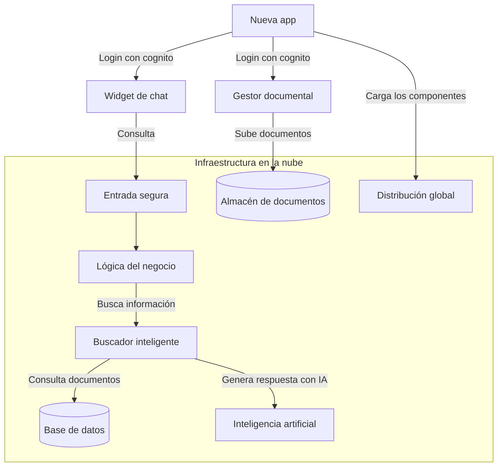
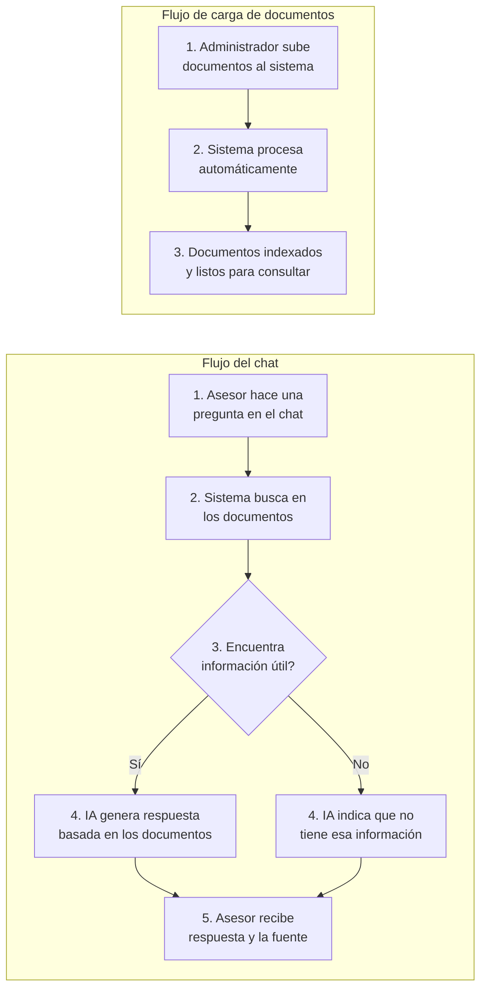
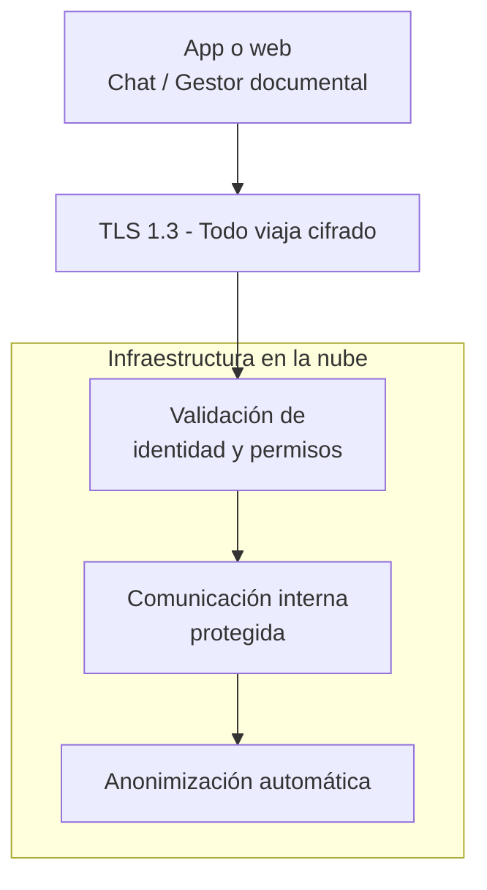

# PROPUESTA TECNOLÓGICA
## Sistema de asesor comercial aumentado con IA
## Índice

1. [Stack Tecnológico](#1-stack-tecnológico)
2. [Arquitectura del Sistema](#2-arquitectura-del-sistema)
3. [Costos de Infraestructura](#3-costos-de-infraestructura)
4. [Stack Tecnológico Detallado](#4-stack-tecnológico-detallado)
5. [Seguridad](#5-seguridad)
6. [Plan de Implementación](#6-plan-de-implementación)
7. [Estimación de Costos](#7-estimación-de-costos)
8. [Modelos de Contratación y Precios](#8-modelos-de-contratación-y-precios)
9. [Referencias y Fuentes](#9-referencias-y-fuentes)

---

## 1. Stack tecnológico

| Capa | Tecnología | Por qué es importante |
|------|-----------|----------------------|
| **Widget (chat en web)** | [Lit 3](https://lit.dev/docs/) - componente web, compatible con cualquier navegador moderno. | Se actualiza desde la nube. Funciona en cualquier dispositivo. |
| **Gestor documental** | Panel web para carga y administración de documentos. | El chat funciona con la información que se cargue aquí. |
| **Autenticación** | [Amazon Cognito](https://docs.aws.amazon.com/cognito/latest/developerguide/what-is-amazon-cognito.html) - sistema de login gestionado por AWS | Cada asesor tiene su propio usuario y contraseña. Se puede activar doble factor de autenticación. |
| **Backend (lógica del negocio)** | [FastAPI](https://fastapi.tiangolo.com/) (Python) + [gRPC](https://grpc.io/docs/) - tecnología moderna de APIs, la misma que usan empresas como Uber y Netflix | Procesa cada consulta en milisegundos. Soporta cientos de asesores simultáneos. |
| **Buscador inteligente (RAG)** | [LlamaIndex](https://docs.llamaindex.ai/) - motor de búsqueda aumentada con IA, el estándar de la industria para sistemas de preguntas y respuestas sobre documentos propios | Busca en los documentos para responder con información real. Cada respuesta viene con la fuente de dónde se obtuvo. |
| **Base de datos de documentos** | [Aurora Serverless v2](https://docs.aws.amazon.com/AmazonRDS/latest/AuroraUserGuide/aurora-serverless-v2.html) + [pgvector](https://github.com/pgvector/pgvector) - base de datos que entiende texto | Almacena y organiza los documentos. Cuando nadie la usa, se apaga para ahorrar costos. |
| **Generación de respuestas** | [Claude Sonnet](https://aws.amazon.com/bedrock/claude/) + [Claude Haiku](https://aws.amazon.com/bedrock/claude/) - modelos de inteligencia artificial de última generación | Sonnet genera respuestas detalladas para preguntas complejas. Haiku responde preguntas simples más rápido y más económico. |
| **Infraestructura** | [AWS](https://aws.amazon.com/) - la nube más usada del mundo, sin servidores que administrar | No hay servidores físicos que mantener. |
| **Seguridad** | [Cifrado TLS 1.3](https://datatracker.ietf.org/doc/html/rfc8446) + [AWS KMS](https://docs.aws.amazon.com/kms/latest/developerguide/overview.html) para llaves de cifrado | Todos los datos viajan y se almacenan cifrados. |
| **Monitoreo** | [OpenTelemetry](https://opentelemetry.io/docs/) + [LangFuse](https://langfuse.com/) + [Grafana](https://grafana.com/docs/) - panel de control en tiempo real | Monitoreo en tiempo real. |
| **Actualizaciones automáticas** | [GitHub Actions](https://docs.github.com/en/actions) + [ECS](https://docs.aws.amazon.com/AmazonECS/latest/developerguide/Welcome.html) - despliegue continuo | Cada mejora o corrección se publica en minutos sin intervencion manual. |

---

## 2. Arquitectura del sistema

### 2.1 Modalidades de despliegue

Existen **dos formas** de implementarlo:

| Aspecto | Opción 1 - Widget solo | Opción 2 - App completa |
|---------|----------------------|------------------------|
| **¿Quién pone la página web?** | Capillas - su web actual | Nosotros - aplicación web liviana |
| **¿Quién maneja el login?** | Capillas - su propio login | Nosotros |
| **¿Qué tiene que hacer Capillas?** | Agregar dos líneas de código en su web: una para el chat y otra para el gestor documental. El login de Capillas protege ambos. | Nada - nosotros manejamos todo |
| **¿Muestra pantalla de login?** | No - el usuario ya está autenticado por Capillas | Sí - nuestra app abre una ventana de login y protege ambos componentes |
| **¿Qué tan difícil es implementar?** | **Mínimo** - Agrega un script | **Medio** - Requiere configurar usuarios y permisos iniciales |

> **¿Cuál elegir?** Si ya se tiene una página web y sistema de login, la Opción 1 es más rápida y económica. Si no se tiene o se quiere simplificar, la Opción 2 incluye todo listo.

**Opción 1 — Widget solo:**

**Opción 2 — App completa:**

---

## 2.2 Flujo del sistema

**Fácil de mantener:** Cuando cambien tarifas, productos o condiciones, se sube el documento actualizado al gestor documental. El sistema lo procesa y el chat empieza a usar la nueva información de inmediato.

## 2.3 Flujo de seguridad

## 2.4 Privacidad de datos - Ley 1581 de 2012

No almacenamos datos personales de clientes. El único registro que se guarda son los chats (ya anonimizados) para monitoreo de calidad, por un tiempo definido por el negocio. Antes de llegar a la IA, cualquier información personal (nombres, documentos, teléfonos, direcciones, etc.) se reemplaza con datos anónimos usando un filtro automático. La IA nunca recibe información personal.

Cumplimos la ley así:

| Requisito de la ley | Cómo lo cumplimos |
|-|-|
| **Consentimiento** | El asesor informa al cliente que la conversación es asistida por IA. No se pide autorización para guardar — no se almacenan datos personales |
| **Propósito definido** | La IA solo asiste en la asesoría comercial. No se entrenan modelos ni se comparten datos con terceros |
| **Datos mínimos** | No almacenamos datos personales. Los chats de monitoreo se guardan sin información que identifique al cliente |
| **Datos protegidos** | La información viaja cifrada (TLS 1.3). Los datos personales se eliminan automáticamente antes de llegar a la IA o guardarse |

---

## 2.5 Matriz de amenazas y mitigaciones

| Amenaza | ¿Qué pasaría? | Cómo lo evitamos |
|-|-|-|
| **Interceptación de datos** | Alguien intercepta la comunicación entre el asesor y el sistema | Todo viaja cifrado con TLS 1.3. Un atacante solo ve datos cifrados |
| **Fuga de datos personales** | La IA recibe nombres, documentos o teléfonos de clientes y podrían filtrarse | Presidio reemplaza automáticamente cualquier dato personal con tokens anónimos antes de llegar a la IA |
| **Robo de sesión** | Alguien roba el token de acceso y se hace pasar por un asesor | Los tokens expiran cada 15 minutos y se renuevan automáticamente. |
| **Uso malicioso de la API** | Un atacante usa el sistema para consultar información sin límite | Límite de consultas por asesor. Intentos sospechosos se bloquean automáticamente |
| **Manipulación de la IA** | Alguien engaña a la IA para que ignore las reglas | Las instrucciones de seguridad están separadas de la conversación. La IA no puede modificarlas |
| **Suplantación entre servicios** | Un servicio falso se hace pasar por parte del sistema | Los microservicios se autentican entre sí con certificados. No se aceptan conexiones no autorizadas |

## 2.6 Mitigación de alucinaciones

Una respuesta errónea sobre una edad de cobertura o un precio puede generar una reclamación. Por eso implementamos varias capas para evitar que la IA invente información:

| Capa | Cómo funciona | Por qué importa |
|-|-|-|
| **Reglas fijas de comportamiento** | La IA tiene instrucciones explícitas: solo responder con información de los documentos. Si no encuentra la respuesta, dice "No tengo esa información" | Nunca inventa precios, edades ni coberturas |
| **Filtro de información no verificada** | El sistema revisa que la respuesta solo contenga datos que están en los documentos cargados. Si detecta información numérica (edades, precios) que no está en los documentos, fuerza una advertencia al asesor | Evita que el asesor comparta información no respaldada |
| **Umbral de confianza** | Si un documento no se parece lo suficiente a lo que preguntó el asesor, se descarta automáticamente. Si no queda ningún documento útil, la IA responde que no tiene información | El asesor solo recibe respuestas basadas en documentos realmente relevantes |
| **Bloqueo por falta de contexto** | Si el sistema no logra armar un contexto sólido con al menos 2 fragmentos de documentos, no se consulta a la IA. Devuelve directamente un mensaje de "No tengo información suficiente" | Ahorra costos y evita respuestas sin fundamento |

---

## 3. Costos de Infraestructura

TRM de referencia: **$1 USD = $3,450 COP**.

**Precio del modelo de IA (Claude Sonnet):**
- Entrada (texto que recibe): ~$10.350 COP por millón de tokens (~3.450 palabras)
- Salida (texto que genera): ~$51.750 COP por millón de tokens (~3.450 palabras)

**Ejemplo de una conversación típica (~2 preguntas):**

> Asesor: *"¿Cuál es el precio del Plan Familiar Premium para una pareja de 35 años?"*
>
> El sistema busca en los documentos, encuentra las tarifas vigentes y se las pasa como contexto a la IA. En total, la IA recibe ~2.050 palabras e instrucciones del sistema y genera una respuesta de ~200 palabras. **($32 COP)**
>
> Asesor: *"¿Y para una familia con dos hijos?"* (pregunta de seguimiento, el historial de la conversación se acumula)
>
> El sistema envía el historial completo (~2.300 palabras) y genera otra respuesta. **($34 COP)**
>
> **Costo total de la conversación (2 preguntas):** ~$66 COP
>
> **Costo promedio por conversación** (contando conversaciones de 1, 2 y hasta 3 preguntas): **~$65 COP**

### 3.1 Desarrollo

| Servicio | Costo/mes (COP) |
|----------|-----------------|
| Login y control de acceso | ~$0 |
| Servidores en la nube (3 servicios + balanceador) | ~$196.000 |
| Base de datos | ~$58.000 |
| Inteligencia artificial (~1.000 conversaciones) | ~$65.000 |
| Almacenamiento y entrega de contenido | ~$3.000 |
| Monitoreo y registros | ~$26.000 |
| Infraestructura adicional (red, seguridad, DNS, etc.) | ~$147.000 |
| **Total** | **~$495.000/mes** |

### 3.2 Piloto (5-10 asesores)

Misma arquitectura que desarrollo. La BD se apaga tras 1 hora sin actividad (no se apaga durante el día porque los asesores hacen consultas con frecuencia).

| Servicio | Costo/mes (COP) |
|----------|-----------------|
| Login y control de acceso | ~$0 |
| Servidores en la nube (3 servicios + balanceador) | ~$196.000 |
| Base de datos | ~$58.000 |
| Inteligencia artificial (~3.000 conversaciones) | ~$195.000 |
| Almacenamiento y entrega de contenido | ~$3.000 |
| Monitoreo y registros | ~$26.000 |
| Infraestructura adicional (red, seguridad, DNS, etc.) | ~$147.000 |
| **Total** | **~$625.000/mes** |

### 3.3 Producción (100 asesores)

Cada asesor tiene ~20 conversaciones/día, ~400/mes. En Producción (100 asesores): ~40.000 conversaciones/mes.

| Servicio | Costo/mes (COP) |
|----------|-----------------|
| Login y control de acceso | ~$0 |
| Servidores en la nube (3 servicios con réplicas + balanceador) | ~$476.000 |
| Base de datos | ~$245.000 |
| Inteligencia artificial (~40.000 conversaciones) | ~$2.600.000 |
| Almacenamiento y entrega de contenido | ~$28.000 |
| Monitoreo y registros | ~$104.000 |
| Infraestructura adicional (red, seguridad, DNS, etc.) | ~$200.000 |
| **Total** | **~$3.653.000/mes** |

### 3.4 Crecimiento (200-500+ asesores)

| Servicio | Costo/mes (COP) |
|----------|-----------------|
| Login y control de acceso | ~$10.000 |
| Servidores en la nube (4 servicios con réplicas + balanceadores) | ~$1.045.000 |
| Base de datos | ~$486.000 |
| Inteligencia artificial (~200.000 conversaciones) | ~$13.000.000 |
| Almacenamiento y entrega de contenido | ~$62.000 |
| Monitoreo y registros | ~$242.000 |
| Infraestructura adicional (red, seguridad, DNS, etc.) | ~$350.000 |
| **Total** | **~$15.195.000/mes** |

---

## 4. Planes y Precios

### 4.1 Construcción

| Concepto | Valor |
|----------|-------|
| Precio mensual | $10.000.000 COP |
| Incluye | Desarrollo del sistema + toda la infraestructura en la nube |
| Uso | construcción y piloto con 5-10 asesores |

### 4.2 Plan Producción (hasta 100 asesores)

| Concepto | Valor |
|----------|-------|
| Precio mensual | $5.500.000 COP |
| Incluye | Soporte + toda la infraestructura en la nube |
| Límite incluido | Hasta 40.000 conversaciones/mes (~20/día × 100 asesores) |
| Si excede el límite | $65 COP por conversación adicional |

### 4.3 Plan Crecimiento (hasta 500+ asesores)

| Concepto | Valor |
|----------|-------|
| Precio mensual | $18.500.000 COP |
| Incluye | Soporte + toda la infraestructura en la nube |
| Límite incluido | Hasta 200.000 conversaciones/mes (~20/día × 500 asesores) |
| Si excede el límite | $65 COP por conversación adicional |

